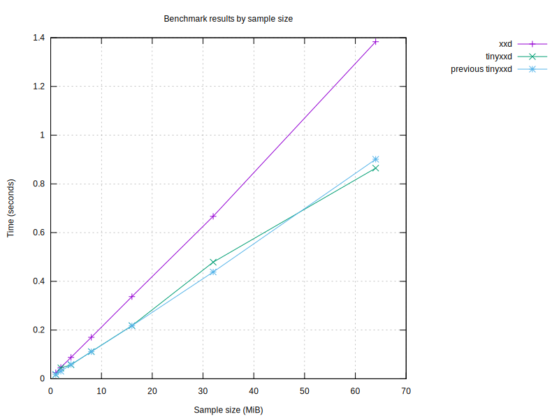
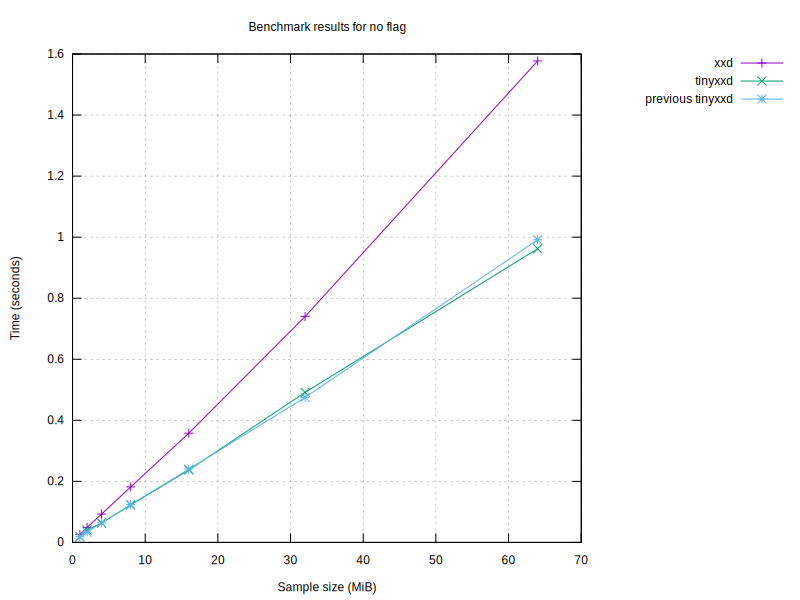
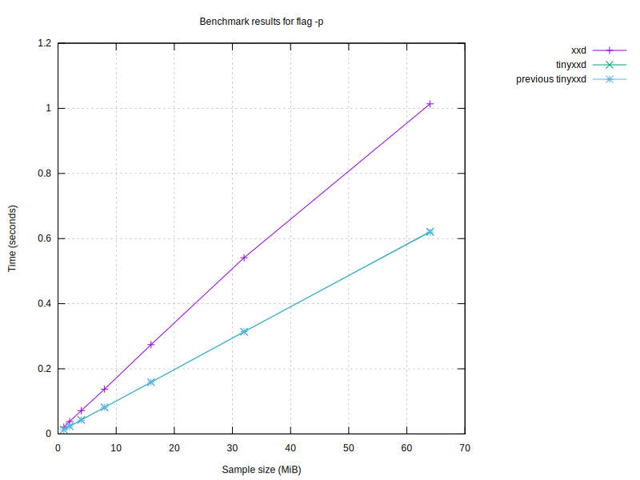
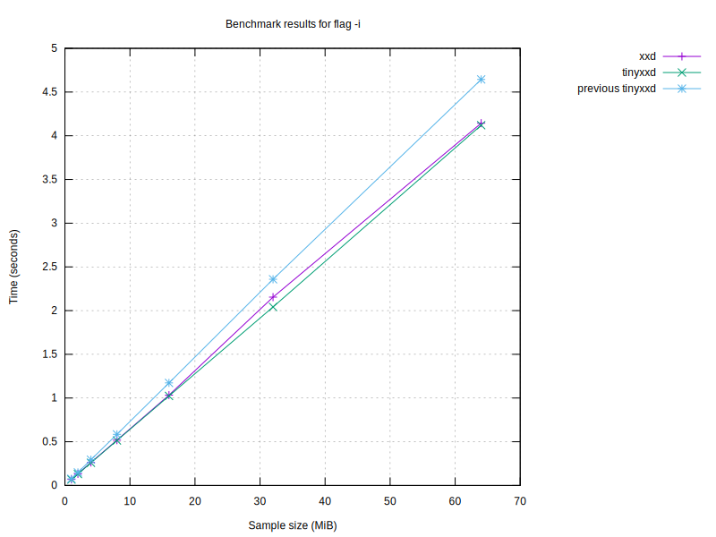
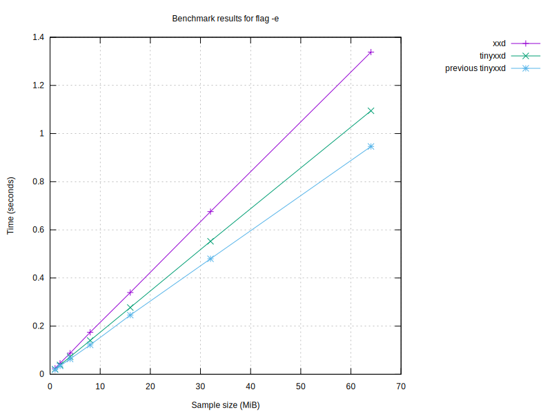
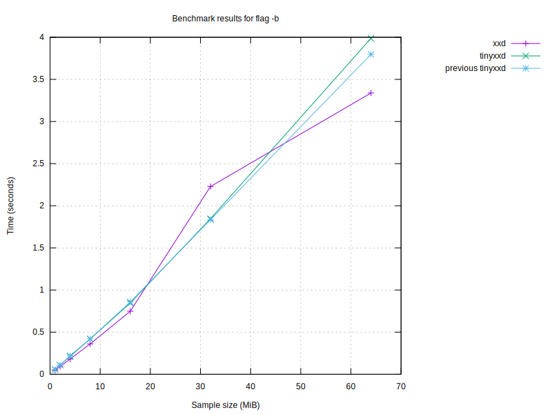
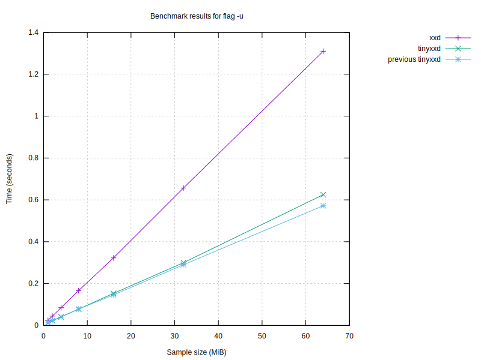
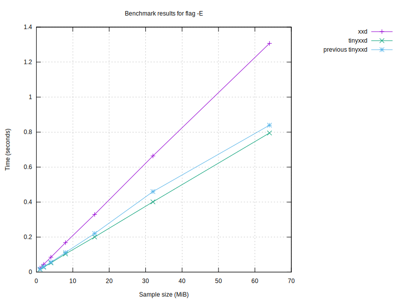

# Benchmark results

## Graphs

### Graph by sample size

### Graph for no flag

### Graph for flag '-p'

### Graph for flag '-i'

### Graph for flag '-e'

### Graph for flag '-b'

### Graph for flag '-u'

### Graph for flag '-E'

| Program | Size (MiB) | Conversion Time (s) | Flags |
|---------|------------|----------------------|-------|
| tinyxxd | 64 | 1.33 |  |
| tinyxxd | 64 | 1.95 | -r |
| tinyxxd | 64 | 5.06 |  |
| tinyxxd | 64 | 3.61 | -r |
| tinyxxd | 64 | 1.28 |  |
| tinyxxd | 64 | 0.77 | -p |
| tinyxxd | 64 | 4.85 | -i |
| tinyxxd | 64 | 1.33 | -e |
| tinyxxd | 64 | 3.06 | -b |
| tinyxxd | 64 | 1.28 | -u |
| tinyxxd | 64 | 1.40 | -E |
| xxd | 64 | 1.43 |  |
| xxd | 64 | 2.24 | -r |
| xxd | 64 | 4.53 |  |
| xxd | 64 | 4.23 | -r |
| xxd | 64 | 1.32 |  |
| xxd | 64 | 0.94 | -p |
| xxd | 64 | 4.85 | -i |
| xxd | 64 | 1.36 | -e |
| xxd | 64 | 3.04 | -b |
| xxd | 64 | 1.31 | -u |
| xxd | 64 | 1.46 | -E |
| tinyxxd | 32 | 0.65 |  |
| tinyxxd | 32 | 0.98 | -r |
| tinyxxd | 32 | 1.95 |  |
| tinyxxd | 32 | 1.81 | -r |
| tinyxxd | 32 | 0.63 |  |
| tinyxxd | 32 | 0.39 | -p |
| tinyxxd | 32 | 2.40 | -i |
| tinyxxd | 32 | 0.66 | -e |
| tinyxxd | 32 | 1.55 | -b |
| tinyxxd | 32 | 0.63 | -u |
| tinyxxd | 32 | 0.70 | -E |
| xxd | 32 | 0.69 |  |
| xxd | 32 | 1.15 | -r |
| xxd | 32 | 2.36 |  |
| xxd | 32 | 2.07 | -r |
| xxd | 32 | 0.68 |  |
| xxd | 32 | 0.47 | -p |
| xxd | 32 | 2.40 | -i |
| xxd | 32 | 0.68 | -e |
| xxd | 32 | 1.52 | -b |
| xxd | 32 | 0.67 | -u |
| xxd | 32 | 0.73 | -E |
| tinyxxd | 16 | 0.33 |  |
| tinyxxd | 16 | 0.49 | -r |
| tinyxxd | 16 | 1.01 |  |
| tinyxxd | 16 | 0.89 | -r |
| tinyxxd | 16 | 0.32 |  |
| tinyxxd | 16 | 0.19 | -p |
| tinyxxd | 16 | 1.18 | -i |
| tinyxxd | 16 | 0.33 | -e |
| tinyxxd | 16 | 0.77 | -b |
| tinyxxd | 16 | 0.32 | -u |
| tinyxxd | 16 | 0.35 | -E |
| xxd | 16 | 0.36 |  |
| xxd | 16 | 0.62 | -r |
| xxd | 16 | 1.76 |  |
| xxd | 16 | 1.04 | -r |
| xxd | 16 | 0.34 |  |
| xxd | 16 | 0.24 | -p |
| xxd | 16 | 1.22 | -i |
| xxd | 16 | 0.34 | -e |
| xxd | 16 | 0.75 | -b |
| xxd | 16 | 0.33 | -u |
| xxd | 16 | 0.37 | -E |
| xxd | 8 | 0.18 |  |
| xxd | 8 | 0.28 | -r |
| xxd | 8 | 0.48 |  |
| xxd | 8 | 0.54 | -r |
| xxd | 8 | 0.17 |  |
| xxd | 8 | 0.12 | -p |
| xxd | 8 | 0.60 | -i |
| xxd | 8 | 0.17 | -e |
| xxd | 8 | 0.38 | -b |
| xxd | 8 | 0.17 | -u |
| xxd | 8 | 0.18 | -E |
| tinyxxd | 8 | 0.17 |  |
| tinyxxd | 8 | 0.25 | -r |
| tinyxxd | 8 | 0.46 |  |
| tinyxxd | 8 | 0.48 | -r |
| tinyxxd | 8 | 0.16 |  |
| tinyxxd | 8 | 0.10 | -p |
| tinyxxd | 8 | 0.59 | -i |
| tinyxxd | 8 | 0.17 | -e |
| tinyxxd | 8 | 0.40 | -b |
| tinyxxd | 8 | 0.16 | -u |
| tinyxxd | 8 | 0.18 | -E |
| tinyxxd | 4 | 0.09 |  |
| tinyxxd | 4 | 0.12 | -r |
| tinyxxd | 4 | 0.21 |  |
| tinyxxd | 4 | 0.23 | -r |
| tinyxxd | 4 | 0.08 |  |
| tinyxxd | 4 | 0.05 | -p |
| tinyxxd | 4 | 0.30 | -i |
| tinyxxd | 4 | 0.09 | -e |
| tinyxxd | 4 | 0.19 | -b |
| tinyxxd | 4 | 0.08 | -u |
| tinyxxd | 4 | 0.09 | -E |
| xxd | 4 | 0.09 |  |
| xxd | 4 | 0.14 | -r |
| xxd | 4 | 0.26 |  |
| xxd | 4 | 0.27 | -r |
| xxd | 4 | 0.09 |  |
| xxd | 4 | 0.06 | -p |
| xxd | 4 | 0.30 | -i |
| xxd | 4 | 0.09 | -e |
| xxd | 4 | 0.19 | -b |
| xxd | 4 | 0.09 | -u |
| xxd | 4 | 0.09 | -E |
| tinyxxd | 2 | 0.05 |  |
| tinyxxd | 2 | 0.06 | -r |
| tinyxxd | 2 | 0.11 |  |
| tinyxxd | 2 | 0.12 | -r |
| tinyxxd | 2 | 0.04 |  |
| tinyxxd | 2 | 0.03 | -p |
| tinyxxd | 2 | 0.15 | -i |
| tinyxxd | 2 | 0.04 | -e |
| tinyxxd | 2 | 0.10 | -b |
| tinyxxd | 2 | 0.04 | -u |
| tinyxxd | 2 | 0.05 | -E |
| xxd | 2 | 0.05 |  |
| xxd | 2 | 0.07 | -r |
| xxd | 2 | 0.11 |  |
| xxd | 2 | 0.13 | -r |
| xxd | 2 | 0.05 |  |
| xxd | 2 | 0.03 | -p |
| xxd | 2 | 0.15 | -i |
| xxd | 2 | 0.05 | -e |
| xxd | 2 | 0.10 | -b |
| xxd | 2 | 0.05 | -u |
| xxd | 2 | 0.05 | -E |
| xxd | 1 | 0.03 |  |
| xxd | 1 | 0.04 | -r |
| xxd | 1 | 0.07 |  |
| xxd | 1 | 0.11 | -r |
| xxd | 1 | 0.02 |  |
| xxd | 1 | 0.02 | -p |
| xxd | 1 | 0.08 | -i |
| xxd | 1 | 0.03 | -e |
| xxd | 1 | 0.05 | -b |
| xxd | 1 | 0.02 | -u |
| xxd | 1 | 0.03 | -E |
| tinyxxd | 1 | 0.02 |  |
| tinyxxd | 1 | 0.12 | -r |
| tinyxxd | 1 | 0.10 |  |
| tinyxxd | 1 | 0.35 | -r |
| tinyxxd | 1 | 0.02 |  |
| tinyxxd | 1 | 0.02 | -p |
| tinyxxd | 1 | 0.08 | -i |
| tinyxxd | 1 | 0.03 | -e |
| tinyxxd | 1 | 0.05 | -b |
| tinyxxd | 1 | 0.02 | -u |
| tinyxxd | 1 | 0.03 | -E |

## Performance Summaries
- For sample size 64 MiB, tinyxxd was 16.42% faster with flags '-r'.
- For sample size 64 MiB, tinyxxd was 21.97% faster with flags '-p'.
- For sample size 32 MiB, tinyxxd was 15.46% faster with no flag.
- For sample size 32 MiB, tinyxxd was 15.39% faster with flags '-r'.
- For sample size 32 MiB, tinyxxd was 21.85% faster with flags '-p'.
- For sample size 32 MiB, tinyxxd was 6.30% faster with flags '-u'.
- For sample size 16 MiB, tinyxxd was 47.75% faster with no flag.
- For sample size 16 MiB, tinyxxd was 20.66% faster with flags '-r'.
- For sample size 16 MiB, tinyxxd was 21.67% faster with flags '-p'.
- For sample size 8 MiB, tinyxxd was 12.44% faster with flags '-r'.
- For sample size 8 MiB, tinyxxd was 21.03% faster with flags '-p'.
- For sample size 8 MiB, xxd was 6.19% faster with flags '-b'.
- For sample size 4 MiB, tinyxxd was 15.07% faster with no flag.
- For sample size 4 MiB, tinyxxd was 17.17% faster with flags '-r'.
- For sample size 4 MiB, tinyxxd was 20.73% faster with flags '-p'.
- For sample size 2 MiB, tinyxxd was 14.70% faster with flags '-r'.
- For sample size 2 MiB, tinyxxd was 19.30% faster with flags '-p'.
- For sample size 2 MiB, tinyxxd was 8.63% faster with flags '-u'.
- For sample size 1 MiB, xxd was 23.79% faster with no flag.
- For sample size 1 MiB, xxd was 215.06% faster with flags '-r'.
- For sample size 1 MiB, tinyxxd was 17.86% faster with flags '-p'.
- For sample size 1 MiB, tinyxxd was 7.46% faster with flags '-i'.
- For sample size 1 MiB, xxd was 13.32% faster with flags '-E'.

### Performance by sample size
- For sample 64 MiB, tinyxxd was 3.08% faster than xxd.
- For sample 32 MiB, tinyxxd was 8.67% faster than xxd.
- For sample 16 MiB, tinyxxd was 18.78% faster than xxd.
- For sample 8 MiB, tinyxxd was 4.64% faster than xxd.
- For sample 4 MiB, tinyxxd was 9.01% faster than xxd.
- For sample 2 MiB, tinyxxd was 4.78% faster than xxd.
- For sample size 1 MiB, xxd was 68.94% faster than tinyxxd.

### Performance by flag
- tinyxxd was 6.98% faster with no flag.
- tinyxxd was 12.92% faster with flag '-r'.
- tinyxxd was 21.71% faster with flag '-p'.

### Performance compared to last run
- For sample 64 MiB with flags '', tinyxxd slowed down by 4.55% compared to the last run.
- For sample 64 MiB with flags '-r', tinyxxd improved by 45.13% compared to the last run.
- For sample 64 MiB with flags '', tinyxxd slowed down by 298.93% compared to the last run.
- For sample 64 MiB with flags '-r', tinyxxd slowed down by 1.50% compared to the last run.
- For sample 64 MiB with flags '', tinyxxd slowed down by 0.46% compared to the last run.
- For sample 64 MiB with flags '-p', tinyxxd improved by 0.08% compared to the last run.
- For sample 64 MiB with flags '-i', tinyxxd slowed down by 2.51% compared to the last run.
- For sample 64 MiB with flags '-e', tinyxxd improved by 0.18% compared to the last run.
- For sample 64 MiB with flags '-b', tinyxxd slowed down by 1.17% compared to the last run.
- For sample 64 MiB with flags '-u', tinyxxd slowed down by 1.77% compared to the last run.
- For sample 64 MiB with flags '-E', tinyxxd improved by 0.27% compared to the last run.
- For sample 64 MiB with flags '', xxd slowed down by 5.26% compared to the last run.
- For sample 64 MiB with flags '-r', xxd improved by 48.09% compared to the last run.
- For sample 64 MiB with flags '', xxd slowed down by 232.97% compared to the last run.
- For sample 64 MiB with flags '-r', xxd improved by 1.84% compared to the last run.
- For sample 64 MiB with flags '', xxd improved by 2.83% compared to the last run.
- For sample 64 MiB with flags '-p', xxd improved by 2.22% compared to the last run.
- For sample 64 MiB with flags '-i', xxd slowed down by 1.94% compared to the last run.
- For sample 64 MiB with flags '-e', xxd improved by 0.63% compared to the last run.
- For sample 64 MiB with flags '-b', xxd improved by 0.15% compared to the last run.
- For sample 64 MiB with flags '-u', xxd improved by 7.05% compared to the last run.
- For sample 64 MiB with flags '-E', xxd improved by 2.78% compared to the last run.
- For sample 32 MiB with flags '', tinyxxd slowed down by 2.50% compared to the last run.
- For sample 32 MiB with flags '-r', tinyxxd improved by 45.01% compared to the last run.
- For sample 32 MiB with flags '', tinyxxd slowed down by 208.37% compared to the last run.
- For sample 32 MiB with flags '-r', tinyxxd slowed down by 1.81% compared to the last run.
- For sample 32 MiB with flags '', tinyxxd improved by 0.59% compared to the last run.
- For sample 32 MiB with flags '-p', tinyxxd improved by 0.60% compared to the last run.
- For sample 32 MiB with flags '-i', tinyxxd slowed down by 0.27% compared to the last run.
- For sample 32 MiB with flags '-e', tinyxxd improved by 2.64% compared to the last run.
- For sample 32 MiB with flags '-b', tinyxxd slowed down by 2.66% compared to the last run.
- For sample 32 MiB with flags '-u', tinyxxd improved by 0.69% compared to the last run.
- For sample 32 MiB with flags '-E', tinyxxd slowed down by 0.56% compared to the last run.
- For sample 32 MiB with flags '', xxd slowed down by 6.02% compared to the last run.
- For sample 32 MiB with flags '-r', xxd improved by 44.41% compared to the last run.
- For sample 32 MiB with flags '', xxd slowed down by 260.40% compared to the last run.
- For sample 32 MiB with flags '-r', xxd improved by 0.20% compared to the last run.
- For sample 32 MiB with flags '', xxd slowed down by 3.21% compared to the last run.
- For sample 32 MiB with flags '-p', xxd slowed down by 0.02% compared to the last run.
- For sample 32 MiB with flags '-i', xxd improved by 0.67% compared to the last run.
- For sample 32 MiB with flags '-e', xxd improved by 0.45% compared to the last run.
- For sample 32 MiB with flags '-b', xxd improved by 15.30% compared to the last run.
- For sample 32 MiB with flags '-u', xxd improved by 5.72% compared to the last run.
- For sample 32 MiB with flags '-E', xxd slowed down by 0.51% compared to the last run.
- For sample 16 MiB with flags '', tinyxxd slowed down by 3.72% compared to the last run.
- For sample 16 MiB with flags '-r', tinyxxd improved by 45.13% compared to the last run.
- For sample 16 MiB with flags '', tinyxxd slowed down by 216.05% compared to the last run.
- For sample 16 MiB with flags '-r', tinyxxd slowed down by 0.08% compared to the last run.
- For sample 16 MiB with flags '', tinyxxd slowed down by 0.19% compared to the last run.
- For sample 16 MiB with flags '-p', tinyxxd improved by 0.20% compared to the last run.
- For sample 16 MiB with flags '-i', tinyxxd slowed down by 0.28% compared to the last run.
- For sample 16 MiB with flags '-e', tinyxxd improved by 2.53% compared to the last run.
- For sample 16 MiB with flags '-b', tinyxxd improved by 0.57% compared to the last run.
- For sample 16 MiB with flags '-u', tinyxxd improved by 1.53% compared to the last run.
- For sample 16 MiB with flags '-E', tinyxxd improved by 4.40% compared to the last run.
- For sample 16 MiB with flags '', xxd slowed down by 5.22% compared to the last run.
- For sample 16 MiB with flags '-r', xxd improved by 56.41% compared to the last run.
- For sample 16 MiB with flags '', xxd slowed down by 420.28% compared to the last run.
- For sample 16 MiB with flags '-r', xxd improved by 26.70% compared to the last run.
- For sample 16 MiB with flags '', xxd slowed down by 1.34% compared to the last run.
- For sample 16 MiB with flags '-p', xxd improved by 0.40% compared to the last run.
- For sample 16 MiB with flags '-i', xxd slowed down by 2.21% compared to the last run.
- For sample 16 MiB with flags '-e', xxd improved by 0.46% compared to the last run.
- For sample 16 MiB with flags '-b', xxd improved by 0.63% compared to the last run.
- For sample 16 MiB with flags '-u', xxd improved by 2.52% compared to the last run.
- For sample 16 MiB with flags '-E', xxd improved by 0.07% compared to the last run.
- For sample 8 MiB with flags '', xxd slowed down by 3.29% compared to the last run.
- For sample 8 MiB with flags '-r', xxd improved by 47.01% compared to the last run.
- For sample 8 MiB with flags '', xxd slowed down by 176.69% compared to the last run.
- For sample 8 MiB with flags '-r', xxd slowed down by 0.38% compared to the last run.
- For sample 8 MiB with flags '', xxd slowed down by 0.03% compared to the last run.
- For sample 8 MiB with flags '-p', xxd improved by 0.73% compared to the last run.
- For sample 8 MiB with flags '-i', xxd improved by 3.34% compared to the last run.
- For sample 8 MiB with flags '-e', xxd improved by 2.05% compared to the last run.
- For sample 8 MiB with flags '-b', xxd improved by 0.52% compared to the last run.
- For sample 8 MiB with flags '-u', xxd improved by 3.61% compared to the last run.
- For sample 8 MiB with flags '-E', xxd improved by 0.42% compared to the last run.
- For sample 8 MiB with flags '', tinyxxd slowed down by 4.15% compared to the last run.
- For sample 8 MiB with flags '-r', tinyxxd improved by 44.57% compared to the last run.
- For sample 8 MiB with flags '', tinyxxd slowed down by 186.89% compared to the last run.
- For sample 8 MiB with flags '-r', tinyxxd slowed down by 7.50% compared to the last run.
- For sample 8 MiB with flags '', tinyxxd slowed down by 0.58% compared to the last run.
- For sample 8 MiB with flags '-p', tinyxxd improved by 0.26% compared to the last run.
- For sample 8 MiB with flags '-i', tinyxxd improved by 0.10% compared to the last run.
- For sample 8 MiB with flags '-e', tinyxxd slowed down by 0.26% compared to the last run.
- For sample 8 MiB with flags '-b', tinyxxd improved by 1.96% compared to the last run.
- For sample 8 MiB with flags '-u', tinyxxd improved by 1.11% compared to the last run.
- For sample 8 MiB with flags '-E', tinyxxd improved by 1.34% compared to the last run.
- For sample 4 MiB with flags '', tinyxxd slowed down by 2.41% compared to the last run.
- For sample 4 MiB with flags '-r', tinyxxd improved by 44.67% compared to the last run.
- For sample 4 MiB with flags '', tinyxxd slowed down by 152.48% compared to the last run.
- For sample 4 MiB with flags '-r', tinyxxd slowed down by 1.21% compared to the last run.
- For sample 4 MiB with flags '', tinyxxd improved by 1.38% compared to the last run.
- For sample 4 MiB with flags '-p', tinyxxd slowed down by 0.24% compared to the last run.
- For sample 4 MiB with flags '-i', tinyxxd improved by 0.32% compared to the last run.
- For sample 4 MiB with flags '-e', tinyxxd improved by 0.10% compared to the last run.
- For sample 4 MiB with flags '-b', tinyxxd improved by 1.15% compared to the last run.
- For sample 4 MiB with flags '-u', tinyxxd slowed down by 1.34% compared to the last run.
- For sample 4 MiB with flags '-E', tinyxxd improved by 3.46% compared to the last run.
- For sample 4 MiB with flags '', xxd improved by 0.86% compared to the last run.
- For sample 4 MiB with flags '-r', xxd improved by 45.96% compared to the last run.
- For sample 4 MiB with flags '', xxd slowed down by 197.81% compared to the last run.
- For sample 4 MiB with flags '-r', xxd slowed down by 3.06% compared to the last run.
- For sample 4 MiB with flags '', xxd improved by 2.55% compared to the last run.
- For sample 4 MiB with flags '-p', xxd slowed down by 0.33% compared to the last run.
- For sample 4 MiB with flags '-i', xxd improved by 1.63% compared to the last run.
- For sample 4 MiB with flags '-e', xxd improved by 0.59% compared to the last run.
- For sample 4 MiB with flags '-b', xxd improved by 0.22% compared to the last run.
- For sample 4 MiB with flags '-u', xxd improved by 2.20% compared to the last run.
- For sample 4 MiB with flags '-E', xxd slowed down by 0.08% compared to the last run.
- For sample 2 MiB with flags '', tinyxxd slowed down by 4.10% compared to the last run.
- For sample 2 MiB with flags '-r', tinyxxd improved by 66.76% compared to the last run.
- For sample 2 MiB with flags '', tinyxxd slowed down by 149.42% compared to the last run.
- For sample 2 MiB with flags '-r', tinyxxd improved by 40.23% compared to the last run.
- For sample 2 MiB with flags '', tinyxxd improved by 0.30% compared to the last run.
- For sample 2 MiB with flags '-p', tinyxxd improved by 0.55% compared to the last run.
- For sample 2 MiB with flags '-i', tinyxxd improved by 1.47% compared to the last run.
- For sample 2 MiB with flags '-e', tinyxxd improved by 0.77% compared to the last run.
- For sample 2 MiB with flags '-b', tinyxxd improved by 0.37% compared to the last run.
- For sample 2 MiB with flags '-u', tinyxxd improved by 0.44% compared to the last run.
- For sample 2 MiB with flags '-E', tinyxxd improved by 2.07% compared to the last run.
- For sample 2 MiB with flags '', xxd improved by 0.03% compared to the last run.
- For sample 2 MiB with flags '-r', xxd improved by 76.79% compared to the last run.
- For sample 2 MiB with flags '', xxd slowed down by 131.49% compared to the last run.
- For sample 2 MiB with flags '-r', xxd improved by 57.76% compared to the last run.
- For sample 2 MiB with flags '', xxd slowed down by 0.12% compared to the last run.
- For sample 2 MiB with flags '-p', xxd slowed down by 0.42% compared to the last run.
- For sample 2 MiB with flags '-i', xxd improved by 0.32% compared to the last run.
- For sample 2 MiB with flags '-e', xxd improved by 0.13% compared to the last run.
- For sample 2 MiB with flags '-b', xxd improved by 0.48% compared to the last run.
- For sample 2 MiB with flags '-u', xxd slowed down by 3.50% compared to the last run.
- For sample 2 MiB with flags '-E', xxd improved by 1.06% compared to the last run.
- For sample 1 MiB with flags '', xxd slowed down by 1.23% compared to the last run.
- For sample 1 MiB with flags '-r', xxd improved by 45.06% compared to the last run.
- For sample 1 MiB with flags '', xxd slowed down by 173.02% compared to the last run.
- For sample 1 MiB with flags '-r', xxd slowed down by 61.25% compared to the last run.
- For sample 1 MiB with flags '', xxd improved by 2.32% compared to the last run.
- For sample 1 MiB with flags '-p', xxd improved by 0.10% compared to the last run.
- For sample 1 MiB with flags '-i', xxd slowed down by 6.74% compared to the last run.
- For sample 1 MiB with flags '-e', xxd improved by 0.91% compared to the last run.
- For sample 1 MiB with flags '-b', xxd slowed down by 7.26% compared to the last run.
- For sample 1 MiB with flags '-u', xxd improved by 1.00% compared to the last run.
- For sample 1 MiB with flags '-E', xxd improved by 1.47% compared to the last run.
- For sample 1 MiB with flags '', tinyxxd slowed down by 0.12% compared to the last run.
- For sample 1 MiB with flags '-r', tinyxxd slowed down by 88.97% compared to the last run.
- For sample 1 MiB with flags '', tinyxxd slowed down by 302.88% compared to the last run.
- For sample 1 MiB with flags '-r', tinyxxd slowed down by 453.69% compared to the last run.
- For sample 1 MiB with flags '', tinyxxd improved by 2.25% compared to the last run.
- For sample 1 MiB with flags '-p', tinyxxd improved by 1.32% compared to the last run.
- For sample 1 MiB with flags '-i', tinyxxd improved by 0.29% compared to the last run.
- For sample 1 MiB with flags '-e', tinyxxd slowed down by 3.68% compared to the last run.
- For sample 1 MiB with flags '-b', tinyxxd slowed down by 0.38% compared to the last run.
- For sample 1 MiB with flags '-u', tinyxxd improved by 0.88% compared to the last run.
- For sample 1 MiB with flags '-E', tinyxxd slowed down by 15.97% compared to the last run.
---
Report generated on: 2024-08-23T11:10:51.111501
