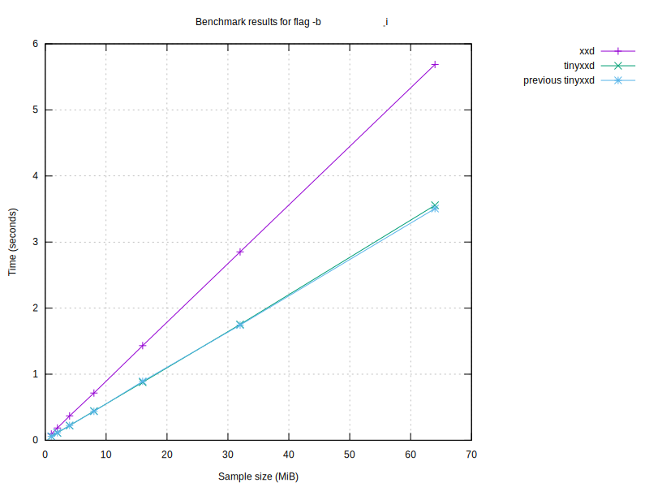

# Benchmark results

## Graphs

### Graph by sample size

### Graph for no flag

### Graph for flag '-p'

### Graph for flag '-i'

### Graph for flag '-e'

### Graph for flag '-b'

### Graph for flag '-u'

### Graph for flag '-E'

### Graph for flag '-b -i'

| Program | Size (MiB) | Conversion Time (s) | Flags |
|---------|------------|----------------------|-------|
| xxd | 64 | 1.33 |  |
| xxd | 64 | 2.27 | -r |
| xxd | 64 | 4.90 | -b |
| xxd | 64 | 4.84 | -r -b |
| xxd | 64 | 1.73 |  |
| xxd | 64 | 1.05 | -p |
| xxd | 64 | 4.99 | -i |
| xxd | 64 | 1.36 | -e |
| xxd | 64 | 2.70 | -b |
| xxd | 64 | 1.33 | -u |
| xxd | 64 | 1.53 | -E |
| xxd | 64 | 5.87 | -b -i |
| tinyxxd | 64 | 0.93 |  |
| tinyxxd | 64 | 1.15 | -r |
| tinyxxd | 64 | 5.23 | -b |
| tinyxxd | 64 | 1.60 | -r -b |
| tinyxxd | 64 | 1.21 |  |
| tinyxxd | 64 | 0.90 | -p |
| tinyxxd | 64 | 4.72 | -i |
| tinyxxd | 64 | 1.12 | -e |
| tinyxxd | 64 | 3.30 | -b |
| tinyxxd | 64 | 0.93 | -u |
| tinyxxd | 64 | 1.13 | -E |
| tinyxxd | 64 | 4.33 | -b -i |
| tinyxxd | 32 | 0.47 |  |
| tinyxxd | 32 | 0.46 | -r |
| tinyxxd | 32 | 2.08 | -b |
| tinyxxd | 32 | 0.79 | -r -b |
| tinyxxd | 32 | 0.54 |  |
| tinyxxd | 32 | 0.45 | -p |
| tinyxxd | 32 | 2.37 | -i |
| tinyxxd | 32 | 0.56 | -e |
| tinyxxd | 32 | 1.62 | -b |
| tinyxxd | 32 | 0.46 | -u |
| tinyxxd | 32 | 0.58 | -E |
| tinyxxd | 32 | 2.13 | -b -i |
| xxd | 32 | 0.66 |  |
| xxd | 32 | 1.12 | -r |
| xxd | 32 | 3.15 | -b |
| xxd | 32 | 2.26 | -r -b |
| xxd | 32 | 0.79 |  |
| xxd | 32 | 0.55 | -p |
| xxd | 32 | 2.51 | -i |
| xxd | 32 | 0.67 | -e |
| xxd | 32 | 1.35 | -b |
| xxd | 32 | 0.66 | -u |
| xxd | 32 | 0.75 | -E |
| xxd | 32 | 2.99 | -b -i |
| xxd | 16 | 0.33 |  |
| xxd | 16 | 0.58 | -r |
| xxd | 16 | 0.79 | -b |
| xxd | 16 | 1.18 | -r -b |
| xxd | 16 | 0.38 |  |
| xxd | 16 | 0.27 | -p |
| xxd | 16 | 1.24 | -i |
| xxd | 16 | 0.34 | -e |
| xxd | 16 | 0.67 | -b |
| xxd | 16 | 0.33 | -u |
| xxd | 16 | 0.37 | -E |
| xxd | 16 | 1.49 | -b -i |
| tinyxxd | 16 | 0.23 |  |
| tinyxxd | 16 | 0.23 | -r |
| tinyxxd | 16 | 0.99 | -b |
| tinyxxd | 16 | 0.39 | -r -b |
| tinyxxd | 16 | 0.27 |  |
| tinyxxd | 16 | 0.23 | -p |
| tinyxxd | 16 | 1.18 | -i |
| tinyxxd | 16 | 0.28 | -e |
| tinyxxd | 16 | 0.81 | -b |
| tinyxxd | 16 | 0.23 | -u |
| tinyxxd | 16 | 0.27 | -E |
| tinyxxd | 16 | 1.07 | -b -i |
| tinyxxd | 8 | 0.12 |  |
| tinyxxd | 8 | 0.12 | -r |
| tinyxxd | 8 | 0.43 | -b |
| tinyxxd | 8 | 0.20 | -r -b |
| tinyxxd | 8 | 0.14 |  |
| tinyxxd | 8 | 0.12 | -p |
| tinyxxd | 8 | 0.59 | -i |
| tinyxxd | 8 | 0.14 | -e |
| tinyxxd | 8 | 0.41 | -b |
| tinyxxd | 8 | 0.12 | -u |
| tinyxxd | 8 | 0.14 | -E |
| tinyxxd | 8 | 0.54 | -b -i |
| xxd | 8 | 0.17 |  |
| xxd | 8 | 0.30 | -r |
| xxd | 8 | 0.36 | -b |
| xxd | 8 | 0.58 | -r -b |
| xxd | 8 | 0.22 |  |
| xxd | 8 | 0.14 | -p |
| xxd | 8 | 0.63 | -i |
| xxd | 8 | 0.17 | -e |
| xxd | 8 | 0.34 | -b |
| xxd | 8 | 0.17 | -u |
| xxd | 8 | 0.18 | -E |
| xxd | 8 | 0.74 | -b -i |
| tinyxxd | 4 | 0.06 |  |
| tinyxxd | 4 | 0.06 | -r |
| tinyxxd | 4 | 0.22 | -b |
| tinyxxd | 4 | 0.10 | -r -b |
| tinyxxd | 4 | 0.07 |  |
| tinyxxd | 4 | 0.06 | -p |
| tinyxxd | 4 | 0.29 | -i |
| tinyxxd | 4 | 0.07 | -e |
| tinyxxd | 4 | 0.21 | -b |
| tinyxxd | 4 | 0.06 | -u |
| tinyxxd | 4 | 0.07 | -E |
| tinyxxd | 4 | 0.27 | -b -i |
| xxd | 4 | 0.09 |  |
| xxd | 4 | 0.15 | -r |
| xxd | 4 | 0.18 | -b |
| xxd | 4 | 0.29 | -r -b |
| xxd | 4 | 0.10 |  |
| xxd | 4 | 0.07 | -p |
| xxd | 4 | 0.31 | -i |
| xxd | 4 | 0.09 | -e |
| xxd | 4 | 0.18 | -b |
| xxd | 4 | 0.09 | -u |
| xxd | 4 | 0.09 | -E |
| xxd | 4 | 0.37 | -b -i |
| xxd | 2 | 0.05 |  |
| xxd | 2 | 0.08 | -r |
| xxd | 2 | 0.09 | -b |
| xxd | 2 | 0.15 | -r -b |
| xxd | 2 | 0.05 |  |
| xxd | 2 | 0.04 | -p |
| xxd | 2 | 0.16 | -i |
| xxd | 2 | 0.05 | -e |
| xxd | 2 | 0.09 | -b |
| xxd | 2 | 0.04 | -u |
| xxd | 2 | 0.05 | -E |
| xxd | 2 | 0.19 | -b -i |
| tinyxxd | 2 | 0.03 |  |
| tinyxxd | 2 | 0.03 | -r |
| tinyxxd | 2 | 0.11 | -b |
| tinyxxd | 2 | 0.05 | -r -b |
| tinyxxd | 2 | 0.04 |  |
| tinyxxd | 2 | 0.03 | -p |
| tinyxxd | 2 | 0.15 | -i |
| tinyxxd | 2 | 0.04 | -e |
| tinyxxd | 2 | 0.10 | -b |
| tinyxxd | 2 | 0.03 | -u |
| tinyxxd | 2 | 0.04 | -E |
| tinyxxd | 2 | 0.14 | -b -i |
| tinyxxd | 1 | 0.02 |  |
| tinyxxd | 1 | 0.02 | -r |
| tinyxxd | 1 | 0.06 | -b |
| tinyxxd | 1 | 0.03 | -r -b |
| tinyxxd | 1 | 0.02 |  |
| tinyxxd | 1 | 0.02 | -p |
| tinyxxd | 1 | 0.08 | -i |
| tinyxxd | 1 | 0.02 | -e |
| tinyxxd | 1 | 0.05 | -b |
| tinyxxd | 1 | 0.02 | -u |
| tinyxxd | 1 | 0.02 | -E |
| tinyxxd | 1 | 0.07 | -b -i |
| xxd | 1 | 0.02 |  |
| xxd | 1 | 0.04 | -r |
| xxd | 1 | 0.05 | -b |
| xxd | 1 | 0.08 | -r -b |
| xxd | 1 | 0.03 |  |
| xxd | 1 | 0.02 | -p |
| xxd | 1 | 0.08 | -i |
| xxd | 1 | 0.02 | -e |
| xxd | 1 | 0.04 | -b |
| xxd | 1 | 0.02 | -u |
| xxd | 1 | 0.03 | -E |
| xxd | 1 | 0.10 | -b -i |

## Performance Summaries
- For sample size 64 MiB, tinyxxd was 43.22% faster with no flag.
- For sample size 64 MiB, tinyxxd was 97.42% faster with flags '-r'.
- For sample size 64 MiB, xxd was 12.33% faster with flags '-b'.
- For sample size 64 MiB, tinyxxd was 202.32% faster with flags '-r -b'.
- For sample size 64 MiB, tinyxxd was 16.93% faster with flags '-p'.
- For sample size 64 MiB, tinyxxd was 5.66% faster with flags '-i'.
- For sample size 64 MiB, tinyxxd was 21.01% faster with flags '-e'.
- For sample size 64 MiB, tinyxxd was 43.70% faster with flags '-u'.
- For sample size 64 MiB, tinyxxd was 35.90% faster with flags '-E'.
- For sample size 64 MiB, tinyxxd was 35.43% faster with flags '-b -i'.
- For sample size 32 MiB, tinyxxd was 43.63% faster with no flag.
- For sample size 32 MiB, tinyxxd was 144.89% faster with flags '-r'.
- For sample size 32 MiB, tinyxxd was 21.21% faster with flags '-b'.
- For sample size 32 MiB, tinyxxd was 185.54% faster with flags '-r -b'.
- For sample size 32 MiB, tinyxxd was 20.51% faster with flags '-p'.
- For sample size 32 MiB, tinyxxd was 6.00% faster with flags '-i'.
- For sample size 32 MiB, tinyxxd was 18.86% faster with flags '-e'.
- For sample size 32 MiB, tinyxxd was 42.80% faster with flags '-u'.
- For sample size 32 MiB, tinyxxd was 29.37% faster with flags '-E'.
- For sample size 32 MiB, tinyxxd was 40.34% faster with flags '-b -i'.
- For sample size 16 MiB, tinyxxd was 42.37% faster with no flag.
- For sample size 16 MiB, tinyxxd was 147.34% faster with flags '-r'.
- For sample size 16 MiB, xxd was 23.20% faster with flags '-b'.
- For sample size 16 MiB, tinyxxd was 199.10% faster with flags '-r -b'.
- For sample size 16 MiB, tinyxxd was 17.51% faster with flags '-p'.
- For sample size 16 MiB, tinyxxd was 20.73% faster with flags '-e'.
- For sample size 16 MiB, tinyxxd was 47.14% faster with flags '-u'.
- For sample size 16 MiB, tinyxxd was 35.62% faster with flags '-E'.
- For sample size 16 MiB, tinyxxd was 39.90% faster with flags '-b -i'.
- For sample size 8 MiB, tinyxxd was 51.20% faster with no flag.
- For sample size 8 MiB, tinyxxd was 151.54% faster with flags '-r'.
- For sample size 8 MiB, xxd was 21.40% faster with flags '-b'.
- For sample size 8 MiB, tinyxxd was 188.15% faster with flags '-r -b'.
- For sample size 8 MiB, tinyxxd was 21.17% faster with flags '-p'.
- For sample size 8 MiB, tinyxxd was 5.80% faster with flags '-i'.
- For sample size 8 MiB, tinyxxd was 21.35% faster with flags '-e'.
- For sample size 8 MiB, tinyxxd was 42.48% faster with flags '-u'.
- For sample size 8 MiB, tinyxxd was 33.50% faster with flags '-E'.
- For sample size 8 MiB, tinyxxd was 38.82% faster with flags '-b -i'.
- For sample size 4 MiB, tinyxxd was 36.96% faster with no flag.
- For sample size 4 MiB, tinyxxd was 148.01% faster with flags '-r'.
- For sample size 4 MiB, xxd was 19.23% faster with flags '-b'.
- For sample size 4 MiB, tinyxxd was 185.69% faster with flags '-r -b'.
- For sample size 4 MiB, tinyxxd was 21.54% faster with flags '-p'.
- For sample size 4 MiB, tinyxxd was 6.69% faster with flags '-i'.
- For sample size 4 MiB, tinyxxd was 20.58% faster with flags '-e'.
- For sample size 4 MiB, tinyxxd was 48.68% faster with flags '-u'.
- For sample size 4 MiB, tinyxxd was 33.60% faster with flags '-E'.
- For sample size 4 MiB, tinyxxd was 37.76% faster with flags '-b -i'.
- For sample size 2 MiB, tinyxxd was 40.93% faster with no flag.
- For sample size 2 MiB, tinyxxd was 139.84% faster with flags '-r'.
- For sample size 2 MiB, xxd was 18.91% faster with flags '-b'.
- For sample size 2 MiB, tinyxxd was 180.38% faster with flags '-r -b'.
- For sample size 2 MiB, tinyxxd was 21.55% faster with flags '-p'.
- For sample size 2 MiB, tinyxxd was 6.68% faster with flags '-i'.
- For sample size 2 MiB, tinyxxd was 18.84% faster with flags '-e'.
- For sample size 2 MiB, tinyxxd was 43.10% faster with flags '-u'.
- For sample size 2 MiB, tinyxxd was 32.91% faster with flags '-E'.
- For sample size 2 MiB, tinyxxd was 39.41% faster with flags '-b -i'.
- For sample size 1 MiB, tinyxxd was 33.25% faster with no flag.
- For sample size 1 MiB, tinyxxd was 132.52% faster with flags '-r'.
- For sample size 1 MiB, xxd was 20.59% faster with flags '-b'.
- For sample size 1 MiB, tinyxxd was 172.90% faster with flags '-r -b'.
- For sample size 1 MiB, tinyxxd was 17.41% faster with flags '-p'.
- For sample size 1 MiB, tinyxxd was 6.64% faster with flags '-i'.
- For sample size 1 MiB, tinyxxd was 17.27% faster with flags '-e'.
- For sample size 1 MiB, tinyxxd was 38.34% faster with flags '-u'.
- For sample size 1 MiB, tinyxxd was 31.46% faster with flags '-E'.
- For sample size 1 MiB, tinyxxd was 38.32% faster with flags '-b -i'.

### Performance by sample size
- For sample 64 MiB, tinyxxd was 27.67% faster than xxd.
- For sample 32 MiB, tinyxxd was 39.35% faster than xxd.
- For sample 16 MiB, tinyxxd was 29.01% faster than xxd.
- For sample 8 MiB, tinyxxd was 30.49% faster than xxd.
- For sample 4 MiB, tinyxxd was 29.84% faster than xxd.
- For sample 2 MiB, tinyxxd was 30.05% faster than xxd.
- For sample 1 MiB, tinyxxd was 28.07% faster than xxd.

### Performance by flag
- tinyxxd was 43.38% faster with no flag.
- tinyxxd was 119.08% faster with flag '-r'.
- tinyxxd was 195.67% faster with flag '-r -b'.
- tinyxxd was 18.41% faster with flag '-p'.
- tinyxxd was 5.75% faster with flag '-i'.
- tinyxxd was 20.37% faster with flag '-e'.
- tinyxxd was 43.92% faster with flag '-u'.
- tinyxxd was 33.87% faster with flag '-E'.
- tinyxxd was 37.59% faster with flag '-b -i'.

### Performance compared to last run
- For sample 64 MiB with flags '', xxd improved by 24.28% compared to the last run.
- For sample 64 MiB with flags '-r', xxd slowed down by 0.44% compared to the last run.
- For sample 64 MiB with flags '-b', xxd slowed down by 79.88% compared to the last run.
- For sample 64 MiB with flags '-r_-b', xxd slowed down by 8.58% compared to the last run.
- For sample 64 MiB with flags '', xxd improved by 1.41% compared to the last run.
- For sample 64 MiB with flags '-p', xxd improved by 3.44% compared to the last run.
- For sample 64 MiB with flags '-i', xxd slowed down by 1.79% compared to the last run.
- For sample 64 MiB with flags '-e', xxd slowed down by 2.24% compared to the last run.
- For sample 64 MiB with flags '-b', xxd improved by 0.83% compared to the last run.
- For sample 64 MiB with flags '-u', xxd slowed down by 0.74% compared to the last run.
- For sample 64 MiB with flags '-E', xxd slowed down by 1.80% compared to the last run.
- For sample 64 MiB with flags '-b_-i', xxd improved by 1.15% compared to the last run.
- For sample 64 MiB with flags '', tinyxxd improved by 15.83% compared to the last run.
- For sample 64 MiB with flags '-r', tinyxxd slowed down by 34.20% compared to the last run.
- For sample 64 MiB with flags '-b', tinyxxd slowed down by 63.03% compared to the last run.
- For sample 64 MiB with flags '-r_-b', tinyxxd slowed down by 1.45% compared to the last run.
- For sample 64 MiB with flags '', tinyxxd slowed down by 9.54% compared to the last run.
- For sample 64 MiB with flags '-p', tinyxxd improved by 2.22% compared to the last run.
- For sample 64 MiB with flags '-i', tinyxxd slowed down by 1.39% compared to the last run.
- For sample 64 MiB with flags '-e', tinyxxd improved by 1.62% compared to the last run.
- For sample 64 MiB with flags '-b', tinyxxd slowed down by 3.02% compared to the last run.
- For sample 64 MiB with flags '-u', tinyxxd slowed down by 3.23% compared to the last run.
- For sample 64 MiB with flags '-E', tinyxxd slowed down by 6.11% compared to the last run.
- For sample 64 MiB with flags '-b_-i', tinyxxd slowed down by 5.85% compared to the last run.
- For sample 32 MiB with flags '', tinyxxd improved by 8.70% compared to the last run.
- For sample 32 MiB with flags '-r', tinyxxd slowed down by 8.38% compared to the last run.
- For sample 32 MiB with flags '-b', tinyxxd slowed down by 30.32% compared to the last run.
- For sample 32 MiB with flags '-r_-b', tinyxxd improved by 0.72% compared to the last run.
- For sample 32 MiB with flags '', tinyxxd slowed down by 5.78% compared to the last run.
- For sample 32 MiB with flags '-p', tinyxxd slowed down by 1.05% compared to the last run.
- For sample 32 MiB with flags '-i', tinyxxd slowed down by 3.39% compared to the last run.
- For sample 32 MiB with flags '-e', tinyxxd improved by 5.65% compared to the last run.
- For sample 32 MiB with flags '-b', tinyxxd slowed down by 1.51% compared to the last run.
- For sample 32 MiB with flags '-u', tinyxxd improved by 3.40% compared to the last run.
- For sample 32 MiB with flags '-E', tinyxxd slowed down by 10.94% compared to the last run.
- For sample 32 MiB with flags '-b_-i', tinyxxd slowed down by 0.20% compared to the last run.
- For sample 32 MiB with flags '', xxd improved by 11.66% compared to the last run.
- For sample 32 MiB with flags '-r', xxd improved by 2.76% compared to the last run.
- For sample 32 MiB with flags '-b', xxd slowed down by 135.46% compared to the last run.
- For sample 32 MiB with flags '-r_-b', xxd improved by 4.59% compared to the last run.
- For sample 32 MiB with flags '', xxd slowed down by 4.98% compared to the last run.
- For sample 32 MiB with flags '-p', xxd improved by 1.04% compared to the last run.
- For sample 32 MiB with flags '-i', xxd slowed down by 3.57% compared to the last run.
- For sample 32 MiB with flags '-e', xxd improved by 1.35% compared to the last run.
- For sample 32 MiB with flags '-b', xxd slowed down by 0.86% compared to the last run.
- For sample 32 MiB with flags '-u', xxd slowed down by 0.47% compared to the last run.
- For sample 32 MiB with flags '-E', xxd slowed down by 1.96% compared to the last run.
- For sample 32 MiB with flags '-b_-i', xxd slowed down by 1.03% compared to the last run.
- For sample 16 MiB with flags '', xxd improved by 12.99% compared to the last run.
- For sample 16 MiB with flags '-r', xxd improved by 0.71% compared to the last run.
- For sample 16 MiB with flags '-b', xxd slowed down by 17.01% compared to the last run.
- For sample 16 MiB with flags '-r_-b', xxd slowed down by 6.54% compared to the last run.
- For sample 16 MiB with flags '', xxd improved by 1.24% compared to the last run.
- For sample 16 MiB with flags '-p', xxd slowed down by 2.12% compared to the last run.
- For sample 16 MiB with flags '-i', xxd slowed down by 2.28% compared to the last run.
- For sample 16 MiB with flags '-e', xxd slowed down by 1.21% compared to the last run.
- For sample 16 MiB with flags '-b', xxd improved by 0.03% compared to the last run.
- For sample 16 MiB with flags '-u', xxd improved by 0.22% compared to the last run.
- For sample 16 MiB with flags '-E', xxd improved by 0.87% compared to the last run.
- For sample 16 MiB with flags '-b_-i', xxd slowed down by 0.02% compared to the last run.
- For sample 16 MiB with flags '', tinyxxd improved by 13.78% compared to the last run.
- For sample 16 MiB with flags '-r', tinyxxd slowed down by 11.50% compared to the last run.
- For sample 16 MiB with flags '-b', tinyxxd slowed down by 19.91% compared to the last run.
- For sample 16 MiB with flags '-r_-b', tinyxxd improved by 0.37% compared to the last run.
- For sample 16 MiB with flags '', tinyxxd slowed down by 4.31% compared to the last run.
- For sample 16 MiB with flags '-p', tinyxxd slowed down by 0.92% compared to the last run.
- For sample 16 MiB with flags '-i', tinyxxd slowed down by 2.31% compared to the last run.
- For sample 16 MiB with flags '-e', tinyxxd slowed down by 1.39% compared to the last run.
- For sample 16 MiB with flags '-b', tinyxxd improved by 1.76% compared to the last run.
- For sample 16 MiB with flags '-u', tinyxxd slowed down by 4.05% compared to the last run.
- For sample 16 MiB with flags '-E', tinyxxd slowed down by 1.69% compared to the last run.
- For sample 16 MiB with flags '-b_-i', tinyxxd slowed down by 3.88% compared to the last run.
- For sample 8 MiB with flags '', tinyxxd improved by 11.43% compared to the last run.
- For sample 8 MiB with flags '-r', tinyxxd slowed down by 6.95% compared to the last run.
- For sample 8 MiB with flags '-b', tinyxxd slowed down by 7.99% compared to the last run.
- For sample 8 MiB with flags '-r_-b', tinyxxd slowed down by 0.13% compared to the last run.
- For sample 8 MiB with flags '', tinyxxd slowed down by 5.67% compared to the last run.
- For sample 8 MiB with flags '-p', tinyxxd slowed down by 0.17% compared to the last run.
- For sample 8 MiB with flags '-i', tinyxxd slowed down by 2.68% compared to the last run.
- For sample 8 MiB with flags '-e', tinyxxd slowed down by 1.43% compared to the last run.
- For sample 8 MiB with flags '-b', tinyxxd slowed down by 2.40% compared to the last run.
- For sample 8 MiB with flags '-u', tinyxxd slowed down by 6.18% compared to the last run.
- For sample 8 MiB with flags '-E', tinyxxd slowed down by 3.15% compared to the last run.
- For sample 8 MiB with flags '-b_-i', tinyxxd slowed down by 3.91% compared to the last run.
- For sample 8 MiB with flags '', xxd improved by 12.37% compared to the last run.
- For sample 8 MiB with flags '-r', xxd slowed down by 1.26% compared to the last run.
- For sample 8 MiB with flags '-b', xxd slowed down by 5.66% compared to the last run.
- For sample 8 MiB with flags '-r_-b', xxd slowed down by 4.77% compared to the last run.
- For sample 8 MiB with flags '', xxd slowed down by 14.29% compared to the last run.
- For sample 8 MiB with flags '-p', xxd slowed down by 1.66% compared to the last run.
- For sample 8 MiB with flags '-i', xxd slowed down by 1.62% compared to the last run.
- For sample 8 MiB with flags '-e', xxd slowed down by 0.26% compared to the last run.
- For sample 8 MiB with flags '-b', xxd improved by 0.93% compared to the last run.
- For sample 8 MiB with flags '-u', xxd improved by 4.30% compared to the last run.
- For sample 8 MiB with flags '-E', xxd improved by 3.57% compared to the last run.
- For sample 8 MiB with flags '-b_-i', xxd slowed down by 1.52% compared to the last run.
- For sample 4 MiB with flags '', tinyxxd improved by 11.65% compared to the last run.
- For sample 4 MiB with flags '-r', tinyxxd slowed down by 6.73% compared to the last run.
- For sample 4 MiB with flags '-b', tinyxxd slowed down by 8.64% compared to the last run.
- For sample 4 MiB with flags '-r_-b', tinyxxd slowed down by 0.67% compared to the last run.
- For sample 4 MiB with flags '', tinyxxd slowed down by 6.67% compared to the last run.
- For sample 4 MiB with flags '-p', tinyxxd improved by 1.12% compared to the last run.
- For sample 4 MiB with flags '-i', tinyxxd improved by 7.33% compared to the last run.
- For sample 4 MiB with flags '-e', tinyxxd improved by 0.60% compared to the last run.
- For sample 4 MiB with flags '-b', tinyxxd slowed down by 2.34% compared to the last run.
- For sample 4 MiB with flags '-u', tinyxxd slowed down by 3.54% compared to the last run.
- For sample 4 MiB with flags '-E', tinyxxd slowed down by 2.75% compared to the last run.
- For sample 4 MiB with flags '-b_-i', tinyxxd slowed down by 4.15% compared to the last run.
- For sample 4 MiB with flags '', xxd improved by 11.52% compared to the last run.
- For sample 4 MiB with flags '-r', xxd slowed down by 0.88% compared to the last run.
- For sample 4 MiB with flags '-b', xxd slowed down by 4.89% compared to the last run.
- For sample 4 MiB with flags '-r_-b', xxd slowed down by 0.52% compared to the last run.
- For sample 4 MiB with flags '', xxd slowed down by 0.10% compared to the last run.
- For sample 4 MiB with flags '-p', xxd slowed down by 1.47% compared to the last run.
- For sample 4 MiB with flags '-i', xxd slowed down by 2.17% compared to the last run.
- For sample 4 MiB with flags '-e', xxd improved by 1.74% compared to the last run.
- For sample 4 MiB with flags '-b', xxd slowed down by 3.00% compared to the last run.
- For sample 4 MiB with flags '-u', xxd slowed down by 3.18% compared to the last run.
- For sample 4 MiB with flags '-E', xxd improved by 2.15% compared to the last run.
- For sample 4 MiB with flags '-b_-i', xxd improved by 0.77% compared to the last run.
- For sample 2 MiB with flags '', xxd improved by 11.61% compared to the last run.
- For sample 2 MiB with flags '-r', xxd slowed down by 1.58% compared to the last run.
- For sample 2 MiB with flags '-b', xxd slowed down by 6.01% compared to the last run.
- For sample 2 MiB with flags '-r_-b', xxd slowed down by 3.80% compared to the last run.
- For sample 2 MiB with flags '', xxd improved by 0.66% compared to the last run.
- For sample 2 MiB with flags '-p', xxd improved by 1.65% compared to the last run.
- For sample 2 MiB with flags '-i', xxd slowed down by 0.56% compared to the last run.
- For sample 2 MiB with flags '-e', xxd improved by 2.09% compared to the last run.
- For sample 2 MiB with flags '-b', xxd improved by 0.24% compared to the last run.
- For sample 2 MiB with flags '-u', xxd improved by 2.92% compared to the last run.
- For sample 2 MiB with flags '-E', xxd improved by 2.37% compared to the last run.
- For sample 2 MiB with flags '-b_-i', xxd improved by 0.20% compared to the last run.
- For sample 2 MiB with flags '', tinyxxd improved by 15.81% compared to the last run.
- For sample 2 MiB with flags '-r', tinyxxd slowed down by 6.70% compared to the last run.
- For sample 2 MiB with flags '-b', tinyxxd slowed down by 5.72% compared to the last run.
- For sample 2 MiB with flags '-r_-b', tinyxxd improved by 1.57% compared to the last run.
- For sample 2 MiB with flags '', tinyxxd improved by 1.76% compared to the last run.
- For sample 2 MiB with flags '-p', tinyxxd improved by 4.00% compared to the last run.
- For sample 2 MiB with flags '-i', tinyxxd improved by 0.88% compared to the last run.
- For sample 2 MiB with flags '-e', tinyxxd improved by 1.33% compared to the last run.
- For sample 2 MiB with flags '-b', tinyxxd improved by 0.01% compared to the last run.
- For sample 2 MiB with flags '-u', tinyxxd slowed down by 0.21% compared to the last run.
- For sample 2 MiB with flags '-E', tinyxxd improved by 0.31% compared to the last run.
- For sample 2 MiB with flags '-b_-i', tinyxxd slowed down by 2.43% compared to the last run.
- For sample 1 MiB with flags '', tinyxxd improved by 14.72% compared to the last run.
- For sample 1 MiB with flags '-r', tinyxxd improved by 1.42% compared to the last run.
- For sample 1 MiB with flags '-b', tinyxxd slowed down by 6.01% compared to the last run.
- For sample 1 MiB with flags '-r_-b', tinyxxd improved by 2.60% compared to the last run.
- For sample 1 MiB with flags '', tinyxxd improved by 2.15% compared to the last run.
- For sample 1 MiB with flags '-p', tinyxxd improved by 5.25% compared to the last run.
- For sample 1 MiB with flags '-i', tinyxxd improved by 0.94% compared to the last run.
- For sample 1 MiB with flags '-e', tinyxxd improved by 3.35% compared to the last run.
- For sample 1 MiB with flags '-b', tinyxxd improved by 0.89% compared to the last run.
- For sample 1 MiB with flags '-u', tinyxxd improved by 7.70% compared to the last run.
- For sample 1 MiB with flags '-E', tinyxxd improved by 8.10% compared to the last run.
- For sample 1 MiB with flags '-b_-i', tinyxxd slowed down by 0.96% compared to the last run.
- For sample 1 MiB with flags '', xxd improved by 13.97% compared to the last run.
- For sample 1 MiB with flags '-r', xxd improved by 3.05% compared to the last run.
- For sample 1 MiB with flags '-b', xxd slowed down by 1.86% compared to the last run.
- For sample 1 MiB with flags '-r_-b', xxd slowed down by 1.09% compared to the last run.
- For sample 1 MiB with flags '', xxd improved by 2.00% compared to the last run.
- For sample 1 MiB with flags '-p', xxd improved by 4.69% compared to the last run.
- For sample 1 MiB with flags '-i', xxd slowed down by 0.68% compared to the last run.
- For sample 1 MiB with flags '-e', xxd improved by 6.00% compared to the last run.
- For sample 1 MiB with flags '-b', xxd improved by 5.03% compared to the last run.
- For sample 1 MiB with flags '-u', xxd improved by 5.43% compared to the last run.
- For sample 1 MiB with flags '-E', xxd improved by 5.63% compared to the last run.
- For sample 1 MiB with flags '-b_-i', xxd improved by 0.24% compared to the last run.
---
Report generated on: 2026-02-13T08:52:19.920836
