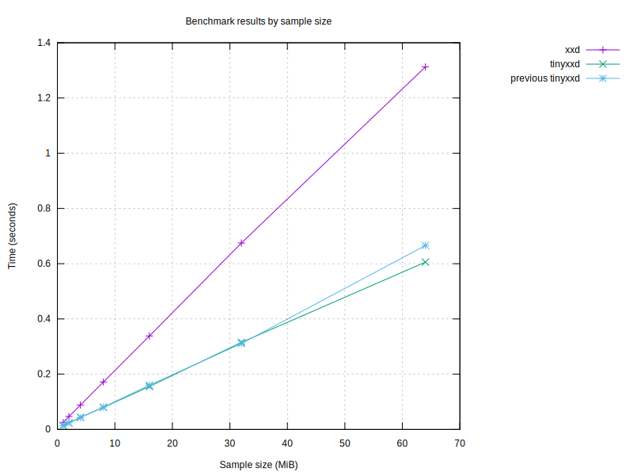
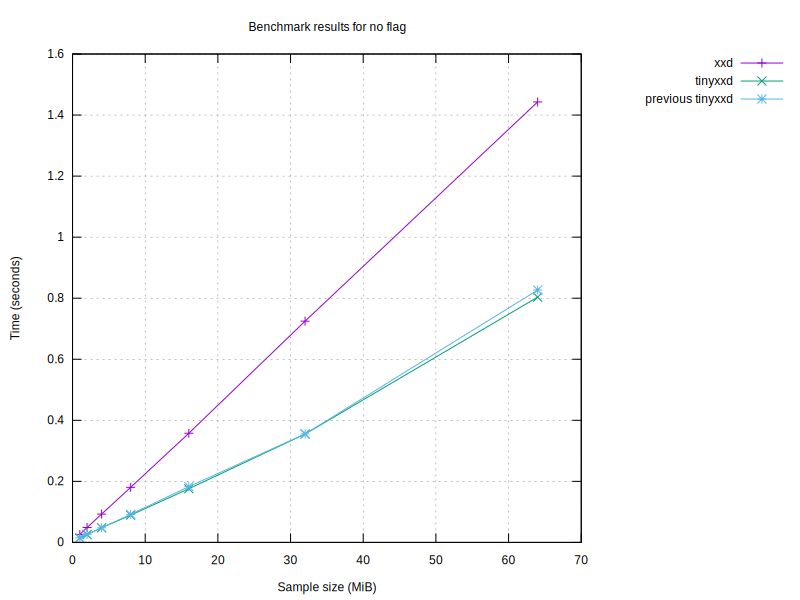
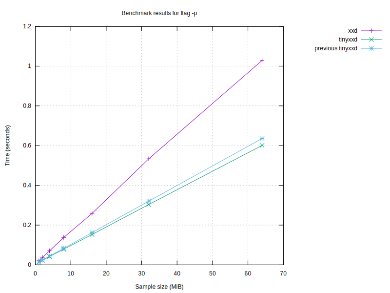
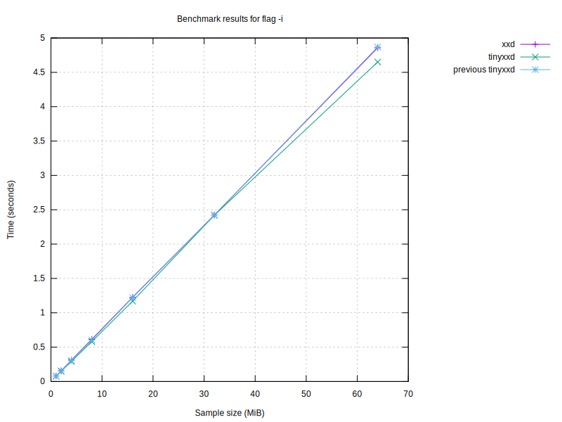
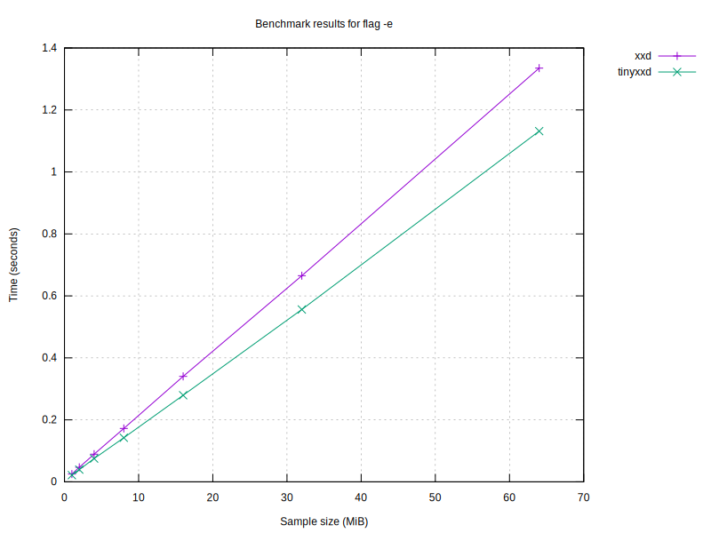
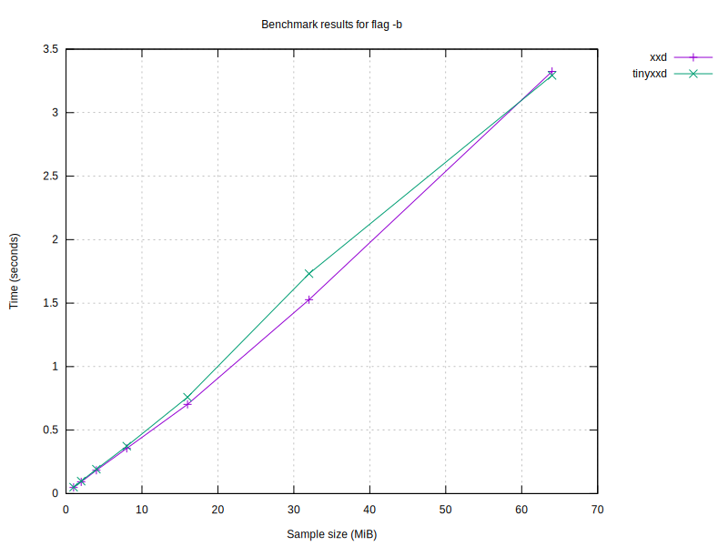
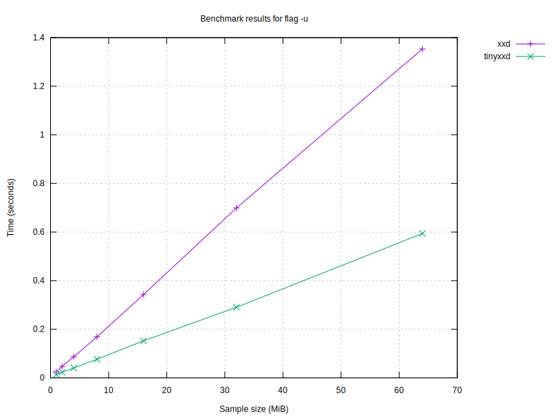
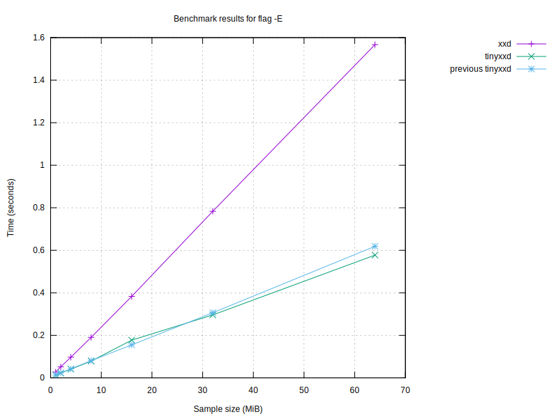
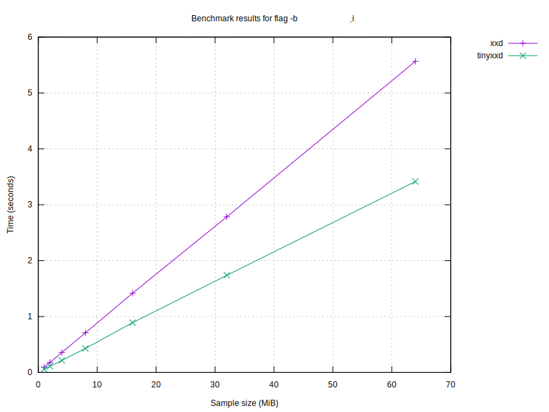

# Benchmark results

## Graphs

### Graph by sample size

### Graph for no flag

### Graph for flag '-p'

### Graph for flag '-i'

### Graph for flag '-e'

### Graph for flag '-b'

### Graph for flag '-u'

### Graph for flag '-E'

### Graph for flag '-b -i'

| Program | Size (MiB) | Conversion Time (s) | Flags |
|---------|------------|----------------------|-------|
| xxd | 64 | 1.14 |  |
| xxd | 64 | 2.11 | -r |
| xxd | 64 | 3.68 | -b |
| xxd | 64 | 3.45 | -r -b |
| xxd | 64 | 1.71 |  |
| xxd | 64 | 0.77 | -p |
| xxd | 64 | 4.14 | -i |
| xxd | 64 | 1.15 | -e |
| xxd | 64 | 2.23 | -b |
| xxd | 64 | 1.14 | -u |
| xxd | 64 | 1.31 | -E |
| xxd | 64 | 4.19 | -b -i |
| tinyxxd | 64 | 0.76 |  |
| tinyxxd | 64 | 0.86 | -r |
| tinyxxd | 64 | 3.78 | -b |
| tinyxxd | 64 | 1.39 | -r -b |
| tinyxxd | 64 | 0.98 |  |
| tinyxxd | 64 | 0.64 | -p |
| tinyxxd | 64 | 4.12 | -i |
| tinyxxd | 64 | 0.90 | -e |
| tinyxxd | 64 | 2.12 | -b |
| tinyxxd | 64 | 0.77 | -u |
| tinyxxd | 64 | 0.80 | -E |
| tinyxxd | 64 | 2.64 | -b -i |
| xxd | 32 | 0.57 |  |
| xxd | 32 | 1.06 | -r |
| xxd | 32 | 1.56 | -b |
| xxd | 32 | 1.72 | -r -b |
| xxd | 32 | 0.64 |  |
| xxd | 32 | 0.38 | -p |
| xxd | 32 | 2.15 | -i |
| xxd | 32 | 0.57 | -e |
| xxd | 32 | 1.11 | -b |
| xxd | 32 | 0.57 | -u |
| xxd | 32 | 0.66 | -E |
| xxd | 32 | 2.07 | -b -i |
| tinyxxd | 32 | 0.39 |  |
| tinyxxd | 32 | 0.42 | -r |
| tinyxxd | 32 | 2.93 | -b |
| tinyxxd | 32 | 0.71 | -r -b |
| tinyxxd | 32 | 0.46 |  |
| tinyxxd | 32 | 0.32 | -p |
| tinyxxd | 32 | 2.04 | -i |
| tinyxxd | 32 | 0.46 | -e |
| tinyxxd | 32 | 1.04 | -b |
| tinyxxd | 32 | 0.38 | -u |
| tinyxxd | 32 | 0.40 | -E |
| tinyxxd | 32 | 1.33 | -b -i |
| tinyxxd | 16 | 0.19 |  |
| tinyxxd | 16 | 0.21 | -r |
| tinyxxd | 16 | 0.70 | -b |
| tinyxxd | 16 | 0.35 | -r -b |
| tinyxxd | 16 | 0.22 |  |
| tinyxxd | 16 | 0.16 | -p |
| tinyxxd | 16 | 1.02 | -i |
| tinyxxd | 16 | 0.25 | -e |
| tinyxxd | 16 | 0.52 | -b |
| tinyxxd | 16 | 0.19 | -u |
| tinyxxd | 16 | 0.20 | -E |
| tinyxxd | 16 | 0.65 | -b -i |
| xxd | 16 | 0.29 |  |
| xxd | 16 | 0.53 | -r |
| xxd | 16 | 0.71 | -b |
| xxd | 16 | 0.86 | -r -b |
| xxd | 16 | 0.31 |  |
| xxd | 16 | 0.19 | -p |
| xxd | 16 | 1.03 | -i |
| xxd | 16 | 0.29 | -e |
| xxd | 16 | 0.56 | -b |
| xxd | 16 | 0.29 | -u |
| xxd | 16 | 0.33 | -E |
| xxd | 16 | 1.03 | -b -i |
| tinyxxd | 8 | 0.10 |  |
| tinyxxd | 8 | 0.11 | -r |
| tinyxxd | 8 | 0.29 | -b |
| tinyxxd | 8 | 0.18 | -r -b |
| tinyxxd | 8 | 0.11 |  |
| tinyxxd | 8 | 0.09 | -p |
| tinyxxd | 8 | 0.51 | -i |
| tinyxxd | 8 | 0.12 | -e |
| tinyxxd | 8 | 0.27 | -b |
| tinyxxd | 8 | 0.10 | -u |
| tinyxxd | 8 | 0.10 | -E |
| tinyxxd | 8 | 0.33 | -b -i |
| xxd | 8 | 0.14 |  |
| xxd | 8 | 0.27 | -r |
| xxd | 8 | 0.31 | -b |
| xxd | 8 | 0.44 | -r -b |
| xxd | 8 | 0.16 |  |
| xxd | 8 | 0.10 | -p |
| xxd | 8 | 0.52 | -i |
| xxd | 8 | 0.15 | -e |
| xxd | 8 | 0.28 | -b |
| xxd | 8 | 0.15 | -u |
| xxd | 8 | 0.17 | -E |
| xxd | 8 | 0.52 | -b -i |
| xxd | 4 | 0.08 |  |
| xxd | 4 | 0.14 | -r |
| xxd | 4 | 0.16 | -b |
| xxd | 4 | 0.22 | -r -b |
| xxd | 4 | 0.08 |  |
| xxd | 4 | 0.05 | -p |
| xxd | 4 | 0.26 | -i |
| xxd | 4 | 0.07 | -e |
| xxd | 4 | 0.14 | -b |
| xxd | 4 | 0.07 | -u |
| xxd | 4 | 0.09 | -E |
| xxd | 4 | 0.26 | -b -i |
| tinyxxd | 4 | 0.05 |  |
| tinyxxd | 4 | 0.06 | -r |
| tinyxxd | 4 | 0.14 | -b |
| tinyxxd | 4 | 0.10 | -r -b |
| tinyxxd | 4 | 0.06 |  |
| tinyxxd | 4 | 0.04 | -p |
| tinyxxd | 4 | 0.26 | -i |
| tinyxxd | 4 | 0.06 | -e |
| tinyxxd | 4 | 0.13 | -b |
| tinyxxd | 4 | 0.05 | -u |
| tinyxxd | 4 | 0.05 | -E |
| tinyxxd | 4 | 0.17 | -b -i |
| xxd | 2 | 0.04 |  |
| xxd | 2 | 0.07 | -r |
| xxd | 2 | 0.08 | -b |
| xxd | 2 | 0.11 | -r -b |
| xxd | 2 | 0.04 |  |
| xxd | 2 | 0.03 | -p |
| xxd | 2 | 0.13 | -i |
| xxd | 2 | 0.04 | -e |
| xxd | 2 | 0.07 | -b |
| xxd | 2 | 0.04 | -u |
| xxd | 2 | 0.04 | -E |
| xxd | 2 | 0.13 | -b -i |
| tinyxxd | 2 | 0.03 |  |
| tinyxxd | 2 | 0.03 | -r |
| tinyxxd | 2 | 0.07 | -b |
| tinyxxd | 2 | 0.05 | -r -b |
| tinyxxd | 2 | 0.03 |  |
| tinyxxd | 2 | 0.02 | -p |
| tinyxxd | 2 | 0.13 | -i |
| tinyxxd | 2 | 0.03 | -e |
| tinyxxd | 2 | 0.07 | -b |
| tinyxxd | 2 | 0.03 | -u |
| tinyxxd | 2 | 0.03 | -E |
| tinyxxd | 2 | 0.08 | -b -i |
| xxd | 1 | 0.02 |  |
| xxd | 1 | 0.04 | -r |
| xxd | 1 | 0.04 | -b |
| xxd | 1 | 0.06 | -r -b |
| xxd | 1 | 0.02 |  |
| xxd | 1 | 0.02 | -p |
| xxd | 1 | 0.07 | -i |
| xxd | 1 | 0.02 | -e |
| xxd | 1 | 0.04 | -b |
| xxd | 1 | 0.02 | -u |
| xxd | 1 | 0.02 | -E |
| xxd | 1 | 0.07 | -b -i |
| tinyxxd | 1 | 0.02 |  |
| tinyxxd | 1 | 0.02 | -r |
| tinyxxd | 1 | 0.04 | -b |
| tinyxxd | 1 | 0.03 | -r -b |
| tinyxxd | 1 | 0.02 |  |
| tinyxxd | 1 | 0.01 | -p |
| tinyxxd | 1 | 0.07 | -i |
| tinyxxd | 1 | 0.02 | -e |
| tinyxxd | 1 | 0.04 | -b |
| tinyxxd | 1 | 0.01 | -u |
| tinyxxd | 1 | 0.02 | -E |
| tinyxxd | 1 | 0.04 | -b -i |

## Performance Summaries
- For sample size 64 MiB, tinyxxd was 63.91% faster with no flag.
- For sample size 64 MiB, tinyxxd was 143.74% faster with flags '-r'.
- For sample size 64 MiB, tinyxxd was 149.39% faster with flags '-r -b'.
- For sample size 64 MiB, tinyxxd was 21.40% faster with flags '-p'.
- For sample size 64 MiB, tinyxxd was 27.24% faster with flags '-e'.
- For sample size 64 MiB, tinyxxd was 47.59% faster with flags '-u'.
- For sample size 64 MiB, tinyxxd was 64.40% faster with flags '-E'.
- For sample size 64 MiB, tinyxxd was 58.45% faster with flags '-b -i'.
- For sample size 32 MiB, tinyxxd was 42.97% faster with no flag.
- For sample size 32 MiB, tinyxxd was 151.19% faster with flags '-r'.
- For sample size 32 MiB, xxd was 49.15% faster with flags '-b'.
- For sample size 32 MiB, tinyxxd was 144.05% faster with flags '-r -b'.
- For sample size 32 MiB, tinyxxd was 19.48% faster with flags '-p'.
- For sample size 32 MiB, tinyxxd was 5.50% faster with flags '-i'.
- For sample size 32 MiB, tinyxxd was 23.94% faster with flags '-e'.
- For sample size 32 MiB, tinyxxd was 50.44% faster with flags '-u'.
- For sample size 32 MiB, tinyxxd was 65.39% faster with flags '-E'.
- For sample size 32 MiB, tinyxxd was 55.98% faster with flags '-b -i'.
- For sample size 16 MiB, tinyxxd was 46.36% faster with no flag.
- For sample size 16 MiB, tinyxxd was 153.22% faster with flags '-r'.
- For sample size 16 MiB, tinyxxd was 143.99% faster with flags '-r -b'.
- For sample size 16 MiB, tinyxxd was 19.37% faster with flags '-p'.
- For sample size 16 MiB, tinyxxd was 17.02% faster with flags '-e'.
- For sample size 16 MiB, tinyxxd was 50.59% faster with flags '-u'.
- For sample size 16 MiB, tinyxxd was 64.21% faster with flags '-E'.
- For sample size 16 MiB, tinyxxd was 59.25% faster with flags '-b -i'.
- For sample size 8 MiB, tinyxxd was 43.60% faster with no flag.
- For sample size 8 MiB, tinyxxd was 148.20% faster with flags '-r'.
- For sample size 8 MiB, tinyxxd was 5.42% faster with flags '-b'.
- For sample size 8 MiB, tinyxxd was 145.19% faster with flags '-r -b'.
- For sample size 8 MiB, tinyxxd was 6.67% faster with flags '-p'.
- For sample size 8 MiB, tinyxxd was 26.32% faster with flags '-e'.
- For sample size 8 MiB, tinyxxd was 56.83% faster with flags '-u'.
- For sample size 8 MiB, tinyxxd was 62.02% faster with flags '-E'.
- For sample size 8 MiB, tinyxxd was 58.94% faster with flags '-b -i'.
- For sample size 4 MiB, tinyxxd was 47.24% faster with no flag.
- For sample size 4 MiB, tinyxxd was 137.15% faster with flags '-r'.
- For sample size 4 MiB, tinyxxd was 10.07% faster with flags '-b'.
- For sample size 4 MiB, tinyxxd was 123.10% faster with flags '-r -b'.
- For sample size 4 MiB, tinyxxd was 18.46% faster with flags '-p'.
- For sample size 4 MiB, tinyxxd was 24.04% faster with flags '-e'.
- For sample size 4 MiB, tinyxxd was 46.78% faster with flags '-u'.
- For sample size 4 MiB, tinyxxd was 61.06% faster with flags '-E'.
- For sample size 4 MiB, tinyxxd was 58.49% faster with flags '-b -i'.
- For sample size 2 MiB, tinyxxd was 44.72% faster with no flag.
- For sample size 2 MiB, tinyxxd was 131.59% faster with flags '-r'.
- For sample size 2 MiB, tinyxxd was 7.42% faster with flags '-b'.
- For sample size 2 MiB, tinyxxd was 135.68% faster with flags '-r -b'.
- For sample size 2 MiB, tinyxxd was 18.06% faster with flags '-p'.
- For sample size 2 MiB, tinyxxd was 25.88% faster with flags '-e'.
- For sample size 2 MiB, tinyxxd was 45.68% faster with flags '-u'.
- For sample size 2 MiB, tinyxxd was 57.55% faster with flags '-E'.
- For sample size 2 MiB, tinyxxd was 57.07% faster with flags '-b -i'.
- For sample size 1 MiB, tinyxxd was 41.84% faster with no flag.
- For sample size 1 MiB, tinyxxd was 124.64% faster with flags '-r'.
- For sample size 1 MiB, tinyxxd was 7.03% faster with flags '-b'.
- For sample size 1 MiB, tinyxxd was 130.86% faster with flags '-r -b'.
- For sample size 1 MiB, tinyxxd was 15.13% faster with flags '-p'.
- For sample size 1 MiB, tinyxxd was 19.59% faster with flags '-e'.
- For sample size 1 MiB, tinyxxd was 39.24% faster with flags '-u'.
- For sample size 1 MiB, tinyxxd was 51.06% faster with flags '-E'.
- For sample size 1 MiB, tinyxxd was 55.31% faster with flags '-b -i'.

### Performance by sample size
- For sample 64 MiB, tinyxxd was 36.73% faster than xxd.
- For sample 32 MiB, tinyxxd was 20.12% faster than xxd.
- For sample 16 MiB, tinyxxd was 37.73% faster than xxd.
- For sample 8 MiB, tinyxxd was 38.81% faster than xxd.
- For sample 4 MiB, tinyxxd was 39.19% faster than xxd.
- For sample 2 MiB, tinyxxd was 38.46% faster than xxd.
- For sample 1 MiB, tinyxxd was 36.68% faster than xxd.

### Performance by flag
- tinyxxd was 54.28% faster with no flag.
- tinyxxd was 146.42% faster with flag '-r'.
- xxd was 10.77% faster with flag '-b'.
- tinyxxd was 145.76% faster with flag '-r -b'.
- tinyxxd was 19.40% faster with flag '-p'.
- tinyxxd was 24.77% faster with flag '-e'.
- tinyxxd was 49.11% faster with flag '-u'.
- tinyxxd was 64.11% faster with flag '-E'.
- tinyxxd was 57.91% faster with flag '-b -i'.

### Performance compared to last run
- For sample 64 MiB with flags '', xxd improved by 35.72% compared to the last run.
- For sample 64 MiB with flags '-r', xxd improved by 6.54% compared to the last run.
- For sample 64 MiB with flags '-b', xxd slowed down by 33.22% compared to the last run.
- For sample 64 MiB with flags '-r_-b', xxd improved by 24.09% compared to the last run.
- For sample 64 MiB with flags '', xxd improved by 3.33% compared to the last run.
- For sample 64 MiB with flags '-p', xxd improved by 31.10% compared to the last run.
- For sample 64 MiB with flags '-i', xxd improved by 17.03% compared to the last run.
- For sample 64 MiB with flags '-e', xxd improved by 18.18% compared to the last run.
- For sample 64 MiB with flags '-b', xxd improved by 19.37% compared to the last run.
- For sample 64 MiB with flags '-u', xxd improved by 15.06% compared to the last run.
- For sample 64 MiB with flags '-E', xxd improved by 12.05% compared to the last run.
- For sample 64 MiB with flags '-b_-i', xxd improved by 26.69% compared to the last run.
- For sample 64 MiB with flags '', tinyxxd improved by 27.99% compared to the last run.
- For sample 64 MiB with flags '-r', tinyxxd slowed down by 2.01% compared to the last run.
- For sample 64 MiB with flags '-b', tinyxxd slowed down by 17.02% compared to the last run.
- For sample 64 MiB with flags '-r_-b', tinyxxd improved by 36.59% compared to the last run.
- For sample 64 MiB with flags '', tinyxxd improved by 7.87% compared to the last run.
- For sample 64 MiB with flags '-p', tinyxxd improved by 28.11% compared to the last run.
- For sample 64 MiB with flags '-i', tinyxxd improved by 11.28% compared to the last run.
- For sample 64 MiB with flags '-e', tinyxxd improved by 21.75% compared to the last run.
- For sample 64 MiB with flags '-b', tinyxxd improved by 34.36% compared to the last run.
- For sample 64 MiB with flags '-u', tinyxxd improved by 10.05% compared to the last run.
- For sample 64 MiB with flags '-E', tinyxxd improved by 5.30% compared to the last run.
- For sample 64 MiB with flags '-b_-i', tinyxxd improved by 36.52% compared to the last run.
- For sample 32 MiB with flags '', xxd improved by 29.81% compared to the last run.
- For sample 32 MiB with flags '-r', xxd improved by 8.67% compared to the last run.
- For sample 32 MiB with flags '-b', xxd slowed down by 13.99% compared to the last run.
- For sample 32 MiB with flags '-r_-b', xxd improved by 23.25% compared to the last run.
- For sample 32 MiB with flags '', xxd improved by 21.81% compared to the last run.
- For sample 32 MiB with flags '-p', xxd improved by 31.77% compared to the last run.
- For sample 32 MiB with flags '-i', xxd improved by 13.24% compared to the last run.
- For sample 32 MiB with flags '-e', xxd improved by 14.62% compared to the last run.
- For sample 32 MiB with flags '-b', xxd improved by 18.90% compared to the last run.
- For sample 32 MiB with flags '-u', xxd improved by 14.14% compared to the last run.
- For sample 32 MiB with flags '-E', xxd improved by 10.95% compared to the last run.
- For sample 32 MiB with flags '-b_-i', xxd improved by 27.77% compared to the last run.
- For sample 32 MiB with flags '', tinyxxd improved by 23.56% compared to the last run.
- For sample 32 MiB with flags '-r', tinyxxd improved by 4.43% compared to the last run.
- For sample 32 MiB with flags '-b', tinyxxd slowed down by 76.96% compared to the last run.
- For sample 32 MiB with flags '-r_-b', tinyxxd improved by 23.89% compared to the last run.
- For sample 32 MiB with flags '', tinyxxd improved by 9.04% compared to the last run.
- For sample 32 MiB with flags '-p', tinyxxd improved by 28.07% compared to the last run.
- For sample 32 MiB with flags '-i', tinyxxd improved by 13.43% compared to the last run.
- For sample 32 MiB with flags '-e', tinyxxd improved by 17.76% compared to the last run.
- For sample 32 MiB with flags '-b', tinyxxd improved by 37.13% compared to the last run.
- For sample 32 MiB with flags '-u', tinyxxd improved by 10.85% compared to the last run.
- For sample 32 MiB with flags '-E', tinyxxd improved by 12.76% compared to the last run.
- For sample 32 MiB with flags '-b_-i', tinyxxd improved by 36.33% compared to the last run.
- For sample 16 MiB with flags '', tinyxxd improved by 25.17% compared to the last run.
- For sample 16 MiB with flags '-r', tinyxxd improved by 3.92% compared to the last run.
- For sample 16 MiB with flags '-b', tinyxxd improved by 13.60% compared to the last run.
- For sample 16 MiB with flags '-r_-b', tinyxxd improved by 23.65% compared to the last run.
- For sample 16 MiB with flags '', tinyxxd improved by 15.33% compared to the last run.
- For sample 16 MiB with flags '-p', tinyxxd improved by 27.95% compared to the last run.
- For sample 16 MiB with flags '-i', tinyxxd improved by 12.70% compared to the last run.
- For sample 16 MiB with flags '-e', tinyxxd improved by 13.17% compared to the last run.
- For sample 16 MiB with flags '-b', tinyxxd improved by 36.30% compared to the last run.
- For sample 16 MiB with flags '-u', tinyxxd improved by 9.84% compared to the last run.
- For sample 16 MiB with flags '-E', tinyxxd improved by 9.01% compared to the last run.
- For sample 16 MiB with flags '-b_-i', tinyxxd improved by 37.87% compared to the last run.
- For sample 16 MiB with flags '', xxd improved by 24.09% compared to the last run.
- For sample 16 MiB with flags '-r', xxd improved by 7.61% compared to the last run.
- For sample 16 MiB with flags '-b', xxd slowed down by 3.41% compared to the last run.
- For sample 16 MiB with flags '-r_-b', xxd improved by 29.22% compared to the last run.
- For sample 16 MiB with flags '', xxd improved by 17.60% compared to the last run.
- For sample 16 MiB with flags '-p', xxd improved by 31.61% compared to the last run.
- For sample 16 MiB with flags '-i', xxd improved by 17.69% compared to the last run.
- For sample 16 MiB with flags '-e', xxd improved by 14.43% compared to the last run.
- For sample 16 MiB with flags '-b', xxd improved by 18.34% compared to the last run.
- For sample 16 MiB with flags '-u', xxd improved by 16.42% compared to the last run.
- For sample 16 MiB with flags '-E', xxd improved by 19.34% compared to the last run.
- For sample 16 MiB with flags '-b_-i', xxd improved by 28.23% compared to the last run.
- For sample 8 MiB with flags '', tinyxxd improved by 25.47% compared to the last run.
- For sample 8 MiB with flags '-r', tinyxxd improved by 3.08% compared to the last run.
- For sample 8 MiB with flags '-b', tinyxxd improved by 30.62% compared to the last run.
- For sample 8 MiB with flags '-r_-b', tinyxxd improved by 22.98% compared to the last run.
- For sample 8 MiB with flags '', tinyxxd improved by 16.42% compared to the last run.
- For sample 8 MiB with flags '-p', tinyxxd improved by 19.58% compared to the last run.
- For sample 8 MiB with flags '-i', tinyxxd improved by 11.98% compared to the last run.
- For sample 8 MiB with flags '-e', tinyxxd improved by 23.23% compared to the last run.
- For sample 8 MiB with flags '-b', tinyxxd improved by 35.76% compared to the last run.
- For sample 8 MiB with flags '-u', tinyxxd improved by 9.73% compared to the last run.
- For sample 8 MiB with flags '-E', tinyxxd improved by 7.33% compared to the last run.
- For sample 8 MiB with flags '-b_-i', tinyxxd improved by 36.34% compared to the last run.
- For sample 8 MiB with flags '', xxd improved by 25.06% compared to the last run.
- For sample 8 MiB with flags '-r', xxd improved by 8.45% compared to the last run.
- For sample 8 MiB with flags '-b', xxd improved by 11.00% compared to the last run.
- For sample 8 MiB with flags '-r_-b', xxd improved by 23.75% compared to the last run.
- For sample 8 MiB with flags '', xxd improved by 18.02% compared to the last run.
- For sample 8 MiB with flags '-p', xxd improved by 31.59% compared to the last run.
- For sample 8 MiB with flags '-i', xxd improved by 21.54% compared to the last run.
- For sample 8 MiB with flags '-e', xxd improved by 15.09% compared to the last run.
- For sample 8 MiB with flags '-b', xxd improved by 18.32% compared to the last run.
- For sample 8 MiB with flags '-u', xxd improved by 12.17% compared to the last run.
- For sample 8 MiB with flags '-E', xxd improved by 12.61% compared to the last run.
- For sample 8 MiB with flags '-b_-i', xxd improved by 25.15% compared to the last run.
- For sample 4 MiB with flags '', xxd improved by 22.66% compared to the last run.
- For sample 4 MiB with flags '-r', xxd improved by 9.26% compared to the last run.
- For sample 4 MiB with flags '-b', xxd improved by 10.95% compared to the last run.
- For sample 4 MiB with flags '-r_-b', xxd improved by 22.62% compared to the last run.
- For sample 4 MiB with flags '', xxd improved by 17.68% compared to the last run.
- For sample 4 MiB with flags '-p', xxd improved by 30.67% compared to the last run.
- For sample 4 MiB with flags '-i', xxd improved by 16.30% compared to the last run.
- For sample 4 MiB with flags '-e', xxd improved by 15.82% compared to the last run.
- For sample 4 MiB with flags '-b', xxd improved by 18.69% compared to the last run.
- For sample 4 MiB with flags '-u', xxd improved by 14.01% compared to the last run.
- For sample 4 MiB with flags '-E', xxd improved by 12.23% compared to the last run.
- For sample 4 MiB with flags '-b_-i', xxd improved by 27.67% compared to the last run.
- For sample 4 MiB with flags '', tinyxxd improved by 28.53% compared to the last run.
- For sample 4 MiB with flags '-r', tinyxxd improved by 1.43% compared to the last run.
- For sample 4 MiB with flags '-b', tinyxxd improved by 33.71% compared to the last run.
- For sample 4 MiB with flags '-r_-b', tinyxxd improved by 18.20% compared to the last run.
- For sample 4 MiB with flags '', tinyxxd improved by 20.36% compared to the last run.
- For sample 4 MiB with flags '-p', tinyxxd improved by 27.50% compared to the last run.
- For sample 4 MiB with flags '-i', tinyxxd improved by 12.00% compared to the last run.
- For sample 4 MiB with flags '-e', tinyxxd improved by 18.70% compared to the last run.
- For sample 4 MiB with flags '-b', tinyxxd improved by 36.29% compared to the last run.
- For sample 4 MiB with flags '-u', tinyxxd improved by 12.90% compared to the last run.
- For sample 4 MiB with flags '-E', tinyxxd improved by 6.52% compared to the last run.
- For sample 4 MiB with flags '-b_-i', tinyxxd improved by 36.72% compared to the last run.
- For sample 2 MiB with flags '', xxd improved by 22.83% compared to the last run.
- For sample 2 MiB with flags '-r', xxd improved by 10.00% compared to the last run.
- For sample 2 MiB with flags '-b', xxd improved by 14.97% compared to the last run.
- For sample 2 MiB with flags '-r_-b', xxd improved by 28.04% compared to the last run.
- For sample 2 MiB with flags '', xxd improved by 17.76% compared to the last run.
- For sample 2 MiB with flags '-p', xxd improved by 30.48% compared to the last run.
- For sample 2 MiB with flags '-i', xxd improved by 16.85% compared to the last run.
- For sample 2 MiB with flags '-e', xxd improved by 14.84% compared to the last run.
- For sample 2 MiB with flags '-b', xxd improved by 18.64% compared to the last run.
- For sample 2 MiB with flags '-u', xxd improved by 15.89% compared to the last run.
- For sample 2 MiB with flags '-E', xxd improved by 13.04% compared to the last run.
- For sample 2 MiB with flags '-b_-i', xxd improved by 30.08% compared to the last run.
- For sample 2 MiB with flags '', tinyxxd improved by 26.56% compared to the last run.
- For sample 2 MiB with flags '-r', tinyxxd improved by 34.59% compared to the last run.
- For sample 2 MiB with flags '-b', tinyxxd improved by 33.17% compared to the last run.
- For sample 2 MiB with flags '-r_-b', tinyxxd improved by 23.43% compared to the last run.
- For sample 2 MiB with flags '', tinyxxd improved by 17.94% compared to the last run.
- For sample 2 MiB with flags '-p', tinyxxd improved by 27.46% compared to the last run.
- For sample 2 MiB with flags '-i', tinyxxd improved by 12.14% compared to the last run.
- For sample 2 MiB with flags '-e', tinyxxd improved by 18.55% compared to the last run.
- For sample 2 MiB with flags '-b', tinyxxd improved by 35.63% compared to the last run.
- For sample 2 MiB with flags '-u', tinyxxd improved by 10.85% compared to the last run.
- For sample 2 MiB with flags '-E', tinyxxd improved by 9.16% compared to the last run.
- For sample 2 MiB with flags '-b_-i', tinyxxd improved by 36.00% compared to the last run.
- For sample 1 MiB with flags '', xxd improved by 16.36% compared to the last run.
- For sample 1 MiB with flags '-r', xxd improved by 8.32% compared to the last run.
- For sample 1 MiB with flags '-b', xxd improved by 14.87% compared to the last run.
- For sample 1 MiB with flags '-r_-b', xxd improved by 25.62% compared to the last run.
- For sample 1 MiB with flags '', xxd improved by 15.00% compared to the last run.
- For sample 1 MiB with flags '-p', xxd improved by 27.95% compared to the last run.
- For sample 1 MiB with flags '-i', xxd improved by 15.16% compared to the last run.
- For sample 1 MiB with flags '-e', xxd improved by 16.35% compared to the last run.
- For sample 1 MiB with flags '-b', xxd improved by 18.83% compared to the last run.
- For sample 1 MiB with flags '-u', xxd improved by 15.00% compared to the last run.
- For sample 1 MiB with flags '-E', xxd improved by 15.10% compared to the last run.
- For sample 1 MiB with flags '-b_-i', xxd improved by 27.20% compared to the last run.
- For sample 1 MiB with flags '', tinyxxd improved by 18.19% compared to the last run.
- For sample 1 MiB with flags '-r', tinyxxd improved by 2.37% compared to the last run.
- For sample 1 MiB with flags '-b', tinyxxd improved by 31.53% compared to the last run.
- For sample 1 MiB with flags '-r_-b', tinyxxd improved by 24.04% compared to the last run.
- For sample 1 MiB with flags '', tinyxxd improved by 16.95% compared to the last run.
- For sample 1 MiB with flags '-p', tinyxxd improved by 24.54% compared to the last run.
- For sample 1 MiB with flags '-i', tinyxxd improved by 11.78% compared to the last run.
- For sample 1 MiB with flags '-e', tinyxxd improved by 17.25% compared to the last run.
- For sample 1 MiB with flags '-b', tinyxxd improved by 33.76% compared to the last run.
- For sample 1 MiB with flags '-u', tinyxxd improved by 14.64% compared to the last run.
- For sample 1 MiB with flags '-E', tinyxxd improved by 10.94% compared to the last run.
- For sample 1 MiB with flags '-b_-i', tinyxxd improved by 35.67% compared to the last run.
---
Report generated on: 2026-03-25T01:20:25.965073
