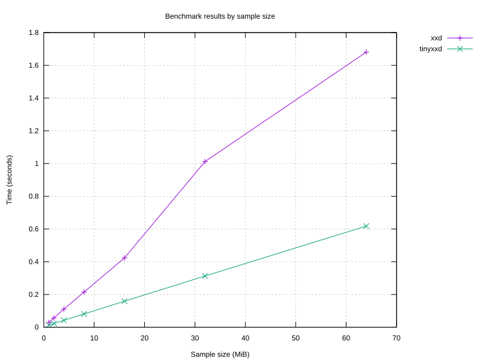
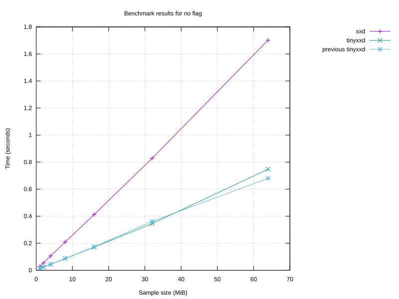
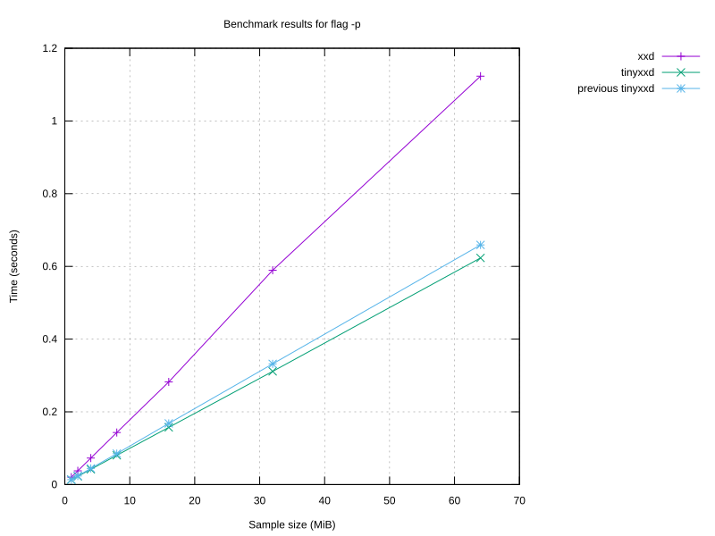
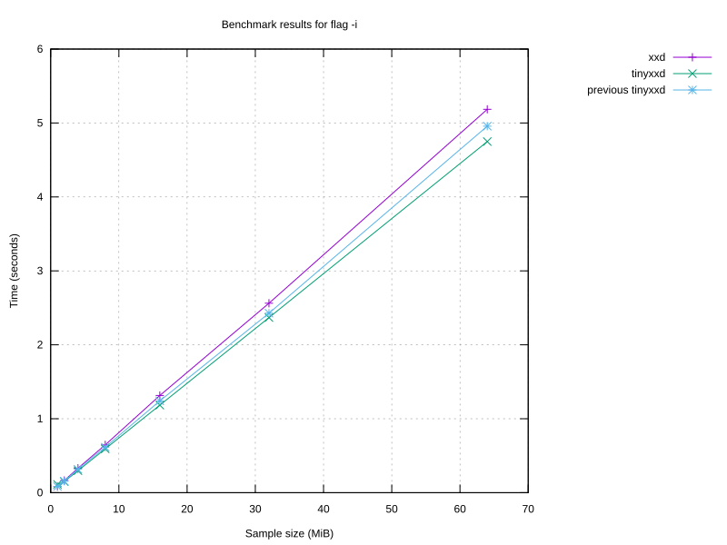
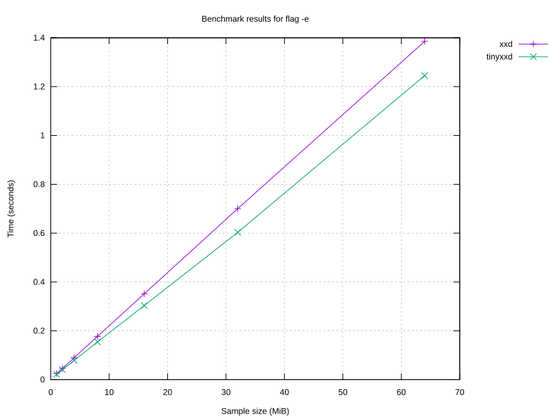
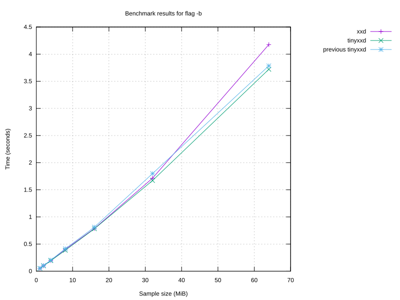
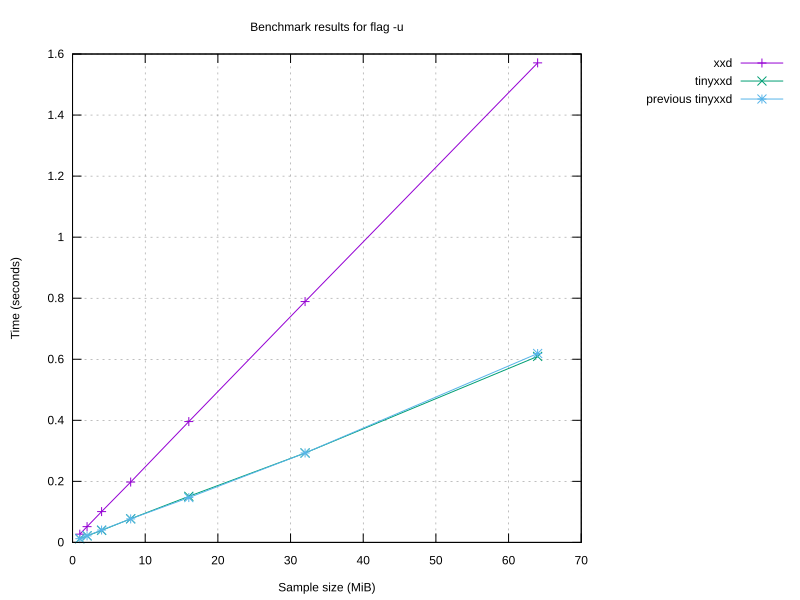
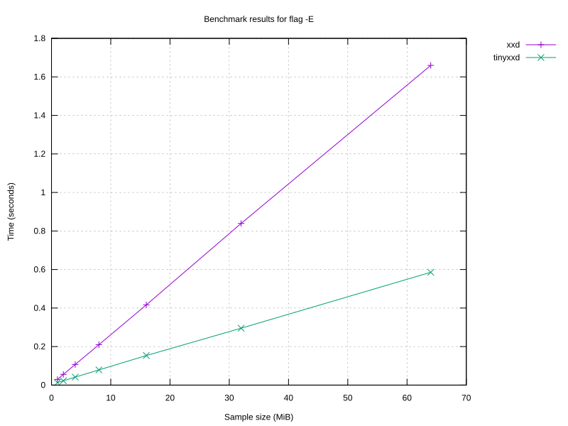
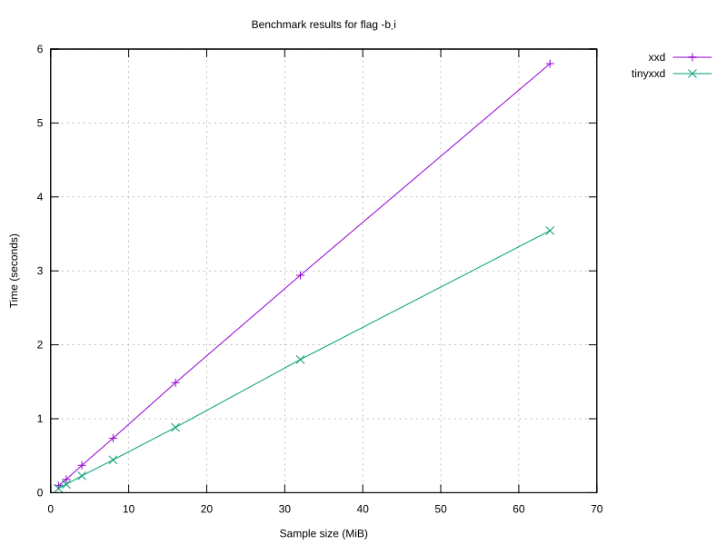

# Benchmark results

## Graphs

### Graph by sample size

### Graph for no flag

### Graph for flag '-p'

### Graph for flag '-i'

### Graph for flag '-e'

### Graph for flag '-b'

### Graph for flag '-u'

### Graph for flag '-E'

### Graph for flag '-b -i'

| Program | Size (MiB) | Conversion Time (s) | Flags |
|---------|------------|----------------------|-------|
| tinyxxd | 64 | 0.62 |  |
| tinyxxd | 64 | 0.78 | -r |
| tinyxxd | 64 | 4.41 | -b |
| tinyxxd | 64 | 3.92 | -r -b |
| tinyxxd | 64 | 0.81 |  |
| tinyxxd | 64 | 0.66 | -p |
| tinyxxd | 64 | 4.96 | -i |
| tinyxxd | 64 | 1.25 | -e |
| tinyxxd | 64 | 3.16 | -b |
| tinyxxd | 64 | 0.62 | -u |
| tinyxxd | 64 | 0.64 | -E |
| tinyxxd | 64 | 3.54 | -b -i |
| xxd | 64 | 1.68 |  |
| xxd | 64 | 2.47 | -r |
| xxd | 64 | 3.77 | -b |
| xxd | 64 | 4.64 | -r -b |
| xxd | 64 | 1.94 |  |
| xxd | 64 | 1.26 | -p |
| xxd | 64 | 5.34 | -i |
| xxd | 64 | 1.39 | -e |
| xxd | 64 | 2.98 | -b |
| xxd | 64 | 1.72 | -u |
| xxd | 64 | 1.73 | -E |
| xxd | 64 | 5.80 | -b -i |
| tinyxxd | 32 | 0.31 |  |
| tinyxxd | 32 | 0.40 | -r |
| tinyxxd | 32 | 2.02 | -b |
| tinyxxd | 32 | 1.96 | -r -b |
| tinyxxd | 32 | 0.41 |  |
| tinyxxd | 32 | 0.33 | -p |
| tinyxxd | 32 | 2.43 | -i |
| tinyxxd | 32 | 0.60 | -e |
| tinyxxd | 32 | 1.57 | -b |
| tinyxxd | 32 | 0.33 | -u |
| tinyxxd | 32 | 0.32 | -E |
| tinyxxd | 32 | 1.80 | -b -i |
| xxd | 32 | 1.01 |  |
| xxd | 32 | 1.22 | -r |
| xxd | 32 | 3.05 | -b |
| xxd | 32 | 2.37 | -r -b |
| xxd | 32 | 0.93 |  |
| xxd | 32 | 0.63 | -p |
| xxd | 32 | 2.67 | -i |
| xxd | 32 | 0.70 | -e |
| xxd | 32 | 1.49 | -b |
| xxd | 32 | 0.85 | -u |
| xxd | 32 | 0.86 | -E |
| xxd | 32 | 2.94 | -b -i |
| tinyxxd | 16 | 0.16 |  |
| tinyxxd | 16 | 0.20 | -r |
| tinyxxd | 16 | 0.84 | -b |
| tinyxxd | 16 | 0.99 | -r -b |
| tinyxxd | 16 | 0.20 |  |
| tinyxxd | 16 | 0.17 | -p |
| tinyxxd | 16 | 1.24 | -i |
| tinyxxd | 16 | 0.30 | -e |
| tinyxxd | 16 | 0.79 | -b |
| tinyxxd | 16 | 0.16 | -u |
| tinyxxd | 16 | 0.16 | -E |
| tinyxxd | 16 | 0.88 | -b -i |
| xxd | 16 | 0.42 |  |
| xxd | 16 | 0.61 | -r |
| xxd | 16 | 0.85 | -b |
| xxd | 16 | 1.14 | -r -b |
| xxd | 16 | 0.47 |  |
| xxd | 16 | 0.32 | -p |
| xxd | 16 | 1.48 | -i |
| xxd | 16 | 0.35 | -e |
| xxd | 16 | 0.75 | -b |
| xxd | 16 | 0.42 | -u |
| xxd | 16 | 0.43 | -E |
| xxd | 16 | 1.49 | -b -i |
| tinyxxd | 8 | 0.08 |  |
| tinyxxd | 8 | 0.10 | -r |
| tinyxxd | 8 | 0.43 | -b |
| tinyxxd | 8 | 0.49 | -r -b |
| tinyxxd | 8 | 0.10 |  |
| tinyxxd | 8 | 0.09 | -p |
| tinyxxd | 8 | 0.61 | -i |
| tinyxxd | 8 | 0.15 | -e |
| tinyxxd | 8 | 0.40 | -b |
| tinyxxd | 8 | 0.08 | -u |
| tinyxxd | 8 | 0.08 | -E |
| tinyxxd | 8 | 0.44 | -b -i |
| xxd | 8 | 0.22 |  |
| xxd | 8 | 0.31 | -r |
| xxd | 8 | 0.40 | -b |
| xxd | 8 | 0.57 | -r -b |
| xxd | 8 | 0.24 |  |
| xxd | 8 | 0.18 | -p |
| xxd | 8 | 0.67 | -i |
| xxd | 8 | 0.18 | -e |
| xxd | 8 | 0.38 | -b |
| xxd | 8 | 0.21 | -u |
| xxd | 8 | 0.21 | -E |
| xxd | 8 | 0.74 | -b -i |
| tinyxxd | 4 | 0.04 |  |
| tinyxxd | 4 | 0.05 | -r |
| tinyxxd | 4 | 0.21 | -b |
| tinyxxd | 4 | 0.25 | -r -b |
| tinyxxd | 4 | 0.05 |  |
| tinyxxd | 4 | 0.04 | -p |
| tinyxxd | 4 | 0.32 | -i |
| tinyxxd | 4 | 0.08 | -e |
| tinyxxd | 4 | 0.20 | -b |
| tinyxxd | 4 | 0.04 | -u |
| tinyxxd | 4 | 0.04 | -E |
| tinyxxd | 4 | 0.23 | -b -i |
| xxd | 4 | 0.11 |  |
| xxd | 4 | 0.16 | -r |
| xxd | 4 | 0.21 | -b |
| xxd | 4 | 0.28 | -r -b |
| xxd | 4 | 0.12 |  |
| xxd | 4 | 0.08 | -p |
| xxd | 4 | 0.34 | -i |
| xxd | 4 | 0.09 | -e |
| xxd | 4 | 0.19 | -b |
| xxd | 4 | 0.11 | -u |
| xxd | 4 | 0.11 | -E |
| xxd | 4 | 0.37 | -b -i |
| xxd | 2 | 0.06 |  |
| xxd | 2 | 0.08 | -r |
| xxd | 2 | 0.10 | -b |
| xxd | 2 | 0.14 | -r -b |
| xxd | 2 | 0.06 |  |
| xxd | 2 | 0.04 | -p |
| xxd | 2 | 0.17 | -i |
| xxd | 2 | 0.05 | -e |
| xxd | 2 | 0.10 | -b |
| xxd | 2 | 0.06 | -u |
| xxd | 2 | 0.06 | -E |
| xxd | 2 | 0.18 | -b -i |
| tinyxxd | 2 | 0.02 |  |
| tinyxxd | 2 | 0.03 | -r |
| tinyxxd | 2 | 0.11 | -b |
| tinyxxd | 2 | 0.13 | -r -b |
| tinyxxd | 2 | 0.03 |  |
| tinyxxd | 2 | 0.02 | -p |
| tinyxxd | 2 | 0.16 | -i |
| tinyxxd | 2 | 0.04 | -e |
| tinyxxd | 2 | 0.10 | -b |
| tinyxxd | 2 | 0.02 | -u |
| tinyxxd | 2 | 0.02 | -E |
| tinyxxd | 2 | 0.11 | -b -i |
| xxd | 1 | 0.03 |  |
| xxd | 1 | 0.04 | -r |
| xxd | 1 | 0.05 | -b |
| xxd | 1 | 0.07 | -r -b |
| xxd | 1 | 0.03 |  |
| xxd | 1 | 0.02 | -p |
| xxd | 1 | 0.09 | -i |
| xxd | 1 | 0.03 | -e |
| xxd | 1 | 0.05 | -b |
| xxd | 1 | 0.03 | -u |
| xxd | 1 | 0.03 | -E |
| xxd | 1 | 0.10 | -b -i |
| tinyxxd | 1 | 0.01 |  |
| tinyxxd | 1 | 0.02 | -r |
| tinyxxd | 1 | 0.06 | -b |
| tinyxxd | 1 | 0.06 | -r -b |
| tinyxxd | 1 | 0.02 |  |
| tinyxxd | 1 | 0.01 | -p |
| tinyxxd | 1 | 0.08 | -i |
| tinyxxd | 1 | 0.02 | -e |
| tinyxxd | 1 | 0.05 | -b |
| tinyxxd | 1 | 0.01 | -u |
| tinyxxd | 1 | 0.01 | -E |
| tinyxxd | 1 | 0.06 | -b -i |

## Performance Summaries
- For sample size 64 MiB, tinyxxd was 152.91% faster with no flag.
- For sample size 64 MiB, tinyxxd was 216.22% faster with flags '-r'.
- For sample size 64 MiB, xxd was 12.05% faster with flags '-b'.
- For sample size 64 MiB, tinyxxd was 18.27% faster with flags '-r -b'.
- For sample size 64 MiB, tinyxxd was 90.68% faster with flags '-p'.
- For sample size 64 MiB, tinyxxd was 7.80% faster with flags '-i'.
- For sample size 64 MiB, tinyxxd was 11.26% faster with flags '-e'.
- For sample size 64 MiB, tinyxxd was 176.75% faster with flags '-u'.
- For sample size 64 MiB, tinyxxd was 169.88% faster with flags '-E'.
- For sample size 64 MiB, tinyxxd was 63.72% faster with flags '-b -i'.
- For sample size 32 MiB, tinyxxd was 169.93% faster with no flag.
- For sample size 32 MiB, tinyxxd was 207.57% faster with flags '-r'.
- For sample size 32 MiB, tinyxxd was 26.11% faster with flags '-b'.
- For sample size 32 MiB, tinyxxd was 20.57% faster with flags '-r -b'.
- For sample size 32 MiB, tinyxxd was 89.83% faster with flags '-p'.
- For sample size 32 MiB, tinyxxd was 9.84% faster with flags '-i'.
- For sample size 32 MiB, tinyxxd was 16.09% faster with flags '-e'.
- For sample size 32 MiB, tinyxxd was 154.66% faster with flags '-u'.
- For sample size 32 MiB, tinyxxd was 171.54% faster with flags '-E'.
- For sample size 32 MiB, tinyxxd was 63.29% faster with flags '-b -i'.
- For sample size 16 MiB, tinyxxd was 146.90% faster with no flag.
- For sample size 16 MiB, tinyxxd was 202.50% faster with flags '-r'.
- For sample size 16 MiB, tinyxxd was 14.80% faster with flags '-r -b'.
- For sample size 16 MiB, tinyxxd was 88.23% faster with flags '-p'.
- For sample size 16 MiB, tinyxxd was 19.15% faster with flags '-i'.
- For sample size 16 MiB, tinyxxd was 15.84% faster with flags '-e'.
- For sample size 16 MiB, tinyxxd was 167.60% faster with flags '-u'.
- For sample size 16 MiB, tinyxxd was 172.03% faster with flags '-E'.
- For sample size 16 MiB, tinyxxd was 68.47% faster with flags '-b -i'.
- For sample size 8 MiB, tinyxxd was 150.06% faster with no flag.
- For sample size 8 MiB, tinyxxd was 203.75% faster with flags '-r'.
- For sample size 8 MiB, xxd was 6.44% faster with flags '-b'.
- For sample size 8 MiB, tinyxxd was 15.78% faster with flags '-r -b'.
- For sample size 8 MiB, tinyxxd was 109.30% faster with flags '-p'.
- For sample size 8 MiB, tinyxxd was 9.47% faster with flags '-i'.
- For sample size 8 MiB, tinyxxd was 14.64% faster with flags '-e'.
- For sample size 8 MiB, tinyxxd was 164.64% faster with flags '-u'.
- For sample size 8 MiB, tinyxxd was 165.18% faster with flags '-E'.
- For sample size 8 MiB, tinyxxd was 66.15% faster with flags '-b -i'.
- For sample size 4 MiB, tinyxxd was 142.83% faster with no flag.
- For sample size 4 MiB, tinyxxd was 200.18% faster with flags '-r'.
- For sample size 4 MiB, tinyxxd was 13.87% faster with flags '-r -b'.
- For sample size 4 MiB, tinyxxd was 83.07% faster with flags '-p'.
- For sample size 4 MiB, tinyxxd was 7.18% faster with flags '-i'.
- For sample size 4 MiB, tinyxxd was 14.04% faster with flags '-e'.
- For sample size 4 MiB, tinyxxd was 153.14% faster with flags '-u'.
- For sample size 4 MiB, tinyxxd was 150.09% faster with flags '-E'.
- For sample size 4 MiB, tinyxxd was 62.60% faster with flags '-b -i'.
- For sample size 2 MiB, tinyxxd was 133.11% faster with no flag.
- For sample size 2 MiB, tinyxxd was 178.71% faster with flags '-r'.
- For sample size 2 MiB, tinyxxd was 13.06% faster with flags '-r -b'.
- For sample size 2 MiB, tinyxxd was 81.53% faster with flags '-p'.
- For sample size 2 MiB, tinyxxd was 9.63% faster with flags '-i'.
- For sample size 2 MiB, tinyxxd was 13.07% faster with flags '-e'.
- For sample size 2 MiB, tinyxxd was 153.56% faster with flags '-u'.
- For sample size 2 MiB, tinyxxd was 155.74% faster with flags '-E'.
- For sample size 2 MiB, tinyxxd was 59.35% faster with flags '-b -i'.
- For sample size 1 MiB, tinyxxd was 115.70% faster with no flag.
- For sample size 1 MiB, tinyxxd was 150.89% faster with flags '-r'.
- For sample size 1 MiB, tinyxxd was 15.22% faster with flags '-r -b'.
- For sample size 1 MiB, tinyxxd was 67.59% faster with flags '-p'.
- For sample size 1 MiB, tinyxxd was 14.40% faster with flags '-e'.
- For sample size 1 MiB, tinyxxd was 127.11% faster with flags '-u'.
- For sample size 1 MiB, tinyxxd was 137.78% faster with flags '-E'.
- For sample size 1 MiB, tinyxxd was 62.61% faster with flags '-b -i'.

### Performance by sample size
- For sample 64 MiB, tinyxxd was 36.85% faster than xxd.
- For sample 32 MiB, tinyxxd was 49.79% faster than xxd.
- For sample 16 MiB, tinyxxd was 43.17% faster than xxd.
- For sample 8 MiB, tinyxxd was 40.58% faster than xxd.
- For sample 4 MiB, tinyxxd was 38.84% faster than xxd.
- For sample 2 MiB, tinyxxd was 38.06% faster than xxd.
- For sample 1 MiB, tinyxxd was 35.33% faster than xxd.

### Performance by flag
- tinyxxd was 155.18% faster with no flag.
- tinyxxd was 209.62% faster with flag '-r'.
- tinyxxd was 18.00% faster with flag '-r -b'.
- tinyxxd was 90.70% faster with flag '-p'.
- tinyxxd was 9.82% faster with flag '-i'.
- tinyxxd was 13.38% faster with flag '-e'.
- tinyxxd was 167.35% faster with flag '-u'.
- tinyxxd was 169.03% faster with flag '-E'.
- tinyxxd was 64.24% faster with flag '-b -i'.
---
Report generated on: 2026-09-29T11:38:48.443482
