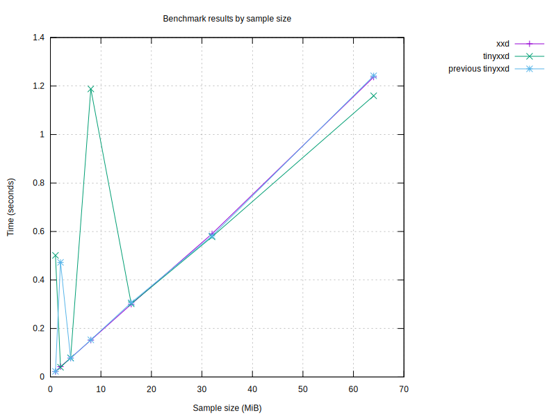

# Benchmark results

## Graphs

### Graph by sample size

### Graph for no flag

### Graph for flag '-p'

### Graph for flag '-i'

### Graph for flag '-e'

### Graph for flag '-b'

### Graph for flag '-u'

### Graph for flag '-E'

| Program | Size (MiB) | Conversion Time (s) | Flags |
|---------|------------|----------------------|-------|
| tinyxxd | 64 | 1.25 |  |
| tinyxxd | 64 | 2.10 | -r |
| tinyxxd | 64 | 4.47 |  |
| tinyxxd | 64 | 3.67 | -r |
| tinyxxd | 64 | 1.17 |  |
| tinyxxd | 64 | 0.73 | -p |
| tinyxxd | 64 | 4.73 | -i |
| tinyxxd | 64 | 1.24 | -e |
| tinyxxd | 64 | 2.84 | -b |
| tinyxxd | 64 | 1.30 | -u |
| tinyxxd | 64 | 1.35 | -E |
| xxd | 64 | 1.90 |  |
| xxd | 64 | 2.13 | -r |
| xxd | 64 | 4.72 |  |
| xxd | 64 | 4.38 | -r |
| xxd | 64 | 1.69 |  |
| xxd | 64 | 0.91 | -p |
| xxd | 64 | 4.67 | -i |
| xxd | 64 | 1.50 | -e |
| xxd | 64 | 3.18 | -b |
| xxd | 64 | 1.72 | -u |
| xxd | 64 | 1.73 | -E |
| tinyxxd | 32 | 0.61 |  |
| tinyxxd | 32 | 0.97 | -r |
| tinyxxd | 32 | 1.94 |  |
| tinyxxd | 32 | 1.77 | -r |
| tinyxxd | 32 | 0.58 |  |
| tinyxxd | 32 | 0.36 | -p |
| tinyxxd | 32 | 2.31 | -i |
| tinyxxd | 32 | 0.62 | -e |
| tinyxxd | 32 | 1.42 | -b |
| tinyxxd | 32 | 0.59 | -u |
| tinyxxd | 32 | 0.68 | -E |
| xxd | 32 | 0.89 |  |
| xxd | 32 | 1.07 | -r |
| xxd | 32 | 3.51 |  |
| xxd | 32 | 2.15 | -r |
| xxd | 32 | 0.85 |  |
| xxd | 32 | 0.46 | -p |
| xxd | 32 | 2.38 | -i |
| xxd | 32 | 0.73 | -e |
| xxd | 32 | 1.57 | -b |
| xxd | 32 | 0.85 | -u |
| xxd | 32 | 0.87 | -E |
| xxd | 16 | 0.44 |  |
| xxd | 16 | 0.53 | -r |
| xxd | 16 | 1.78 |  |
| xxd | 16 | 1.10 | -r |
| xxd | 16 | 0.44 |  |
| xxd | 16 | 0.23 | -p |
| xxd | 16 | 1.24 | -i |
| xxd | 16 | 0.37 | -e |
| xxd | 16 | 0.79 | -b |
| xxd | 16 | 0.43 | -u |
| xxd | 16 | 0.43 | -E |
| tinyxxd | 16 | 0.30 |  |
| tinyxxd | 16 | 0.50 | -r |
| tinyxxd | 16 | 0.91 |  |
| tinyxxd | 16 | 0.89 | -r |
| tinyxxd | 16 | 0.30 |  |
| tinyxxd | 16 | 0.18 | -p |
| tinyxxd | 16 | 1.20 | -i |
| tinyxxd | 16 | 0.31 | -e |
| tinyxxd | 16 | 0.71 | -b |
| tinyxxd | 16 | 0.30 | -u |
| tinyxxd | 16 | 0.33 | -E |
| tinyxxd | 8 | 0.16 |  |
| tinyxxd | 8 | 0.24 | -r |
| tinyxxd | 8 | 0.46 |  |
| tinyxxd | 8 | 0.45 | -r |
| tinyxxd | 8 | 0.15 |  |
| tinyxxd | 8 | 0.09 | -p |
| tinyxxd | 8 | 0.58 | -i |
| tinyxxd | 8 | 0.16 | -e |
| tinyxxd | 8 | 0.35 | -b |
| tinyxxd | 8 | 0.15 | -u |
| tinyxxd | 8 | 0.17 | -E |
| xxd | 8 | 0.22 |  |
| xxd | 8 | 0.27 | -r |
| xxd | 8 | 0.44 |  |
| xxd | 8 | 0.54 | -r |
| xxd | 8 | 0.22 |  |
| xxd | 8 | 0.12 | -p |
| xxd | 8 | 0.59 | -i |
| xxd | 8 | 0.19 | -e |
| xxd | 8 | 0.40 | -b |
| xxd | 8 | 0.22 | -u |
| xxd | 8 | 0.22 | -E |
| xxd | 4 | 0.11 |  |
| xxd | 4 | 0.14 | -r |
| xxd | 4 | 0.22 |  |
| xxd | 4 | 0.28 | -r |
| xxd | 4 | 0.11 |  |
| xxd | 4 | 0.06 | -p |
| xxd | 4 | 0.30 | -i |
| xxd | 4 | 0.10 | -e |
| xxd | 4 | 0.20 | -b |
| xxd | 4 | 0.11 | -u |
| xxd | 4 | 0.11 | -E |
| tinyxxd | 4 | 0.08 |  |
| tinyxxd | 4 | 0.13 | -r |
| tinyxxd | 4 | 0.20 |  |
| tinyxxd | 4 | 0.27 | -r |
| tinyxxd | 4 | 0.08 |  |
| tinyxxd | 4 | 0.05 | -p |
| tinyxxd | 4 | 0.29 | -i |
| tinyxxd | 4 | 0.08 | -e |
| tinyxxd | 4 | 0.18 | -b |
| tinyxxd | 4 | 0.08 | -u |
| tinyxxd | 4 | 0.09 | -E |
| tinyxxd | 2 | 0.04 |  |
| tinyxxd | 2 | 0.06 | -r |
| tinyxxd | 2 | 0.30 |  |
| tinyxxd | 2 | 0.19 | -r |
| tinyxxd | 2 | 0.04 |  |
| tinyxxd | 2 | 0.03 | -p |
| tinyxxd | 2 | 0.15 | -i |
| tinyxxd | 2 | 0.04 | -e |
| tinyxxd | 2 | 0.09 | -b |
| tinyxxd | 2 | 0.04 | -u |
| tinyxxd | 2 | 0.04 | -E |
| xxd | 2 | 0.06 |  |
| xxd | 2 | 0.07 | -r |
| xxd | 2 | 0.12 |  |
| xxd | 2 | 0.14 | -r |
| xxd | 2 | 0.06 |  |
| xxd | 2 | 0.03 | -p |
| xxd | 2 | 0.15 | -i |
| xxd | 2 | 0.05 | -e |
| xxd | 2 | 0.10 | -b |
| xxd | 2 | 0.06 | -u |
| xxd | 2 | 0.06 | -E |
| tinyxxd | 1 | 0.02 |  |
| tinyxxd | 1 | 0.03 | -r |
| tinyxxd | 1 | 0.05 |  |
| tinyxxd | 1 | 0.06 | -r |
| tinyxxd | 1 | 0.03 |  |
| tinyxxd | 1 | 0.01 | -p |
| tinyxxd | 1 | 0.07 | -i |
| tinyxxd | 1 | 0.02 | -e |
| tinyxxd | 1 | 0.05 | -b |
| tinyxxd | 1 | 0.02 | -u |
| tinyxxd | 1 | 0.02 | -E |
| xxd | 1 | 0.03 |  |
| xxd | 1 | 0.04 | -r |
| xxd | 1 | 0.06 |  |
| xxd | 1 | 0.07 | -r |
| xxd | 1 | 0.03 |  |
| xxd | 1 | 0.02 | -p |
| xxd | 1 | 0.08 | -i |
| xxd | 1 | 0.03 | -e |
| xxd | 1 | 0.05 | -b |
| xxd | 1 | 0.03 | -u |
| xxd | 1 | 0.03 | -E |

## Performance Summaries
- For sample size 64 MiB, tinyxxd was 20.61% faster with no flag.
- For sample size 64 MiB, tinyxxd was 12.79% faster with flags '-r'.
- For sample size 64 MiB, tinyxxd was 25.91% faster with flags '-p'.
- For sample size 64 MiB, tinyxxd was 21.19% faster with flags '-e'.
- For sample size 64 MiB, tinyxxd was 12.06% faster with flags '-b'.
- For sample size 64 MiB, tinyxxd was 32.05% faster with flags '-u'.
- For sample size 64 MiB, tinyxxd was 28.10% faster with flags '-E'.
- For sample size 32 MiB, tinyxxd was 67.69% faster with no flag.
- For sample size 32 MiB, tinyxxd was 17.73% faster with flags '-r'.
- For sample size 32 MiB, tinyxxd was 26.20% faster with flags '-p'.
- For sample size 32 MiB, tinyxxd was 17.13% faster with flags '-e'.
- For sample size 32 MiB, tinyxxd was 10.39% faster with flags '-b'.
- For sample size 32 MiB, tinyxxd was 44.45% faster with flags '-u'.
- For sample size 32 MiB, tinyxxd was 28.41% faster with flags '-E'.
- For sample size 16 MiB, tinyxxd was 76.05% faster with no flag.
- For sample size 16 MiB, tinyxxd was 17.96% faster with flags '-r'.
- For sample size 16 MiB, tinyxxd was 25.53% faster with flags '-p'.
- For sample size 16 MiB, tinyxxd was 18.66% faster with flags '-e'.
- For sample size 16 MiB, tinyxxd was 11.82% faster with flags '-b'.
- For sample size 16 MiB, tinyxxd was 44.86% faster with flags '-u'.
- For sample size 16 MiB, tinyxxd was 30.88% faster with flags '-E'.
- For sample size 8 MiB, tinyxxd was 14.33% faster with no flag.
- For sample size 8 MiB, tinyxxd was 15.25% faster with flags '-r'.
- For sample size 8 MiB, tinyxxd was 26.03% faster with flags '-p'.
- For sample size 8 MiB, tinyxxd was 17.02% faster with flags '-e'.
- For sample size 8 MiB, tinyxxd was 13.27% faster with flags '-b'.
- For sample size 8 MiB, tinyxxd was 46.13% faster with flags '-u'.
- For sample size 8 MiB, tinyxxd was 29.29% faster with flags '-E'.
- For sample size 4 MiB, tinyxxd was 25.50% faster with no flag.
- For sample size 4 MiB, tinyxxd was 24.39% faster with flags '-p'.
- For sample size 4 MiB, tinyxxd was 16.62% faster with flags '-e'.
- For sample size 4 MiB, tinyxxd was 10.26% faster with flags '-b'.
- For sample size 4 MiB, tinyxxd was 44.19% faster with flags '-u'.
- For sample size 4 MiB, tinyxxd was 31.48% faster with flags '-E'.
- For sample size 2 MiB, xxd was 59.32% faster with no flag.
- For sample size 2 MiB, xxd was 23.12% faster with flags '-r'.
- For sample size 2 MiB, tinyxxd was 17.21% faster with flags '-p'.
- For sample size 2 MiB, tinyxxd was 13.37% faster with flags '-e'.
- For sample size 2 MiB, tinyxxd was 10.31% faster with flags '-b'.
- For sample size 2 MiB, tinyxxd was 40.81% faster with flags '-u'.
- For sample size 2 MiB, tinyxxd was 29.25% faster with flags '-E'.
- For sample size 1 MiB, tinyxxd was 15.94% faster with no flag.
- For sample size 1 MiB, tinyxxd was 14.66% faster with flags '-r'.
- For sample size 1 MiB, tinyxxd was 19.20% faster with flags '-p'.
- For sample size 1 MiB, tinyxxd was 15.28% faster with flags '-e'.
- For sample size 1 MiB, tinyxxd was 9.94% faster with flags '-b'.
- For sample size 1 MiB, tinyxxd was 35.95% faster with flags '-u'.
- For sample size 1 MiB, tinyxxd was 24.87% faster with flags '-E'.

### Performance by sample size
- For sample 64 MiB, tinyxxd was 14.86% faster than xxd.
- For sample 32 MiB, tinyxxd was 29.34% faster than xxd.
- For sample 16 MiB, tinyxxd was 31.36% faster than xxd.
- For sample 8 MiB, tinyxxd was 14.87% faster than xxd.
- For sample 4 MiB, tinyxxd was 14.24% faster than xxd.
- For sample size 2 MiB, xxd was 16.27% faster than tinyxxd.
- For sample 1 MiB, tinyxxd was 14.18% faster than xxd.

### Performance by flag
- tinyxxd was 36.23% faster with no flag.
- tinyxxd was 13.72% faster with flag '-r'.
- tinyxxd was 25.66% faster with flag '-p'.
- tinyxxd was 19.25% faster with flag '-e'.
- tinyxxd was 11.58% faster with flag '-b'.
- tinyxxd was 37.95% faster with flag '-u'.
- tinyxxd was 28.69% faster with flag '-E'.
---
Report generated on: 2024-09-26T11:49:21.566617
