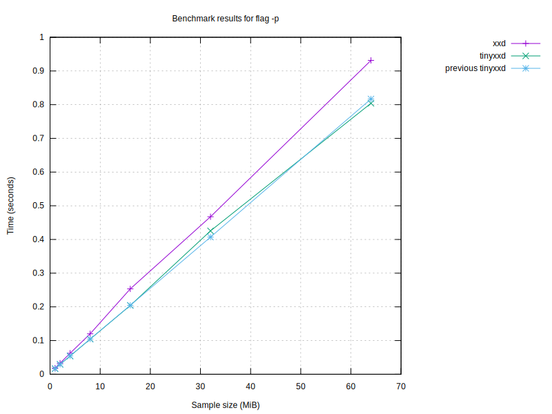

# Benchmark Results

| Program | Size (MiB) | Conversion Time (s) | Flags |
|---------|------------|----------------------|-------|
| original xxd | 64 | 1.61 |  |
| original xxd | 64 | 2.17 | -r |
| original xxd | 64 | 1.53 |  |
| original xxd | 64 | 0.98 | -p |
| original xxd | 64 | 5.03 | -i |
| original xxd | 64 | 1.50 | -e |
| original xxd | 64 | 3.53 | -b |
| original xxd | 64 | 1.51 | -u |
| original xxd | 64 | 1.74 | -E |
| tinyxxd | 64 | 1.30 |  |
| tinyxxd | 64 | 2.21 | -r |
| tinyxxd | 64 | 1.25 |  |
| tinyxxd | 64 | 0.82 | -p |
| tinyxxd | 64 | 4.89 | -i |
| tinyxxd | 64 | 1.28 | -e |
| tinyxxd | 64 | 3.07 | -b |
| tinyxxd | 64 | 1.27 | -u |
| tinyxxd | 64 | 1.43 | -E |
| tinyxxd | 32 | 0.65 |  |
| tinyxxd | 32 | 1.07 | -r |
| tinyxxd | 32 | 0.67 |  |
| tinyxxd | 32 | 0.41 | -p |
| tinyxxd | 32 | 2.42 | -i |
| tinyxxd | 32 | 0.64 | -e |
| tinyxxd | 32 | 1.53 | -b |
| tinyxxd | 32 | 0.64 | -u |
| tinyxxd | 32 | 0.70 | -E |
| original xxd | 32 | 0.79 |  |
| original xxd | 32 | 1.10 | -r |
| original xxd | 32 | 0.74 |  |
| original xxd | 32 | 0.48 | -p |
| original xxd | 32 | 2.49 | -i |
| original xxd | 32 | 0.74 | -e |
| original xxd | 32 | 1.76 | -b |
| original xxd | 32 | 0.78 | -u |
| original xxd | 32 | 0.84 | -E |
| tinyxxd | 16 | 0.33 |  |
| tinyxxd | 16 | 0.54 | -r |
| tinyxxd | 16 | 0.31 |  |
| tinyxxd | 16 | 0.21 | -p |
| tinyxxd | 16 | 1.23 | -i |
| tinyxxd | 16 | 0.32 | -e |
| tinyxxd | 16 | 0.77 | -b |
| tinyxxd | 16 | 0.31 | -u |
| tinyxxd | 16 | 0.36 | -E |
| original xxd | 16 | 0.38 |  |
| original xxd | 16 | 0.56 | -r |
| original xxd | 16 | 0.37 |  |
| original xxd | 16 | 0.24 | -p |
| original xxd | 16 | 1.21 | -i |
| original xxd | 16 | 0.37 | -e |
| original xxd | 16 | 0.88 | -b |
| original xxd | 16 | 0.37 | -u |
| original xxd | 16 | 0.41 | -E |
| original xxd | 8 | 0.19 |  |
| original xxd | 8 | 0.28 | -r |
| original xxd | 8 | 0.19 |  |
| original xxd | 8 | 0.12 | -p |
| original xxd | 8 | 0.61 | -i |
| original xxd | 8 | 0.19 | -e |
| original xxd | 8 | 0.44 | -b |
| original xxd | 8 | 0.19 | -u |
| original xxd | 8 | 0.21 | -E |
| tinyxxd | 8 | 0.16 |  |
| tinyxxd | 8 | 0.27 | -r |
| tinyxxd | 8 | 0.16 |  |
| tinyxxd | 8 | 0.11 | -p |
| tinyxxd | 8 | 0.61 | -i |
| tinyxxd | 8 | 0.16 | -e |
| tinyxxd | 8 | 0.42 | -b |
| tinyxxd | 8 | 0.17 | -u |
| tinyxxd | 8 | 0.18 | -E |

## Performance Summaries
- With flags '' and size 64MiB, tinyxxd was 23.23% faster.
- With flags '-p' and size 64MiB, tinyxxd was 18.67% faster.
- With flags '-e' and size 64MiB, tinyxxd was 16.86% faster.
- With flags '-b' and size 64MiB, tinyxxd was 14.97% faster.
- With flags '-u' and size 64MiB, tinyxxd was 18.77% faster.
- With flags '-E' and size 64MiB, tinyxxd was 21.98% faster.
- With flags '' and size 32MiB, tinyxxd was 16.59% faster.
- With flags '-p' and size 32MiB, tinyxxd was 15.48% faster.
- With flags '-e' and size 32MiB, tinyxxd was 15.37% faster.
- With flags '-b' and size 32MiB, tinyxxd was 14.94% faster.
- With flags '-u' and size 32MiB, tinyxxd was 21.63% faster.
- With flags '-E' and size 32MiB, tinyxxd was 19.18% faster.
- With flags '' and size 16MiB, tinyxxd was 17.33% faster.
- With flags '-p' and size 16MiB, tinyxxd was 15.31% faster.
- With flags '-e' and size 16MiB, tinyxxd was 14.85% faster.
- With flags '-b' and size 16MiB, tinyxxd was 14.28% faster.
- With flags '-u' and size 16MiB, tinyxxd was 19.23% faster.
- With flags '-E' and size 16MiB, tinyxxd was 14.89% faster.
- With flags '' and size 8MiB, tinyxxd was 18.25% faster.
- With flags '-p' and size 8MiB, tinyxxd was 17.27% faster.
- With flags '-e' and size 8MiB, tinyxxd was 15.38% faster.
- With flags '-u' and size 8MiB, tinyxxd was 15.61% faster.
- With flags '-E' and size 8MiB, tinyxxd was 16.06% faster.

### Performance by sample size
- For 64MiB files, tinyxxd was 11.86% faster than original xxd.
- For 32MiB files, tinyxxd was 11.13% faster than original xxd.
- For 16MiB files, tinyxxd was 9.48% faster than original xxd.
- For 8MiB files, tinyxxd was 7.96% faster than original xxd.

### Performance by flag
- With flag '', tinyxxd was 20.31% faster.
- With flag '-p', tinyxxd was 17.27% faster.
- With flag '-e', tinyxxd was 16.09% faster.
- With flag '-b', tinyxxd was 14.15% faster.
- With flag '-u', tinyxxd was 19.37% faster.
- With flag '-E', tinyxxd was 19.89% faster.

### Performance compared to last run
- For 64MiB files with flags '', original xxd slowed down by 3.72% compared to the last run.
- For 64MiB files with flags '-r', original xxd improved by 1.37% compared to the last run.
- For 64MiB files with flags '', original xxd improved by 1.47% compared to the last run.
- For 64MiB files with flags '-p', original xxd improved by 0.92% compared to the last run.
- For 64MiB files with flags '-i', original xxd slowed down by 1.01% compared to the last run.
- For 64MiB files with flags '-e', original xxd improved by 2.22% compared to the last run.
- For 64MiB files with flags '-b', original xxd improved by 0.28% compared to the last run.
- For 64MiB files with flags '-u', original xxd improved by 3.31% compared to the last run.
- For 64MiB files with flags '-E', original xxd slowed down by 2.66% compared to the last run.
- For 64MiB files with flags '', tinyxxd slowed down by 2.51% compared to the last run.
- For 64MiB files with flags '-r', tinyxxd slowed down by 0.23% compared to the last run.
- For 64MiB files with flags '', tinyxxd improved by 1.31% compared to the last run.
- For 64MiB files with flags '-p', tinyxxd improved by 0.06% compared to the last run.
- For 64MiB files with flags '-i', tinyxxd slowed down by 1.34% compared to the last run.
- For 64MiB files with flags '-e', tinyxxd improved by 1.39% compared to the last run.
- For 64MiB files with flags '-b', tinyxxd slowed down by 0.42% compared to the last run.
- For 64MiB files with flags '-u', tinyxxd slowed down by 1.74% compared to the last run.
- For 64MiB files with flags '-E', tinyxxd slowed down by 1.28% compared to the last run.
- For 32MiB files with flags '', tinyxxd slowed down by 1.01% compared to the last run.
- For 32MiB files with flags '-r', tinyxxd improved by 0.07% compared to the last run.
- For 32MiB files with flags '', tinyxxd slowed down by 4.26% compared to the last run.
- For 32MiB files with flags '-p', tinyxxd slowed down by 0.47% compared to the last run.
- For 32MiB files with flags '-i', tinyxxd improved by 0.35% compared to the last run.
- For 32MiB files with flags '-e', tinyxxd improved by 1.54% compared to the last run.
- For 32MiB files with flags '-b', tinyxxd improved by 0.59% compared to the last run.
- For 32MiB files with flags '-u', tinyxxd slowed down by 0.23% compared to the last run.
- For 32MiB files with flags '-E', tinyxxd slowed down by 0.37% compared to the last run.
- For 32MiB files with flags '', original xxd slowed down by 4.42% compared to the last run.
- For 32MiB files with flags '-r', original xxd improved by 3.23% compared to the last run.
- For 32MiB files with flags '', original xxd improved by 1.44% compared to the last run.
- For 32MiB files with flags '-p', original xxd improved by 0.44% compared to the last run.
- For 32MiB files with flags '-i', original xxd slowed down by 2.59% compared to the last run.
- For 32MiB files with flags '-e', original xxd improved by 4.88% compared to the last run.
- For 32MiB files with flags '-b', original xxd improved by 0.38% compared to the last run.
- For 32MiB files with flags '-u', original xxd improved by 0.40% compared to the last run.
- For 32MiB files with flags '-E', original xxd improved by 0.76% compared to the last run.
- For 16MiB files with flags '', tinyxxd slowed down by 1.32% compared to the last run.
- For 16MiB files with flags '-r', tinyxxd improved by 4.29% compared to the last run.
- For 16MiB files with flags '', tinyxxd improved by 3.56% compared to the last run.
- For 16MiB files with flags '-p', tinyxxd improved by 11.47% compared to the last run.
- For 16MiB files with flags '-i', tinyxxd improved by 0.79% compared to the last run.
- For 16MiB files with flags '-e', tinyxxd improved by 0.25% compared to the last run.
- For 16MiB files with flags '-b', tinyxxd slowed down by 0.03% compared to the last run.
- For 16MiB files with flags '-u', tinyxxd improved by 0.14% compared to the last run.
- For 16MiB files with flags '-E', tinyxxd slowed down by 2.02% compared to the last run.
- For 16MiB files with flags '', original xxd slowed down by 2.48% compared to the last run.
- For 16MiB files with flags '-r', original xxd slowed down by 1.81% compared to the last run.
- For 16MiB files with flags '', original xxd improved by 0.01% compared to the last run.
- For 16MiB files with flags '-p', original xxd improved by 0.15% compared to the last run.
- For 16MiB files with flags '-i', original xxd slowed down by 0.39% compared to the last run.
- For 16MiB files with flags '-e', original xxd improved by 0.97% compared to the last run.
- For 16MiB files with flags '-b', original xxd improved by 1.34% compared to the last run.
- For 16MiB files with flags '-u', original xxd improved by 0.03% compared to the last run.
- For 16MiB files with flags '-E', original xxd improved by 2.76% compared to the last run.
- For 8MiB files with flags '', original xxd improved by 0.27% compared to the last run.
- For 8MiB files with flags '-r', original xxd improved by 1.21% compared to the last run.
- For 8MiB files with flags '', original xxd improved by 2.54% compared to the last run.
- For 8MiB files with flags '-p', original xxd slowed down by 1.71% compared to the last run.
- For 8MiB files with flags '-i', original xxd improved by 0.22% compared to the last run.
- For 8MiB files with flags '-e', original xxd slowed down by 0.43% compared to the last run.
- For 8MiB files with flags '-b', original xxd improved by 0.09% compared to the last run.
- For 8MiB files with flags '-u', original xxd slowed down by 0.79% compared to the last run.
- For 8MiB files with flags '-E', original xxd slowed down by 0.99% compared to the last run.
- For 8MiB files with flags '', tinyxxd slowed down by 2.74% compared to the last run.
- For 8MiB files with flags '-r', tinyxxd slowed down by 0.64% compared to the last run.
- For 8MiB files with flags '', tinyxxd improved by 0.40% compared to the last run.
- For 8MiB files with flags '-p', tinyxxd improved by 0.27% compared to the last run.
- For 8MiB files with flags '-i', tinyxxd improved by 1.45% compared to the last run.
- For 8MiB files with flags '-e', tinyxxd slowed down by 0.24% compared to the last run.
- For 8MiB files with flags '-b', tinyxxd slowed down by 10.71% compared to the last run.
- For 8MiB files with flags '-u', tinyxxd slowed down by 3.79% compared to the last run.
- For 8MiB files with flags '-E', tinyxxd slowed down by 1.34% compared to the last run.

## Graphs

### Graph by Size

### Graph for no flag

### Graph for flag '-p'

### Graph for flag '-i'

### Graph for flag '-e'

### Graph for flag '-b'

### Graph for flag '-u'

### Graph for flag '-E'

Report generated on: 2024-02-11T22:09:40.698280
