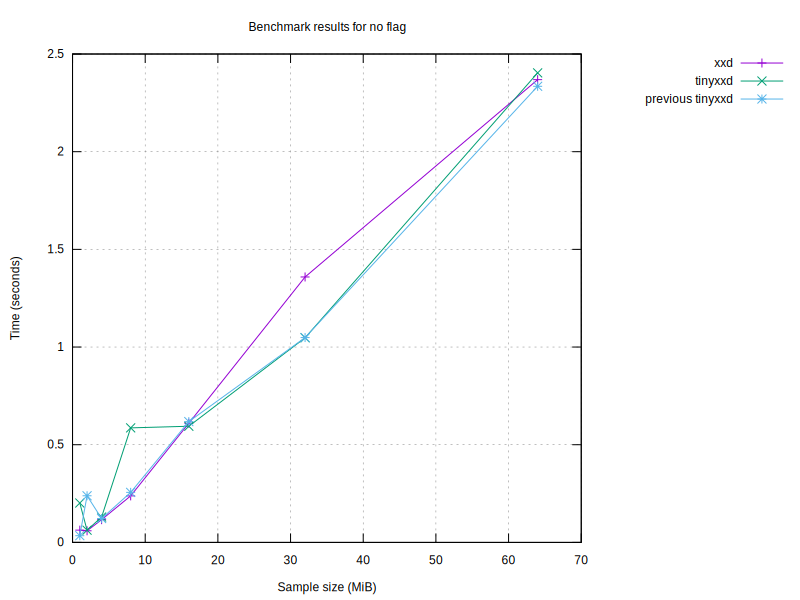

# Benchmark Results

| Program | Size (MiB) | Conversion Time (s) | Flags |
|---------|------------|----------------------|-------|
| tinyxxd | 64 | 1.35 |  |
| tinyxxd | 64 | 2.14 | -r |
| tinyxxd | 64 | 1.25 |  |
| tinyxxd | 64 | 0.80 | -p |
| tinyxxd | 64 | 4.89 | -i |
| tinyxxd | 64 | 1.34 | -e |
| tinyxxd | 64 | 3.01 | -b |
| tinyxxd | 64 | 1.25 | -u |
| tinyxxd | 64 | 1.46 | -E |
| og_xxd | 64 | 1.39 |  |
| og_xxd | 64 | 2.28 | -r |
| og_xxd | 64 | 1.36 |  |
| og_xxd | 64 | 0.95 | -p |
| og_xxd | 64 | 4.92 | -i |
| og_xxd | 64 | 1.32 | -e |
| og_xxd | 64 | 3.12 | -b |
| og_xxd | 64 | 1.37 | -u |
| og_xxd | 64 | 1.49 | -E |
| og_xxd | 32 | 0.69 |  |
| og_xxd | 32 | 1.12 | -r |
| og_xxd | 32 | 0.69 |  |
| og_xxd | 32 | 0.48 | -p |
| og_xxd | 32 | 2.42 | -i |
| og_xxd | 32 | 0.67 | -e |
| og_xxd | 32 | 1.56 | -b |
| og_xxd | 32 | 0.69 | -u |
| og_xxd | 32 | 0.75 | -E |
| tinyxxd | 32 | 0.65 |  |
| tinyxxd | 32 | 1.08 | -r |
| tinyxxd | 32 | 0.65 |  |
| tinyxxd | 32 | 0.40 | -p |
| tinyxxd | 32 | 2.43 | -i |
| tinyxxd | 32 | 0.65 | -e |
| tinyxxd | 32 | 1.49 | -b |
| tinyxxd | 32 | 0.64 | -u |
| tinyxxd | 32 | 0.71 | -E |
| og_xxd | 16 | 0.35 |  |
| og_xxd | 16 | 0.54 | -r |
| og_xxd | 16 | 0.33 |  |
| og_xxd | 16 | 0.24 | -p |
| og_xxd | 16 | 1.21 | -i |
| og_xxd | 16 | 0.34 | -e |
| og_xxd | 16 | 0.83 | -b |
| og_xxd | 16 | 0.35 | -u |
| og_xxd | 16 | 0.38 | -E |
| tinyxxd | 16 | 0.33 |  |
| tinyxxd | 16 | 0.54 | -r |
| tinyxxd | 16 | 0.32 |  |
| tinyxxd | 16 | 0.20 | -p |
| tinyxxd | 16 | 1.20 | -i |
| tinyxxd | 16 | 0.32 | -e |
| tinyxxd | 16 | 0.74 | -b |
| tinyxxd | 16 | 0.32 | -u |
| tinyxxd | 16 | 0.37 | -E |
| tinyxxd | 8 | 0.16 |  |
| tinyxxd | 8 | 0.27 | -r |
| tinyxxd | 8 | 0.16 |  |
| tinyxxd | 8 | 0.10 | -p |
| tinyxxd | 8 | 0.60 | -i |
| tinyxxd | 8 | 0.16 | -e |
| tinyxxd | 8 | 0.38 | -b |
| tinyxxd | 8 | 0.17 | -u |
| tinyxxd | 8 | 0.18 | -E |
| og_xxd | 8 | 0.17 |  |
| og_xxd | 8 | 0.28 | -r |
| og_xxd | 8 | 0.17 |  |
| og_xxd | 8 | 0.12 | -p |
| og_xxd | 8 | 0.62 | -i |
| og_xxd | 8 | 0.17 | -e |
| og_xxd | 8 | 0.38 | -b |
| og_xxd | 8 | 0.21 | -u |
| og_xxd | 8 | 0.19 | -E |

## Performance Summaries
- With flags '' and size 64MiB, tinyxxd was 5.65% faster.
- With flags '-r' and size 64MiB, tinyxxd was 6.53% faster.
- With flags '-p' and size 64MiB, tinyxxd was 18.89% faster.
- With flags '-u' and size 64MiB, tinyxxd was 9.79% faster.
- With flags '' and size 32MiB, tinyxxd was 5.92% faster.
- With flags '-p' and size 32MiB, tinyxxd was 18.49% faster.
- With flags '-u' and size 32MiB, tinyxxd was 9.05% faster.
- With flags '' and size 16MiB, tinyxxd was 6.00% faster.
- With flags '-p' and size 16MiB, tinyxxd was 18.19% faster.
- With flags '-e' and size 16MiB, tinyxxd was 6.25% faster.
- With flags '-b' and size 16MiB, tinyxxd was 11.51% faster.
- With flags '-u' and size 16MiB, tinyxxd was 9.92% faster.
- With flags '' and size 8MiB, tinyxxd was 6.41% faster.
- With flags '-p' and size 8MiB, tinyxxd was 17.44% faster.
- With flags '-u' and size 8MiB, tinyxxd was 21.81% faster.
- With flags '-E' and size 8MiB, tinyxxd was 5.55% faster.

### Performance by sample size
- For 64MiB files, tinyxxd was 4.05% faster than og_xxd.
- For 32MiB files, tinyxxd was 4.16% faster than og_xxd.
- For 16MiB files, tinyxxd was 5.39% faster than og_xxd.
- For 8MiB files, tinyxxd was 5.35% faster than og_xxd.

### Performance by flag
- With flag '', tinyxxd was 5.82% faster.
- With flag '-p', tinyxxd was 18.59% faster.
- With flag '-u', tinyxxd was 10.50% faster.

### Performance compared to last run
- For 64MiB files with flags '', tinyxxd improved by 9.78% compared to the last run.
- For 64MiB files with flags '-r', tinyxxd improved by 2.32% compared to the last run.
- For 64MiB files with flags '', tinyxxd improved by 16.87% compared to the last run.
- For 64MiB files with flags '-p', tinyxxd improved by 0.90% compared to the last run.
- For 64MiB files with flags '-i', tinyxxd slowed down by 1.49% compared to the last run.
- For 64MiB files with flags '-e', tinyxxd slowed down by 4.91% compared to the last run.
- For 64MiB files with flags '-b', tinyxxd improved by 0.38% compared to the last run.
- For 64MiB files with flags '-u', tinyxxd slowed down by 0.29% compared to the last run.
- For 64MiB files with flags '-E', tinyxxd slowed down by 4.18% compared to the last run.
- For 64MiB files with flags '', og_xxd improved by 24.93% compared to the last run.
- For 64MiB files with flags '-r', og_xxd slowed down by 5.66% compared to the last run.
- For 64MiB files with flags '', og_xxd improved by 26.35% compared to the last run.
- For 64MiB files with flags '-p', og_xxd slowed down by 0.59% compared to the last run.
- For 64MiB files with flags '-i', og_xxd improved by 1.63% compared to the last run.
- For 64MiB files with flags '-e', og_xxd improved by 1.58% compared to the last run.
- For 64MiB files with flags '-b', og_xxd slowed down by 0.74% compared to the last run.
- For 64MiB files with flags '-u', og_xxd improved by 0.17% compared to the last run.
- For 64MiB files with flags '-E', og_xxd improved by 1.15% compared to the last run.
- For 32MiB files with flags '', og_xxd improved by 14.50% compared to the last run.
- For 32MiB files with flags '-r', og_xxd slowed down by 1.29% compared to the last run.
- For 32MiB files with flags '', og_xxd improved by 14.11% compared to the last run.
- For 32MiB files with flags '-p', og_xxd slowed down by 0.32% compared to the last run.
- For 32MiB files with flags '-i', og_xxd improved by 1.85% compared to the last run.
- For 32MiB files with flags '-e', og_xxd improved by 0.19% compared to the last run.
- For 32MiB files with flags '-b', og_xxd slowed down by 0.10% compared to the last run.
- For 32MiB files with flags '-u', og_xxd slowed down by 2.27% compared to the last run.
- For 32MiB files with flags '-E', og_xxd slowed down by 0.12% compared to the last run.
- For 32MiB files with flags '', tinyxxd improved by 60.26% compared to the last run.
- For 32MiB files with flags '-r', tinyxxd slowed down by 0.98% compared to the last run.
- For 32MiB files with flags '', tinyxxd improved by 60.20% compared to the last run.
- For 32MiB files with flags '-p', tinyxxd improved by 2.72% compared to the last run.
- For 32MiB files with flags '-i', tinyxxd improved by 2.42% compared to the last run.
- For 32MiB files with flags '-e', tinyxxd slowed down by 0.74% compared to the last run.
- For 32MiB files with flags '-b', tinyxxd slowed down by 0.21% compared to the last run.
- For 32MiB files with flags '-u', tinyxxd slowed down by 2.18% compared to the last run.
- For 32MiB files with flags '-E', tinyxxd slowed down by 1.52% compared to the last run.
- For 16MiB files with flags '', og_xxd improved by 10.83% compared to the last run.
- For 16MiB files with flags '-r', og_xxd slowed down by 0.73% compared to the last run.
- For 16MiB files with flags '', og_xxd improved by 14.67% compared to the last run.
- For 16MiB files with flags '-p', og_xxd improved by 0.14% compared to the last run.
- For 16MiB files with flags '-i', og_xxd improved by 3.87% compared to the last run.
- For 16MiB files with flags '-e', og_xxd improved by 8.81% compared to the last run.
- For 16MiB files with flags '-b', og_xxd slowed down by 5.36% compared to the last run.
- For 16MiB files with flags '-u', og_xxd slowed down by 1.51% compared to the last run.
- For 16MiB files with flags '-E', og_xxd slowed down by 1.33% compared to the last run.
- For 16MiB files with flags '', tinyxxd improved by 3.03% compared to the last run.
- For 16MiB files with flags '-r', tinyxxd slowed down by 1.21% compared to the last run.
- For 16MiB files with flags '', tinyxxd improved by 6.75% compared to the last run.
- For 16MiB files with flags '-p', tinyxxd improved by 1.43% compared to the last run.
- For 16MiB files with flags '-i', tinyxxd improved by 2.01% compared to the last run.
- For 16MiB files with flags '-e', tinyxxd slowed down by 0.57% compared to the last run.
- For 16MiB files with flags '-b', tinyxxd improved by 2.63% compared to the last run.
- For 16MiB files with flags '-u', tinyxxd slowed down by 0.41% compared to the last run.
- For 16MiB files with flags '-E', tinyxxd slowed down by 5.11% compared to the last run.
- For 8MiB files with flags '', tinyxxd improved by 7.39% compared to the last run.
- For 8MiB files with flags '-r', tinyxxd slowed down by 0.95% compared to the last run.
- For 8MiB files with flags '', tinyxxd improved by 9.92% compared to the last run.
- For 8MiB files with flags '-p', tinyxxd improved by 0.15% compared to the last run.
- For 8MiB files with flags '-i', tinyxxd improved by 0.92% compared to the last run.
- For 8MiB files with flags '-e', tinyxxd improved by 0.53% compared to the last run.
- For 8MiB files with flags '-b', tinyxxd improved by 1.12% compared to the last run.
- For 8MiB files with flags '-u', tinyxxd slowed down by 8.40% compared to the last run.
- For 8MiB files with flags '-E', tinyxxd improved by 0.01% compared to the last run.
- For 8MiB files with flags '', og_xxd improved by 5.18% compared to the last run.
- For 8MiB files with flags '-r', og_xxd slowed down by 0.71% compared to the last run.
- For 8MiB files with flags '', og_xxd improved by 5.08% compared to the last run.
- For 8MiB files with flags '-p', og_xxd improved by 0.91% compared to the last run.
- For 8MiB files with flags '-i', og_xxd slowed down by 1.28% compared to the last run.
- For 8MiB files with flags '-e', og_xxd improved by 0.92% compared to the last run.
- For 8MiB files with flags '-b', og_xxd improved by 0.82% compared to the last run.
- For 8MiB files with flags '-u', og_xxd slowed down by 27.02% compared to the last run.
- For 8MiB files with flags '-E', og_xxd improved by 0.13% compared to the last run.

## Graphs

### Graph by Size

### Graph for no flag

### Graph for flag '-p'

### Graph for flag '-i'

### Graph for flag '-e'

### Graph for flag '-b'

### Graph for flag '-u'

### Graph for flag '-E'

Report generated on: 2024-02-10T10:24:20.479287
