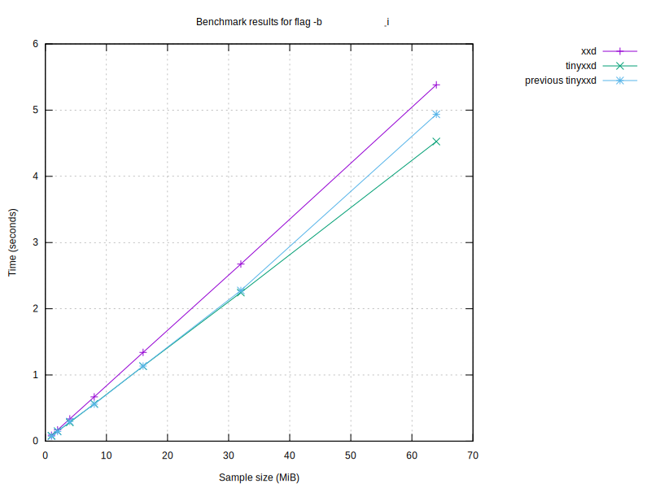

# Benchmark results

## Graphs

### Graph by sample size

### Graph for no flag

### Graph for flag '-p'

### Graph for flag '-i'

### Graph for flag '-e'

### Graph for flag '-b'

### Graph for flag '-u'

### Graph for flag '-E'

### Graph for flag '-b -i'

| Program | Size (MiB) | Conversion Time (s) | Flags |
|---------|------------|----------------------|-------|
| xxd | 64 | 1.55 |  |
| xxd | 64 | 2.10 | -r |
| xxd | 64 | 4.69 |  |
| xxd | 64 | 4.05 | -r |
| xxd | 64 | 1.51 |  |
| xxd | 64 | 0.98 | -p |
| xxd | 64 | 4.86 | -i |
| xxd | 64 | 1.52 | -e |
| xxd | 64 | 3.23 | -b |
| xxd | 64 | 1.52 | -u |
| xxd | 64 | 1.65 | -E |
| xxd | 64 | 5.80 | -b -i |
| tinyxxd | 64 | 1.28 |  |
| tinyxxd | 64 | 1.50 | -r |
| tinyxxd | 64 | 4.89 |  |
| tinyxxd | 64 | 3.69 | -r |
| tinyxxd | 64 | 1.26 |  |
| tinyxxd | 64 | 0.79 | -p |
| tinyxxd | 64 | 4.79 | -i |
| tinyxxd | 64 | 1.28 | -e |
| tinyxxd | 64 | 2.98 | -b |
| tinyxxd | 64 | 1.25 | -u |
| tinyxxd | 64 | 1.43 | -E |
| tinyxxd | 64 | 4.51 | -b -i |
| xxd | 32 | 0.78 |  |
| xxd | 32 | 1.05 | -r |
| xxd | 32 | 2.39 |  |
| xxd | 32 | 2.04 | -r |
| xxd | 32 | 0.75 |  |
| xxd | 32 | 0.46 | -p |
| xxd | 32 | 2.45 | -i |
| xxd | 32 | 0.78 | -e |
| xxd | 32 | 1.62 | -b |
| xxd | 32 | 0.75 | -u |
| xxd | 32 | 0.82 | -E |
| xxd | 32 | 2.86 | -b -i |
| tinyxxd | 32 | 0.64 |  |
| tinyxxd | 32 | 0.77 | -r |
| tinyxxd | 32 | 2.02 |  |
| tinyxxd | 32 | 1.83 | -r |
| tinyxxd | 32 | 0.62 |  |
| tinyxxd | 32 | 0.40 | -p |
| tinyxxd | 32 | 2.36 | -i |
| tinyxxd | 32 | 0.65 | -e |
| tinyxxd | 32 | 1.49 | -b |
| tinyxxd | 32 | 0.62 | -u |
| tinyxxd | 32 | 0.70 | -E |
| tinyxxd | 32 | 2.25 | -b -i |
| tinyxxd | 16 | 0.34 |  |
| tinyxxd | 16 | 0.37 | -r |
| tinyxxd | 16 | 0.85 |  |
| tinyxxd | 16 | 0.92 | -r |
| tinyxxd | 16 | 0.31 |  |
| tinyxxd | 16 | 0.20 | -p |
| tinyxxd | 16 | 1.18 | -i |
| tinyxxd | 16 | 0.32 | -e |
| tinyxxd | 16 | 0.76 | -b |
| tinyxxd | 16 | 0.31 | -u |
| tinyxxd | 16 | 0.35 | -E |
| tinyxxd | 16 | 1.16 | -b -i |
| xxd | 16 | 0.53 |  |
| xxd | 16 | 0.53 | -r |
| xxd | 16 | 0.91 |  |
| xxd | 16 | 1.00 | -r |
| xxd | 16 | 0.39 |  |
| xxd | 16 | 0.23 | -p |
| xxd | 16 | 1.22 | -i |
| xxd | 16 | 0.38 | -e |
| xxd | 16 | 0.80 | -b |
| xxd | 16 | 0.38 | -u |
| xxd | 16 | 0.41 | -E |
| xxd | 16 | 1.44 | -b -i |
| tinyxxd | 8 | 0.16 |  |
| tinyxxd | 8 | 0.19 | -r |
| tinyxxd | 8 | 0.41 |  |
| tinyxxd | 8 | 0.46 | -r |
| tinyxxd | 8 | 0.16 |  |
| tinyxxd | 8 | 0.10 | -p |
| tinyxxd | 8 | 0.59 | -i |
| tinyxxd | 8 | 0.16 | -e |
| tinyxxd | 8 | 0.37 | -b |
| tinyxxd | 8 | 0.16 | -u |
| tinyxxd | 8 | 0.18 | -E |
| tinyxxd | 8 | 0.58 | -b -i |
| xxd | 8 | 0.20 |  |
| xxd | 8 | 0.53 | -r |
| xxd | 8 | 0.90 |  |
| xxd | 8 | 0.50 | -r |
| xxd | 8 | 0.20 |  |
| xxd | 8 | 0.12 | -p |
| xxd | 8 | 0.60 | -i |
| xxd | 8 | 0.20 | -e |
| xxd | 8 | 0.40 | -b |
| xxd | 8 | 0.19 | -u |
| xxd | 8 | 0.21 | -E |
| xxd | 8 | 0.70 | -b -i |
| tinyxxd | 4 | 0.08 |  |
| tinyxxd | 4 | 0.10 | -r |
| tinyxxd | 4 | 0.23 |  |
| tinyxxd | 4 | 0.23 | -r |
| tinyxxd | 4 | 0.08 |  |
| tinyxxd | 4 | 0.05 | -p |
| tinyxxd | 4 | 0.30 | -i |
| tinyxxd | 4 | 0.08 | -e |
| tinyxxd | 4 | 0.21 | -b |
| tinyxxd | 4 | 0.08 | -u |
| tinyxxd | 4 | 0.09 | -E |
| tinyxxd | 4 | 0.28 | -b -i |
| xxd | 4 | 0.10 |  |
| xxd | 4 | 0.14 | -r |
| xxd | 4 | 0.23 |  |
| xxd | 4 | 0.25 | -r |
| xxd | 4 | 0.10 |  |
| xxd | 4 | 0.06 | -p |
| xxd | 4 | 0.30 | -i |
| xxd | 4 | 0.10 | -e |
| xxd | 4 | 0.20 | -b |
| xxd | 4 | 0.10 | -u |
| xxd | 4 | 0.11 | -E |
| xxd | 4 | 0.35 | -b -i |
| tinyxxd | 2 | 0.04 |  |
| tinyxxd | 2 | 0.05 | -r |
| tinyxxd | 2 | 0.11 |  |
| tinyxxd | 2 | 0.12 | -r |
| tinyxxd | 2 | 0.04 |  |
| tinyxxd | 2 | 0.03 | -p |
| tinyxxd | 2 | 0.15 | -i |
| tinyxxd | 2 | 0.04 | -e |
| tinyxxd | 2 | 0.10 | -b |
| tinyxxd | 2 | 0.04 | -u |
| tinyxxd | 2 | 0.05 | -E |
| tinyxxd | 2 | 0.14 | -b -i |
| xxd | 2 | 0.05 |  |
| xxd | 2 | 0.07 | -r |
| xxd | 2 | 0.11 |  |
| xxd | 2 | 0.13 | -r |
| xxd | 2 | 0.05 |  |
| xxd | 2 | 0.03 | -p |
| xxd | 2 | 0.15 | -i |
| xxd | 2 | 0.05 | -e |
| xxd | 2 | 0.10 | -b |
| xxd | 2 | 0.05 | -u |
| xxd | 2 | 0.06 | -E |
| xxd | 2 | 0.18 | -b -i |
| tinyxxd | 1 | 0.02 |  |
| tinyxxd | 1 | 0.03 | -r |
| tinyxxd | 1 | 0.06 |  |
| tinyxxd | 1 | 0.06 | -r |
| tinyxxd | 1 | 0.02 |  |
| tinyxxd | 1 | 0.02 | -p |
| tinyxxd | 1 | 0.08 | -i |
| tinyxxd | 1 | 0.02 | -e |
| tinyxxd | 1 | 0.05 | -b |
| tinyxxd | 1 | 0.02 | -u |
| tinyxxd | 1 | 0.03 | -E |
| tinyxxd | 1 | 0.08 | -b -i |
| xxd | 1 | 0.03 |  |
| xxd | 1 | 0.04 | -r |
| xxd | 1 | 0.06 |  |
| xxd | 1 | 0.22 | -r |
| xxd | 1 | 0.03 |  |
| xxd | 1 | 0.02 | -p |
| xxd | 1 | 0.08 | -i |
| xxd | 1 | 0.03 | -e |
| xxd | 1 | 0.05 | -b |
| xxd | 1 | 0.03 | -u |
| xxd | 1 | 0.03 | -E |
| xxd | 1 | 0.09 | -b -i |

## Performance Summaries
- For sample size 64 MiB, tinyxxd was 18.79% faster with flags '-r'.
- For sample size 64 MiB, tinyxxd was 24.11% faster with flags '-p'.
- For sample size 64 MiB, tinyxxd was 18.56% faster with flags '-e'.
- For sample size 64 MiB, tinyxxd was 8.52% faster with flags '-b'.
- For sample size 64 MiB, tinyxxd was 21.69% faster with flags '-u'.
- For sample size 64 MiB, tinyxxd was 15.06% faster with flags '-E'.
- For sample size 64 MiB, tinyxxd was 28.46% faster with flags '-b -i'.
- For sample size 32 MiB, tinyxxd was 19.20% faster with no flag.
- For sample size 32 MiB, tinyxxd was 18.81% faster with flags '-r'.
- For sample size 32 MiB, tinyxxd was 16.02% faster with flags '-p'.
- For sample size 32 MiB, tinyxxd was 21.07% faster with flags '-e'.
- For sample size 32 MiB, tinyxxd was 8.30% faster with flags '-b'.
- For sample size 32 MiB, tinyxxd was 20.79% faster with flags '-u'.
- For sample size 32 MiB, tinyxxd was 16.48% faster with flags '-E'.
- For sample size 32 MiB, tinyxxd was 26.96% faster with flags '-b -i'.
- For sample size 16 MiB, tinyxxd was 22.67% faster with no flag.
- For sample size 16 MiB, tinyxxd was 19.47% faster with flags '-r'.
- For sample size 16 MiB, tinyxxd was 16.54% faster with flags '-p'.
- For sample size 16 MiB, tinyxxd was 19.63% faster with flags '-e'.
- For sample size 16 MiB, tinyxxd was 5.49% faster with flags '-b'.
- For sample size 16 MiB, tinyxxd was 21.04% faster with flags '-u'.
- For sample size 16 MiB, tinyxxd was 17.08% faster with flags '-E'.
- For sample size 16 MiB, tinyxxd was 24.09% faster with flags '-b -i'.
- For sample size 8 MiB, tinyxxd was 77.28% faster with no flag.
- For sample size 8 MiB, tinyxxd was 58.24% faster with flags '-r'.
- For sample size 8 MiB, tinyxxd was 13.82% faster with flags '-p'.
- For sample size 8 MiB, tinyxxd was 19.79% faster with flags '-e'.
- For sample size 8 MiB, tinyxxd was 8.62% faster with flags '-b'.
- For sample size 8 MiB, tinyxxd was 20.82% faster with flags '-u'.
- For sample size 8 MiB, tinyxxd was 16.75% faster with flags '-E'.
- For sample size 8 MiB, tinyxxd was 21.60% faster with flags '-b -i'.
- For sample size 4 MiB, tinyxxd was 7.96% faster with no flag.
- For sample size 4 MiB, tinyxxd was 18.51% faster with flags '-r'.
- For sample size 4 MiB, tinyxxd was 15.02% faster with flags '-p'.
- For sample size 4 MiB, tinyxxd was 17.91% faster with flags '-e'.
- For sample size 4 MiB, tinyxxd was 16.15% faster with flags '-u'.
- For sample size 4 MiB, tinyxxd was 15.56% faster with flags '-E'.
- For sample size 4 MiB, tinyxxd was 24.23% faster with flags '-b -i'.
- For sample size 2 MiB, tinyxxd was 11.35% faster with no flag.
- For sample size 2 MiB, tinyxxd was 17.26% faster with flags '-r'.
- For sample size 2 MiB, tinyxxd was 14.13% faster with flags '-p'.
- For sample size 2 MiB, tinyxxd was 18.09% faster with flags '-e'.
- For sample size 2 MiB, tinyxxd was 7.30% faster with flags '-b'.
- For sample size 2 MiB, tinyxxd was 16.76% faster with flags '-u'.
- For sample size 2 MiB, tinyxxd was 15.56% faster with flags '-E'.
- For sample size 2 MiB, tinyxxd was 23.93% faster with flags '-b -i'.
- For sample size 1 MiB, tinyxxd was 10.37% faster with no flag.
- For sample size 1 MiB, tinyxxd was 186.51% faster with flags '-r'.
- For sample size 1 MiB, tinyxxd was 10.97% faster with flags '-p'.
- For sample size 1 MiB, tinyxxd was 15.05% faster with flags '-e'.
- For sample size 1 MiB, tinyxxd was 8.10% faster with flags '-b'.
- For sample size 1 MiB, tinyxxd was 19.52% faster with flags '-u'.
- For sample size 1 MiB, tinyxxd was 14.94% faster with flags '-E'.
- For sample size 1 MiB, tinyxxd was 17.65% faster with flags '-b -i'.

### Performance by sample size
- For sample 64 MiB, tinyxxd was 12.87% faster than xxd.
- For sample 32 MiB, tinyxxd was 16.58% faster than xxd.
- For sample 16 MiB, tinyxxd was 16.62% faster than xxd.
- For sample 8 MiB, tinyxxd was 34.91% faster than xxd.
- For sample 4 MiB, tinyxxd was 11.49% faster than xxd.
- For sample 2 MiB, tinyxxd was 13.02% faster than xxd.
- For sample 1 MiB, tinyxxd was 43.03% faster than xxd.

### Performance by flag
- tinyxxd was 14.12% faster with no flag.
- tinyxxd was 22.80% faster with flag '-r'.
- tinyxxd was 19.84% faster with flag '-p'.
- tinyxxd was 19.34% faster with flag '-e'.
- tinyxxd was 7.73% faster with flag '-b'.
- tinyxxd was 21.04% faster with flag '-u'.
- tinyxxd was 15.80% faster with flag '-E'.
- tinyxxd was 26.78% faster with flag '-b -i'.

### Performance compared to last run
- For sample 64 MiB with flags '', xxd slowed down by 3.29% compared to the last run.
- For sample 64 MiB with flags '-r', xxd improved by 48.96% compared to the last run.
- For sample 64 MiB with flags '', xxd slowed down by 212.38% compared to the last run.
- For sample 64 MiB with flags '-r', xxd improved by 1.66% compared to the last run.
- For sample 64 MiB with flags '', xxd slowed down by 0.41% compared to the last run.
- For sample 64 MiB with flags '-p', xxd slowed down by 6.41% compared to the last run.
- For sample 64 MiB with flags '-i', xxd slowed down by 2.67% compared to the last run.
- For sample 64 MiB with flags '-e', xxd improved by 1.66% compared to the last run.
- For sample 64 MiB with flags '-b', xxd improved by 0.05% compared to the last run.
- For sample 64 MiB with flags '-u', xxd improved by 0.56% compared to the last run.
- For sample 64 MiB with flags '-E', xxd improved by 0.36% compared to the last run.
- For sample 64 MiB with flags '-b_-i', xxd slowed down by 2.99% compared to the last run.
- For sample 64 MiB with flags '', tinyxxd slowed down by 2.11% compared to the last run.
- For sample 64 MiB with flags '-r', tinyxxd improved by 60.03% compared to the last run.
- For sample 64 MiB with flags '', tinyxxd slowed down by 288.88% compared to the last run.
- For sample 64 MiB with flags '-r', tinyxxd improved by 1.47% compared to the last run.
- For sample 64 MiB with flags '', tinyxxd slowed down by 0.03% compared to the last run.
- For sample 64 MiB with flags '-p', tinyxxd improved by 1.11% compared to the last run.
- For sample 64 MiB with flags '-i', tinyxxd slowed down by 1.15% compared to the last run.
- For sample 64 MiB with flags '-e', tinyxxd slowed down by 0.06% compared to the last run.
- For sample 64 MiB with flags '-b', tinyxxd improved by 1.41% compared to the last run.
- For sample 64 MiB with flags '-u', tinyxxd improved by 0.90% compared to the last run.
- For sample 64 MiB with flags '-E', tinyxxd slowed down by 0.89% compared to the last run.
- For sample 64 MiB with flags '-b_-i', tinyxxd slowed down by 0.39% compared to the last run.
- For sample 32 MiB with flags '', xxd slowed down by 3.19% compared to the last run.
- For sample 32 MiB with flags '-r', xxd improved by 47.71% compared to the last run.
- For sample 32 MiB with flags '', xxd slowed down by 217.39% compared to the last run.
- For sample 32 MiB with flags '-r', xxd slowed down by 1.75% compared to the last run.
- For sample 32 MiB with flags '', xxd improved by 0.91% compared to the last run.
- For sample 32 MiB with flags '-p', xxd improved by 0.37% compared to the last run.
- For sample 32 MiB with flags '-i', xxd improved by 1.17% compared to the last run.
- For sample 32 MiB with flags '-e', xxd slowed down by 2.29% compared to the last run.
- For sample 32 MiB with flags '-b', xxd improved by 1.33% compared to the last run.
- For sample 32 MiB with flags '-u', xxd improved by 0.68% compared to the last run.
- For sample 32 MiB with flags '-E', xxd improved by 0.57% compared to the last run.
- For sample 32 MiB with flags '-b_-i', xxd slowed down by 1.84% compared to the last run.
- For sample 32 MiB with flags '', tinyxxd slowed down by 3.07% compared to the last run.
- For sample 32 MiB with flags '-r', tinyxxd improved by 60.95% compared to the last run.
- For sample 32 MiB with flags '', tinyxxd slowed down by 223.19% compared to the last run.
- For sample 32 MiB with flags '-r', tinyxxd improved by 7.01% compared to the last run.
- For sample 32 MiB with flags '', tinyxxd improved by 0.17% compared to the last run.
- For sample 32 MiB with flags '-p', tinyxxd improved by 2.54% compared to the last run.
- For sample 32 MiB with flags '-i', tinyxxd improved by 1.82% compared to the last run.
- For sample 32 MiB with flags '-e', tinyxxd improved by 23.22% compared to the last run.
- For sample 32 MiB with flags '-b', tinyxxd slowed down by 1.03% compared to the last run.
- For sample 32 MiB with flags '-u', tinyxxd improved by 6.50% compared to the last run.
- For sample 32 MiB with flags '-E', tinyxxd improved by 0.33% compared to the last run.
- For sample 32 MiB with flags '-b_-i', tinyxxd improved by 0.62% compared to the last run.
- For sample 16 MiB with flags '', tinyxxd slowed down by 7.05% compared to the last run.
- For sample 16 MiB with flags '-r', tinyxxd improved by 59.41% compared to the last run.
- For sample 16 MiB with flags '', tinyxxd slowed down by 169.31% compared to the last run.
- For sample 16 MiB with flags '-r', tinyxxd improved by 0.15% compared to the last run.
- For sample 16 MiB with flags '', tinyxxd improved by 1.11% compared to the last run.
- For sample 16 MiB with flags '-p', tinyxxd improved by 0.57% compared to the last run.
- For sample 16 MiB with flags '-i', tinyxxd improved by 0.09% compared to the last run.
- For sample 16 MiB with flags '-e', tinyxxd improved by 1.07% compared to the last run.
- For sample 16 MiB with flags '-b', tinyxxd slowed down by 2.54% compared to the last run.
- For sample 16 MiB with flags '-u', tinyxxd improved by 0.56% compared to the last run.
- For sample 16 MiB with flags '-E', tinyxxd improved by 6.49% compared to the last run.
- For sample 16 MiB with flags '-b_-i', tinyxxd slowed down by 0.50% compared to the last run.
- For sample 16 MiB with flags '', xxd slowed down by 39.97% compared to the last run.
- For sample 16 MiB with flags '-r', xxd improved by 46.62% compared to the last run.
- For sample 16 MiB with flags '', xxd slowed down by 142.49% compared to the last run.
- For sample 16 MiB with flags '-r', xxd slowed down by 0.72% compared to the last run.
- For sample 16 MiB with flags '', xxd slowed down by 4.45% compared to the last run.
- For sample 16 MiB with flags '-p', xxd slowed down by 0.19% compared to the last run.
- For sample 16 MiB with flags '-i', xxd slowed down by 0.32% compared to the last run.
- For sample 16 MiB with flags '-e', xxd improved by 0.64% compared to the last run.
- For sample 16 MiB with flags '-b', xxd slowed down by 0.09% compared to the last run.
- For sample 16 MiB with flags '-u', xxd slowed down by 1.11% compared to the last run.
- For sample 16 MiB with flags '-E', xxd improved by 2.33% compared to the last run.
- For sample 16 MiB with flags '-b_-i', xxd slowed down by 0.26% compared to the last run.
- For sample 8 MiB with flags '', tinyxxd slowed down by 3.37% compared to the last run.
- For sample 8 MiB with flags '-r', tinyxxd improved by 60.20% compared to the last run.
- For sample 8 MiB with flags '', tinyxxd slowed down by 159.56% compared to the last run.
- For sample 8 MiB with flags '-r', tinyxxd improved by 2.72% compared to the last run.
- For sample 8 MiB with flags '', tinyxxd slowed down by 0.71% compared to the last run.
- For sample 8 MiB with flags '-p', tinyxxd slowed down by 1.68% compared to the last run.
- For sample 8 MiB with flags '-i', tinyxxd improved by 1.74% compared to the last run.
- For sample 8 MiB with flags '-e', tinyxxd improved by 0.16% compared to the last run.
- For sample 8 MiB with flags '-b', tinyxxd improved by 0.30% compared to the last run.
- For sample 8 MiB with flags '-u', tinyxxd improved by 0.42% compared to the last run.
- For sample 8 MiB with flags '-E', tinyxxd improved by 0.60% compared to the last run.
- For sample 8 MiB with flags '-b_-i', tinyxxd slowed down by 1.77% compared to the last run.
- For sample 8 MiB with flags '', xxd slowed down by 2.94% compared to the last run.
- For sample 8 MiB with flags '-r', xxd improved by 34.01% compared to the last run.
- For sample 8 MiB with flags '', xxd slowed down by 373.33% compared to the last run.
- For sample 8 MiB with flags '-r', xxd improved by 37.28% compared to the last run.
- For sample 8 MiB with flags '', xxd slowed down by 7.09% compared to the last run.
- For sample 8 MiB with flags '-p', xxd improved by 0.10% compared to the last run.
- For sample 8 MiB with flags '-i', xxd improved by 0.06% compared to the last run.
- For sample 8 MiB with flags '-e', xxd slowed down by 1.84% compared to the last run.
- For sample 8 MiB with flags '-b', xxd slowed down by 0.57% compared to the last run.
- For sample 8 MiB with flags '-u', xxd slowed down by 0.74% compared to the last run.
- For sample 8 MiB with flags '-E', xxd slowed down by 1.00% compared to the last run.
- For sample 8 MiB with flags '-b_-i', xxd improved by 2.56% compared to the last run.
- For sample 4 MiB with flags '', tinyxxd slowed down by 2.30% compared to the last run.
- For sample 4 MiB with flags '-r', tinyxxd improved by 58.56% compared to the last run.
- For sample 4 MiB with flags '', tinyxxd slowed down by 180.12% compared to the last run.
- For sample 4 MiB with flags '-r', tinyxxd improved by 0.31% compared to the last run.
- For sample 4 MiB with flags '', tinyxxd improved by 2.04% compared to the last run.
- For sample 4 MiB with flags '-p', tinyxxd slowed down by 0.03% compared to the last run.
- For sample 4 MiB with flags '-i', tinyxxd slowed down by 0.36% compared to the last run.
- For sample 4 MiB with flags '-e', tinyxxd slowed down by 0.98% compared to the last run.
- For sample 4 MiB with flags '-b', tinyxxd slowed down by 10.02% compared to the last run.
- For sample 4 MiB with flags '-u', tinyxxd slowed down by 3.75% compared to the last run.
- For sample 4 MiB with flags '-E', tinyxxd improved by 0.43% compared to the last run.
- For sample 4 MiB with flags '-b_-i', tinyxxd slowed down by 0.06% compared to the last run.
- For sample 4 MiB with flags '', xxd slowed down by 4.29% compared to the last run.
- For sample 4 MiB with flags '-r', xxd improved by 46.14% compared to the last run.
- For sample 4 MiB with flags '', xxd slowed down by 139.84% compared to the last run.
- For sample 4 MiB with flags '-r', xxd slowed down by 0.16% compared to the last run.
- For sample 4 MiB with flags '', xxd improved by 0.49% compared to the last run.
- For sample 4 MiB with flags '-p', xxd slowed down by 0.44% compared to the last run.
- For sample 4 MiB with flags '-i', xxd slowed down by 0.30% compared to the last run.
- For sample 4 MiB with flags '-e', xxd slowed down by 1.16% compared to the last run.
- For sample 4 MiB with flags '-b', xxd slowed down by 0.41% compared to the last run.
- For sample 4 MiB with flags '-u', xxd improved by 0.01% compared to the last run.
- For sample 4 MiB with flags '-E', xxd improved by 1.11% compared to the last run.
- For sample 4 MiB with flags '-b_-i', xxd improved by 0.13% compared to the last run.
- For sample 2 MiB with flags '', tinyxxd slowed down by 3.92% compared to the last run.
- For sample 2 MiB with flags '-r', tinyxxd improved by 57.81% compared to the last run.
- For sample 2 MiB with flags '', tinyxxd slowed down by 149.58% compared to the last run.
- For sample 2 MiB with flags '-r', tinyxxd improved by 1.52% compared to the last run.
- For sample 2 MiB with flags '', tinyxxd slowed down by 0.64% compared to the last run.
- For sample 2 MiB with flags '-p', tinyxxd slowed down by 1.06% compared to the last run.
- For sample 2 MiB with flags '-i', tinyxxd slowed down by 0.89% compared to the last run.
- For sample 2 MiB with flags '-e', tinyxxd improved by 0.51% compared to the last run.
- For sample 2 MiB with flags '-b', tinyxxd improved by 0.17% compared to the last run.
- For sample 2 MiB with flags '-u', tinyxxd slowed down by 0.05% compared to the last run.
- For sample 2 MiB with flags '-E', tinyxxd improved by 0.18% compared to the last run.
- For sample 2 MiB with flags '-b_-i', tinyxxd improved by 0.59% compared to the last run.
- For sample 2 MiB with flags '', xxd slowed down by 0.55% compared to the last run.
- For sample 2 MiB with flags '-r', xxd improved by 45.40% compared to the last run.
- For sample 2 MiB with flags '', xxd slowed down by 121.11% compared to the last run.
- For sample 2 MiB with flags '-r', xxd improved by 0.10% compared to the last run.
- For sample 2 MiB with flags '', xxd improved by 1.91% compared to the last run.
- For sample 2 MiB with flags '-p', xxd improved by 0.75% compared to the last run.
- For sample 2 MiB with flags '-i', xxd slowed down by 1.08% compared to the last run.
- For sample 2 MiB with flags '-e', xxd improved by 1.78% compared to the last run.
- For sample 2 MiB with flags '-b', xxd improved by 6.11% compared to the last run.
- For sample 2 MiB with flags '-u', xxd improved by 1.39% compared to the last run.
- For sample 2 MiB with flags '-E', xxd improved by 25.24% compared to the last run.
- For sample 2 MiB with flags '-b_-i', xxd slowed down by 0.08% compared to the last run.
- For sample 1 MiB with flags '', tinyxxd slowed down by 3.75% compared to the last run.
- For sample 1 MiB with flags '-r', tinyxxd improved by 86.86% compared to the last run.
- For sample 1 MiB with flags '', tinyxxd slowed down by 135.85% compared to the last run.
- For sample 1 MiB with flags '-r', tinyxxd improved by 70.39% compared to the last run.
- For sample 1 MiB with flags '', tinyxxd slowed down by 1.03% compared to the last run.
- For sample 1 MiB with flags '-p', tinyxxd slowed down by 1.61% compared to the last run.
- For sample 1 MiB with flags '-i', tinyxxd slowed down by 0.62% compared to the last run.
- For sample 1 MiB with flags '-e', tinyxxd slowed down by 0.64% compared to the last run.
- For sample 1 MiB with flags '-b', tinyxxd improved by 8.31% compared to the last run.
- For sample 1 MiB with flags '-u', tinyxxd improved by 1.95% compared to the last run.
- For sample 1 MiB with flags '-E', tinyxxd slowed down by 0.26% compared to the last run.
- For sample 1 MiB with flags '-b_-i', tinyxxd slowed down by 5.66% compared to the last run.
- For sample 1 MiB with flags '', xxd slowed down by 0.67% compared to the last run.
- For sample 1 MiB with flags '-r', xxd improved by 44.37% compared to the last run.
- For sample 1 MiB with flags '', xxd slowed down by 115.03% compared to the last run.
- For sample 1 MiB with flags '-r', xxd slowed down by 224.04% compared to the last run.
- For sample 1 MiB with flags '', xxd improved by 0.45% compared to the last run.
- For sample 1 MiB with flags '-p', xxd improved by 0.54% compared to the last run.
- For sample 1 MiB with flags '-i', xxd slowed down by 0.67% compared to the last run.
- For sample 1 MiB with flags '-e', xxd improved by 1.27% compared to the last run.
- For sample 1 MiB with flags '-b', xxd slowed down by 1.16% compared to the last run.
- For sample 1 MiB with flags '-u', xxd improved by 23.93% compared to the last run.
- For sample 1 MiB with flags '-E', xxd improved by 12.42% compared to the last run.
- For sample 1 MiB with flags '-b_-i', xxd improved by 0.56% compared to the last run.
---
Report generated on: 2024-10-23T16:56:09.176189
