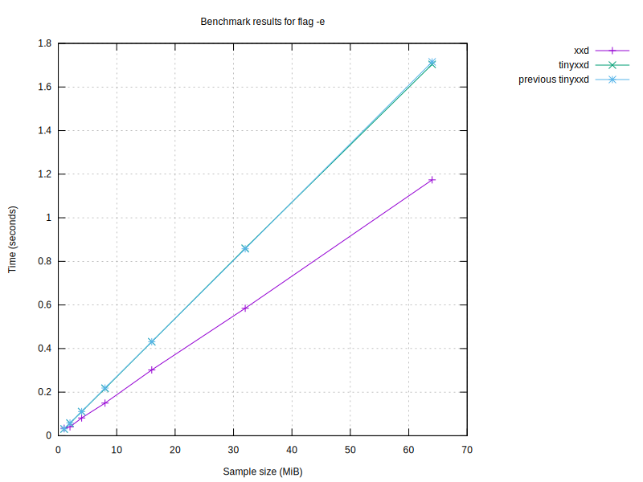

# Benchmark Results

| Program | Size (MiB) | Conversion Time (s) | Flags |
|---------|------------|----------------------|-------|
| original xxd | 64 | 1.61 |  |
| original xxd | 64 | 2.19 | -r |
| original xxd | 64 | 1.54 |  |
| original xxd | 64 | 0.96 | -p |
| original xxd | 64 | 4.97 | -i |
| original xxd | 64 | 1.49 | -e |
| original xxd | 64 | 3.51 | -b |
| original xxd | 64 | 1.54 | -u |
| original xxd | 64 | 1.70 | -E |
| tinyxxd | 64 | 1.33 |  |
| tinyxxd | 64 | 2.17 | -r |
| tinyxxd | 64 | 1.25 |  |
| tinyxxd | 64 | 0.82 | -p |
| tinyxxd | 64 | 4.89 | -i |
| tinyxxd | 64 | 1.29 | -e |
| tinyxxd | 64 | 3.09 | -b |
| tinyxxd | 64 | 1.25 | -u |
| tinyxxd | 64 | 1.40 | -E |
| original xxd | 32 | 0.79 |  |
| original xxd | 32 | 1.13 | -r |
| original xxd | 32 | 0.77 |  |
| original xxd | 32 | 0.48 | -p |
| original xxd | 32 | 2.43 | -i |
| original xxd | 32 | 0.75 | -e |
| original xxd | 32 | 1.76 | -b |
| original xxd | 32 | 0.77 | -u |
| original xxd | 32 | 0.83 | -E |
| tinyxxd | 32 | 0.64 |  |
| tinyxxd | 32 | 1.11 | -r |
| tinyxxd | 32 | 0.65 |  |
| tinyxxd | 32 | 0.42 | -p |
| tinyxxd | 32 | 2.43 | -i |
| tinyxxd | 32 | 0.65 | -e |
| tinyxxd | 32 | 1.53 | -b |
| tinyxxd | 32 | 0.63 | -u |
| tinyxxd | 32 | 0.71 | -E |
| tinyxxd | 16 | 0.32 |  |
| tinyxxd | 16 | 0.54 | -r |
| tinyxxd | 16 | 0.32 |  |
| tinyxxd | 16 | 0.21 | -p |
| tinyxxd | 16 | 1.21 | -i |
| tinyxxd | 16 | 0.32 | -e |
| tinyxxd | 16 | 0.81 | -b |
| tinyxxd | 16 | 0.31 | -u |
| tinyxxd | 16 | 0.38 | -E |
| original xxd | 16 | 0.40 |  |
| original xxd | 16 | 0.55 | -r |
| original xxd | 16 | 0.39 |  |
| original xxd | 16 | 0.24 | -p |
| original xxd | 16 | 1.23 | -i |
| original xxd | 16 | 0.39 | -e |
| original xxd | 16 | 0.91 | -b |
| original xxd | 16 | 0.39 | -u |
| original xxd | 16 | 0.42 | -E |
| tinyxxd | 8 | 0.16 |  |
| tinyxxd | 8 | 0.27 | -r |
| tinyxxd | 8 | 0.16 |  |
| tinyxxd | 8 | 0.11 | -p |
| tinyxxd | 8 | 0.61 | -i |
| tinyxxd | 8 | 0.16 | -e |
| tinyxxd | 8 | 0.38 | -b |
| tinyxxd | 8 | 0.16 | -u |
| tinyxxd | 8 | 0.18 | -E |
| original xxd | 8 | 0.20 |  |
| original xxd | 8 | 0.28 | -r |
| original xxd | 8 | 0.19 |  |
| original xxd | 8 | 0.12 | -p |
| original xxd | 8 | 0.61 | -i |
| original xxd | 8 | 0.19 | -e |
| original xxd | 8 | 0.49 | -b |
| original xxd | 8 | 0.19 | -u |
| original xxd | 8 | 0.21 | -E |

## Performance Summaries
- With flags '' and size 64MiB, tinyxxd was 22.21% faster.
- With flags '-p' and size 64MiB, tinyxxd was 16.43% faster.
- With flags '-e' and size 64MiB, tinyxxd was 15.41% faster.
- With flags '-b' and size 64MiB, tinyxxd was 13.49% faster.
- With flags '-u' and size 64MiB, tinyxxd was 23.13% faster.
- With flags '-E' and size 64MiB, tinyxxd was 21.00% faster.
- With flags '' and size 32MiB, tinyxxd was 20.93% faster.
- With flags '-p' and size 32MiB, tinyxxd was 14.97% faster.
- With flags '-e' and size 32MiB, tinyxxd was 14.92% faster.
- With flags '-b' and size 32MiB, tinyxxd was 15.45% faster.
- With flags '-u' and size 32MiB, tinyxxd was 22.38% faster.
- With flags '-E' and size 32MiB, tinyxxd was 16.76% faster.
- With flags '' and size 16MiB, tinyxxd was 22.79% faster.
- With flags '-p' and size 16MiB, tinyxxd was 15.96% faster.
- With flags '-e' and size 16MiB, tinyxxd was 19.04% faster.
- With flags '-b' and size 16MiB, tinyxxd was 12.29% faster.
- With flags '-u' and size 16MiB, tinyxxd was 23.21% faster.
- With flags '-E' and size 16MiB, tinyxxd was 8.38% faster.
- With flags '' and size 8MiB, tinyxxd was 20.89% faster.
- With flags '-p' and size 8MiB, tinyxxd was 15.41% faster.
- With flags '-e' and size 8MiB, tinyxxd was 15.24% faster.
- With flags '-b' and size 8MiB, tinyxxd was 27.62% faster.
- With flags '-u' and size 8MiB, tinyxxd was 19.30% faster.
- With flags '-E' and size 8MiB, tinyxxd was 16.80% faster.

### Performance by sample size
- For 64MiB files, tinyxxd was 11.54% faster than original xxd.
- For 32MiB files, tinyxxd was 10.89% faster than original xxd.
- For 16MiB files, tinyxxd was 10.86% faster than original xxd.
- For 8MiB files, tinyxxd was 12.96% faster than original xxd.

### Performance by flag
- With flag '', tinyxxd was 21.86% faster.
- With flag '-p', tinyxxd was 15.90% faster.
- With flag '-e', tinyxxd was 15.75% faster.
- With flag '-b', tinyxxd was 14.77% faster.
- With flag '-u', tinyxxd was 22.68% faster.
- With flag '-E', tinyxxd was 17.78% faster.

### Performance compared to last run
- For 64MiB files with flags '', original xxd slowed down by 5.42% compared to the last run.
- For 64MiB files with flags '-r', original xxd slowed down by 1.03% compared to the last run.
- For 64MiB files with flags '', original xxd slowed down by 0.41% compared to the last run.
- For 64MiB files with flags '-p', original xxd improved by 1.82% compared to the last run.
- For 64MiB files with flags '-i', original xxd improved by 1.13% compared to the last run.
- For 64MiB files with flags '-e', original xxd improved by 0.30% compared to the last run.
- For 64MiB files with flags '-b', original xxd improved by 0.54% compared to the last run.
- For 64MiB files with flags '-u', original xxd slowed down by 1.68% compared to the last run.
- For 64MiB files with flags '-E', original xxd improved by 2.39% compared to the last run.
- For 64MiB files with flags '', tinyxxd slowed down by 6.47% compared to the last run.
- For 64MiB files with flags '-r', tinyxxd improved by 2.09% compared to the last run.
- For 64MiB files with flags '', tinyxxd improved by 0.35% compared to the last run.
- For 64MiB files with flags '-p', tinyxxd slowed down by 0.08% compared to the last run.
- For 64MiB files with flags '-i', tinyxxd slowed down by 0.07% compared to the last run.
- For 64MiB files with flags '-e', tinyxxd slowed down by 0.95% compared to the last run.
- For 64MiB files with flags '-b', tinyxxd slowed down by 0.76% compared to the last run.
- For 64MiB files with flags '-u', tinyxxd improved by 1.92% compared to the last run.
- For 64MiB files with flags '-E', tinyxxd improved by 1.60% compared to the last run.
- For 32MiB files with flags '', original xxd slowed down by 6.04% compared to the last run.
- For 32MiB files with flags '-r', original xxd slowed down by 3.01% compared to the last run.
- For 32MiB files with flags '', original xxd slowed down by 4.08% compared to the last run.
- For 32MiB files with flags '-p', original xxd slowed down by 0.11% compared to the last run.
- For 32MiB files with flags '-i', original xxd improved by 2.42% compared to the last run.
- For 32MiB files with flags '-e', original xxd slowed down by 0.88% compared to the last run.
- For 32MiB files with flags '-b', original xxd slowed down by 0.07% compared to the last run.
- For 32MiB files with flags '-u', original xxd improved by 1.17% compared to the last run.
- For 32MiB files with flags '-E', original xxd improved by 0.82% compared to the last run.
- For 32MiB files with flags '', tinyxxd improved by 3.36% compared to the last run.
- For 32MiB files with flags '-r', tinyxxd slowed down by 2.89% compared to the last run.
- For 32MiB files with flags '', tinyxxd improved by 2.98% compared to the last run.
- For 32MiB files with flags '-p', tinyxxd slowed down by 0.55% compared to the last run.
- For 32MiB files with flags '-i', tinyxxd slowed down by 0.17% compared to the last run.
- For 32MiB files with flags '-e', tinyxxd slowed down by 1.28% compared to the last run.
- For 32MiB files with flags '-b', tinyxxd improved by 0.38% compared to the last run.
- For 32MiB files with flags '-u', tinyxxd improved by 1.78% compared to the last run.
- For 32MiB files with flags '-E', tinyxxd slowed down by 1.24% compared to the last run.
- For 16MiB files with flags '', tinyxxd slowed down by 2.70% compared to the last run.
- For 16MiB files with flags '-r', tinyxxd improved by 0.67% compared to the last run.
- For 16MiB files with flags '', tinyxxd slowed down by 0.17% compared to the last run.
- For 16MiB files with flags '-p', tinyxxd improved by 0.01% compared to the last run.
- For 16MiB files with flags '-i', tinyxxd improved by 1.61% compared to the last run.
- For 16MiB files with flags '-e', tinyxxd slowed down by 0.02% compared to the last run.
- For 16MiB files with flags '-b', tinyxxd slowed down by 5.05% compared to the last run.
- For 16MiB files with flags '-u', tinyxxd slowed down by 0.19% compared to the last run.
- For 16MiB files with flags '-E', tinyxxd slowed down by 6.49% compared to the last run.
- For 16MiB files with flags '', original xxd slowed down by 6.12% compared to the last run.
- For 16MiB files with flags '-r', original xxd improved by 0.76% compared to the last run.
- For 16MiB files with flags '', original xxd slowed down by 3.54% compared to the last run.
- For 16MiB files with flags '-p', original xxd slowed down by 0.55% compared to the last run.
- For 16MiB files with flags '-i', original xxd slowed down by 1.28% compared to the last run.
- For 16MiB files with flags '-e', original xxd slowed down by 3.67% compared to the last run.
- For 16MiB files with flags '-b', original xxd slowed down by 3.22% compared to the last run.
- For 16MiB files with flags '-u', original xxd slowed down by 3.53% compared to the last run.
- For 16MiB files with flags '-E', original xxd slowed down by 0.45% compared to the last run.
- For 8MiB files with flags '', tinyxxd slowed down by 3.68% compared to the last run.
- For 8MiB files with flags '-r', tinyxxd improved by 0.80% compared to the last run.
- For 8MiB files with flags '', tinyxxd slowed down by 0.01% compared to the last run.
- For 8MiB files with flags '-p', tinyxxd slowed down by 0.09% compared to the last run.
- For 8MiB files with flags '-i', tinyxxd improved by 0.53% compared to the last run.
- For 8MiB files with flags '-e', tinyxxd improved by 0.09% compared to the last run.
- For 8MiB files with flags '-b', tinyxxd improved by 9.51% compared to the last run.
- For 8MiB files with flags '-u', tinyxxd improved by 4.18% compared to the last run.
- For 8MiB files with flags '-E', tinyxxd improved by 0.77% compared to the last run.
- For 8MiB files with flags '', original xxd slowed down by 5.25% compared to the last run.
- For 8MiB files with flags '-r', original xxd slowed down by 1.27% compared to the last run.
- For 8MiB files with flags '', original xxd slowed down by 2.14% compared to the last run.
- For 8MiB files with flags '-p', original xxd improved by 1.50% compared to the last run.
- For 8MiB files with flags '-i', original xxd slowed down by 0.09% compared to the last run.
- For 8MiB files with flags '-e', original xxd improved by 0.21% compared to the last run.
- For 8MiB files with flags '-b', original xxd slowed down by 9.88% compared to the last run.
- For 8MiB files with flags '-u', original xxd improved by 1.12% compared to the last run.
- For 8MiB files with flags '-E', original xxd improved by 0.15% compared to the last run.

## Graphs

### Graph by Size

### Graph for no flag

### Graph for flag '-p'

### Graph for flag '-i'

### Graph for flag '-e'

### Graph for flag '-b'

### Graph for flag '-u'

### Graph for flag '-E'

Report generated on: 2024-02-11T22:13:00.322185
