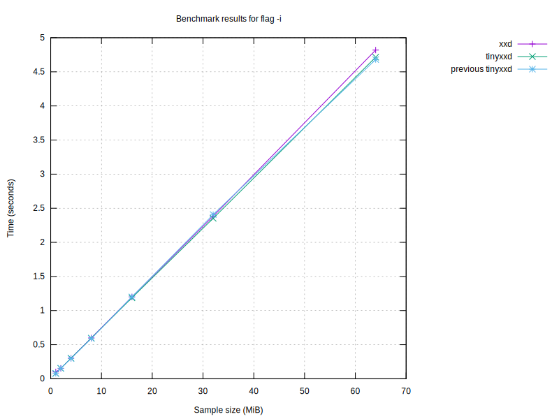
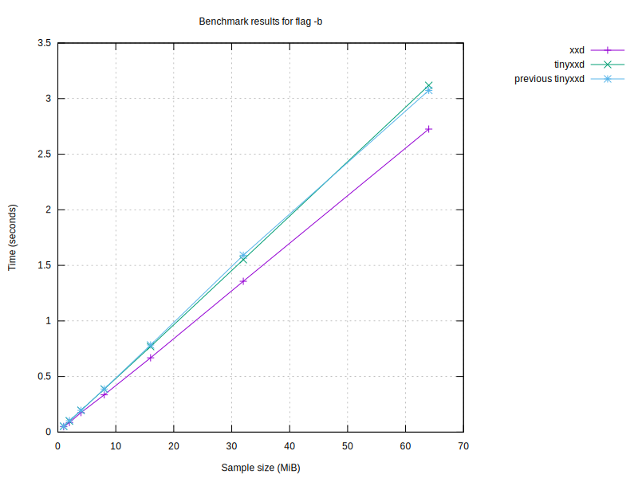

# Benchmark results

| Program | Size (MiB) | Conversion Time (s) | Flags |
|---------|------------|----------------------|-------|
| xxd | 64 | 1.54 |  |
| xxd | 64 | 2.18 | -r |
| xxd | 64 | 5.04 |  |
| xxd | 64 | 3.93 | -r |
| xxd | 64 | 1.53 |  |
| xxd | 64 | 0.95 | -p |
| xxd | 64 | 4.85 | -i |
| xxd | 64 | 1.50 | -e |
| xxd | 64 | 3.59 | -b |
| xxd | 64 | 1.52 | -u |
| xxd | 64 | 1.73 | -E |
| tinyxxd | 64 | 1.29 |  |
| tinyxxd | 64 | 2.06 | -r |
| tinyxxd | 64 | 5.02 |  |
| tinyxxd | 64 | 3.71 | -r |
| tinyxxd | 64 | 1.26 |  |
| tinyxxd | 64 | 0.80 | -p |
| tinyxxd | 64 | 4.88 | -i |
| tinyxxd | 64 | 1.30 | -e |
| tinyxxd | 64 | 3.50 | -b |
| tinyxxd | 64 | 1.26 | -u |
| tinyxxd | 64 | 1.40 | -E |
| tinyxxd | 32 | 0.66 |  |
| tinyxxd | 32 | 1.04 | -r |
| tinyxxd | 32 | 2.54 |  |
| tinyxxd | 32 | 1.77 | -r |
| tinyxxd | 32 | 0.63 |  |
| tinyxxd | 32 | 0.40 | -p |
| tinyxxd | 32 | 2.44 | -i |
| tinyxxd | 32 | 0.66 | -e |
| tinyxxd | 32 | 1.76 | -b |
| tinyxxd | 32 | 0.63 | -u |
| tinyxxd | 32 | 0.71 | -E |
| xxd | 32 | 0.78 |  |
| xxd | 32 | 1.11 | -r |
| xxd | 32 | 2.23 |  |
| xxd | 32 | 1.95 | -r |
| xxd | 32 | 0.77 |  |
| xxd | 32 | 0.48 | -p |
| xxd | 32 | 2.52 | -i |
| xxd | 32 | 0.76 | -e |
| xxd | 32 | 1.78 | -b |
| xxd | 32 | 0.75 | -u |
| xxd | 32 | 0.83 | -E |
| tinyxxd | 16 | 0.33 |  |
| tinyxxd | 16 | 0.50 | -r |
| tinyxxd | 16 | 1.09 |  |
| tinyxxd | 16 | 0.91 | -r |
| tinyxxd | 16 | 0.32 |  |
| tinyxxd | 16 | 0.20 | -p |
| tinyxxd | 16 | 1.26 | -i |
| tinyxxd | 16 | 0.33 | -e |
| tinyxxd | 16 | 0.87 | -b |
| tinyxxd | 16 | 0.33 | -u |
| tinyxxd | 16 | 0.36 | -E |
| xxd | 16 | 0.39 |  |
| xxd | 16 | 0.55 | -r |
| xxd | 16 | 1.79 |  |
| xxd | 16 | 1.24 | -r |
| xxd | 16 | 0.38 |  |
| xxd | 16 | 0.24 | -p |
| xxd | 16 | 1.22 | -i |
| xxd | 16 | 0.37 | -e |
| xxd | 16 | 0.89 | -b |
| xxd | 16 | 0.38 | -u |
| xxd | 16 | 0.41 | -E |
| xxd | 8 | 0.20 |  |
| xxd | 8 | 0.28 | -r |
| xxd | 8 | 0.53 |  |
| xxd | 8 | 0.51 | -r |
| xxd | 8 | 0.19 |  |
| xxd | 8 | 0.12 | -p |
| xxd | 8 | 0.61 | -i |
| xxd | 8 | 0.19 | -e |
| xxd | 8 | 0.44 | -b |
| xxd | 8 | 0.19 | -u |
| xxd | 8 | 0.21 | -E |
| tinyxxd | 8 | 0.18 |  |
| tinyxxd | 8 | 0.26 | -r |
| tinyxxd | 8 | 0.52 |  |
| tinyxxd | 8 | 0.44 | -r |
| tinyxxd | 8 | 0.16 |  |
| tinyxxd | 8 | 0.10 | -p |
| tinyxxd | 8 | 0.60 | -i |
| tinyxxd | 8 | 0.16 | -e |
| tinyxxd | 8 | 0.44 | -b |
| tinyxxd | 8 | 0.17 | -u |
| tinyxxd | 8 | 0.18 | -E |
| xxd | 4 | 0.10 |  |
| xxd | 4 | 0.14 | -r |
| xxd | 4 | 0.24 |  |
| xxd | 4 | 0.25 | -r |
| xxd | 4 | 0.10 |  |
| xxd | 4 | 0.06 | -p |
| xxd | 4 | 0.31 | -i |
| xxd | 4 | 0.10 | -e |
| xxd | 4 | 0.22 | -b |
| xxd | 4 | 0.10 | -u |
| xxd | 4 | 0.11 | -E |
| tinyxxd | 4 | 0.08 |  |
| tinyxxd | 4 | 0.13 | -r |
| tinyxxd | 4 | 0.24 |  |
| tinyxxd | 4 | 0.22 | -r |
| tinyxxd | 4 | 0.09 |  |
| tinyxxd | 4 | 0.05 | -p |
| tinyxxd | 4 | 0.30 | -i |
| tinyxxd | 4 | 0.08 | -e |
| tinyxxd | 4 | 0.22 | -b |
| tinyxxd | 4 | 0.09 | -u |
| tinyxxd | 4 | 0.12 | -E |
| tinyxxd | 2 | 0.05 |  |
| tinyxxd | 2 | 0.07 | -r |
| tinyxxd | 2 | 0.12 |  |
| tinyxxd | 2 | 0.11 | -r |
| tinyxxd | 2 | 0.04 |  |
| tinyxxd | 2 | 0.03 | -p |
| tinyxxd | 2 | 0.16 | -i |
| tinyxxd | 2 | 0.04 | -e |
| tinyxxd | 2 | 0.11 | -b |
| tinyxxd | 2 | 0.04 | -u |
| tinyxxd | 2 | 0.05 | -E |
| xxd | 2 | 0.05 |  |
| xxd | 2 | 0.07 | -r |
| xxd | 2 | 0.12 |  |
| xxd | 2 | 0.12 | -r |
| xxd | 2 | 0.05 |  |
| xxd | 2 | 0.03 | -p |
| xxd | 2 | 0.15 | -i |
| xxd | 2 | 0.05 | -e |
| xxd | 2 | 0.11 | -b |
| xxd | 2 | 0.05 | -u |
| xxd | 2 | 0.06 | -E |
| tinyxxd | 1 | 0.02 |  |
| tinyxxd | 1 | 0.03 | -r |
| tinyxxd | 1 | 0.06 |  |
| tinyxxd | 1 | 0.07 | -r |
| tinyxxd | 1 | 0.02 |  |
| tinyxxd | 1 | 0.02 | -p |
| tinyxxd | 1 | 0.08 | -i |
| tinyxxd | 1 | 0.02 | -e |
| tinyxxd | 1 | 0.06 | -b |
| tinyxxd | 1 | 0.02 | -u |
| tinyxxd | 1 | 0.03 | -E |
| xxd | 1 | 0.03 |  |
| xxd | 1 | 0.10 | -r |
| xxd | 1 | 0.10 |  |
| xxd | 1 | 0.30 | -r |
| xxd | 1 | 0.03 |  |
| xxd | 1 | 0.02 | -p |
| xxd | 1 | 0.08 | -i |
| xxd | 1 | 0.03 | -e |
| xxd | 1 | 0.06 | -b |
| xxd | 1 | 0.03 | -u |
| xxd | 1 | 0.03 | -E |

## Performance Summaries
- With flags '' and size 64MiB, tinyxxd was 7.03% faster.
- With flags '-r' and size 64MiB, tinyxxd was 5.80% faster.
- With flags '-p' and size 64MiB, tinyxxd was 18.92% faster.
- With flags '-e' and size 64MiB, tinyxxd was 15.81% faster.
- With flags '-u' and size 64MiB, tinyxxd was 20.89% faster.
- With flags '-E' and size 64MiB, tinyxxd was 23.40% faster.
- With flags '-r' and size 32MiB, tinyxxd was 8.86% faster.
- With flags '-p' and size 32MiB, tinyxxd was 18.59% faster.
- With flags '-e' and size 32MiB, tinyxxd was 14.66% faster.
- With flags '-u' and size 32MiB, tinyxxd was 19.02% faster.
- With flags '-E' and size 32MiB, tinyxxd was 16.46% faster.
- With flags '' and size 16MiB, tinyxxd was 47.49% faster.
- With flags '-r' and size 16MiB, tinyxxd was 26.87% faster.
- With flags '-p' and size 16MiB, tinyxxd was 18.64% faster.
- With flags '-e' and size 16MiB, tinyxxd was 13.06% faster.
- With flags '-u' and size 16MiB, tinyxxd was 18.08% faster.
- With flags '-E' and size 16MiB, tinyxxd was 16.16% faster.
- With flags '' and size 8MiB, tinyxxd was 7.60% faster.
- With flags '-r' and size 8MiB, tinyxxd was 11.58% faster.
- With flags '-p' and size 8MiB, tinyxxd was 17.75% faster.
- With flags '-e' and size 8MiB, tinyxxd was 15.68% faster.
- With flags '-u' and size 8MiB, tinyxxd was 11.81% faster.
- With flags '-E' and size 8MiB, tinyxxd was 15.87% faster.
- With flags '' and size 4MiB, tinyxxd was 7.18% faster.
- With flags '-r' and size 4MiB, tinyxxd was 9.42% faster.
- With flags '-p' and size 4MiB, tinyxxd was 16.67% faster.
- With flags '-e' and size 4MiB, tinyxxd was 14.89% faster.
- With flags '-E' and size 4MiB, xxd was 9.10% faster.
- With flags '' and size 2MiB, tinyxxd was 7.09% faster.
- With flags '-r' and size 2MiB, tinyxxd was 7.64% faster.
- With flags '-p' and size 2MiB, tinyxxd was 15.41% faster.
- With flags '-e' and size 2MiB, tinyxxd was 13.88% faster.
- With flags '-u' and size 2MiB, tinyxxd was 16.07% faster.
- With flags '-E' and size 2MiB, tinyxxd was 15.12% faster.
- With flags '' and size 1MiB, tinyxxd was 38.01% faster.
- With flags '-r' and size 1MiB, tinyxxd was 302.04% faster.
- With flags '-p' and size 1MiB, tinyxxd was 11.05% faster.
- With flags '-e' and size 1MiB, tinyxxd was 12.02% faster.
- With flags '-u' and size 1MiB, tinyxxd was 17.70% faster.
- With flags '-E' and size 1MiB, tinyxxd was 15.43% faster.

### Performance by sample size
- For 64MiB files, tinyxxd was 7.05% faster than xxd.
- For 32MiB files, tinyxxd was 5.37% faster than xxd.
- For 16MiB files, tinyxxd was 21.39% faster than xxd.
- For 8MiB files, tinyxxd was 8.06% faster than xxd.
- For 4MiB files, tinyxxd was 5.39% faster than xxd.
- For 2MiB files, tinyxxd was 6.55% faster than xxd.
- For 1MiB files, tinyxxd was 79.68% faster than xxd.

### Performance by flag
- With flag '', tinyxxd was 9.93% faster.
- With flag '-r', tinyxxd was 12.34% faster.
- With flag '-p', tinyxxd was 18.50% faster.
- With flag '-e', tinyxxd was 15.06% faster.
- With flag '-u', tinyxxd was 18.74% faster.
- With flag '-E', tinyxxd was 18.76% faster.

### Performance compared to last run
- For 64MiB files with flags '', xxd slowed down by 0.44% compared to the last run.
- For 64MiB files with flags '-r', xxd improved by 46.80% compared to the last run.
- For 64MiB files with flags '', xxd slowed down by 228.99% compared to the last run.
- For 64MiB files with flags '-r', xxd improved by 3.98% compared to the last run.
- For 64MiB files with flags '', xxd improved by 0.36% compared to the last run.
- For 64MiB files with flags '-p', xxd slowed down by 0.22% compared to the last run.
- For 64MiB files with flags '-i', xxd improved by 0.79% compared to the last run.
- For 64MiB files with flags '-e', xxd slowed down by 1.37% compared to the last run.
- For 64MiB files with flags '-b', xxd slowed down by 1.24% compared to the last run.
- For 64MiB files with flags '-u', xxd slowed down by 1.16% compared to the last run.
- For 64MiB files with flags '-E', xxd slowed down by 0.35% compared to the last run.
- For 64MiB files with flags '', tinyxxd slowed down by 3.11% compared to the last run.
- For 64MiB files with flags '-r', tinyxxd improved by 42.54% compared to the last run.
- For 64MiB files with flags '', tinyxxd slowed down by 300.59% compared to the last run.
- For 64MiB files with flags '-r', tinyxxd slowed down by 3.16% compared to the last run.
- For 64MiB files with flags '', tinyxxd slowed down by 0.61% compared to the last run.
- For 64MiB files with flags '-p', tinyxxd slowed down by 0.02% compared to the last run.
- For 64MiB files with flags '-i', tinyxxd slowed down by 0.80% compared to the last run.
- For 64MiB files with flags '-e', tinyxxd improved by 0.56% compared to the last run.
- For 64MiB files with flags '-b', tinyxxd slowed down by 2.75% compared to the last run.
- For 64MiB files with flags '-u', tinyxxd improved by 0.24% compared to the last run.
- For 64MiB files with flags '-E', tinyxxd improved by 3.53% compared to the last run.
- For 32MiB files with flags '', tinyxxd slowed down by 4.24% compared to the last run.
- For 32MiB files with flags '-r', tinyxxd improved by 41.31% compared to the last run.
- For 32MiB files with flags '', tinyxxd slowed down by 302.52% compared to the last run.
- For 32MiB files with flags '-r', tinyxxd slowed down by 0.35% compared to the last run.
- For 32MiB files with flags '', tinyxxd improved by 0.32% compared to the last run.
- For 32MiB files with flags '-p', tinyxxd improved by 0.07% compared to the last run.
- For 32MiB files with flags '-i', tinyxxd improved by 0.23% compared to the last run.
- For 32MiB files with flags '-e', tinyxxd slowed down by 2.20% compared to the last run.
- For 32MiB files with flags '-b', tinyxxd slowed down by 2.81% compared to the last run.
- For 32MiB files with flags '-u', tinyxxd improved by 1.31% compared to the last run.
- For 32MiB files with flags '-E', tinyxxd slowed down by 0.08% compared to the last run.
- For 32MiB files with flags '', xxd slowed down by 3.35% compared to the last run.
- For 32MiB files with flags '-r', xxd improved by 44.38% compared to the last run.
- For 32MiB files with flags '', xxd slowed down by 193.90% compared to the last run.
- For 32MiB files with flags '-r', xxd improved by 2.92% compared to the last run.
- For 32MiB files with flags '', xxd slowed down by 1.07% compared to the last run.
- For 32MiB files with flags '-p', xxd slowed down by 0.13% compared to the last run.
- For 32MiB files with flags '-i', xxd slowed down by 4.80% compared to the last run.
- For 32MiB files with flags '-e', xxd slowed down by 1.72% compared to the last run.
- For 32MiB files with flags '-b', xxd slowed down by 0.81% compared to the last run.
- For 32MiB files with flags '-u', xxd improved by 5.64% compared to the last run.
- For 32MiB files with flags '-E', xxd slowed down by 0.48% compared to the last run.
- For 16MiB files with flags '', tinyxxd slowed down by 1.86% compared to the last run.
- For 16MiB files with flags '-r', tinyxxd improved by 47.68% compared to the last run.
- For 16MiB files with flags '', tinyxxd slowed down by 238.04% compared to the last run.
- For 16MiB files with flags '-r', tinyxxd improved by 5.29% compared to the last run.
- For 16MiB files with flags '', tinyxxd improved by 2.34% compared to the last run.
- For 16MiB files with flags '-p', tinyxxd improved by 14.00% compared to the last run.
- For 16MiB files with flags '-i', tinyxxd slowed down by 2.42% compared to the last run.
- For 16MiB files with flags '-e', tinyxxd slowed down by 2.19% compared to the last run.
- For 16MiB files with flags '-b', tinyxxd slowed down by 0.68% compared to the last run.
- For 16MiB files with flags '-u', tinyxxd slowed down by 2.92% compared to the last run.
- For 16MiB files with flags '-E', tinyxxd improved by 0.02% compared to the last run.
- For 16MiB files with flags '', xxd slowed down by 2.55% compared to the last run.
- For 16MiB files with flags '-r', xxd improved by 43.20% compared to the last run.
- For 16MiB files with flags '', xxd slowed down by 365.74% compared to the last run.
- For 16MiB files with flags '-r', xxd slowed down by 28.06% compared to the last run.
- For 16MiB files with flags '', xxd slowed down by 0.09% compared to the last run.
- For 16MiB files with flags '-p', xxd slowed down by 0.13% compared to the last run.
- For 16MiB files with flags '-i', xxd improved by 0.13% compared to the last run.
- For 16MiB files with flags '-e', xxd improved by 0.53% compared to the last run.
- For 16MiB files with flags '-b', xxd slowed down by 1.19% compared to the last run.
- For 16MiB files with flags '-u', xxd improved by 0.18% compared to the last run.
- For 16MiB files with flags '-E', xxd improved by 6.35% compared to the last run.
- For 8MiB files with flags '', xxd slowed down by 7.15% compared to the last run.
- For 8MiB files with flags '-r', xxd improved by 41.80% compared to the last run.
- For 8MiB files with flags '', xxd slowed down by 179.02% compared to the last run.
- For 8MiB files with flags '-r', xxd slowed down by 6.89% compared to the last run.
- For 8MiB files with flags '', xxd slowed down by 0.29% compared to the last run.
- For 8MiB files with flags '-p', xxd improved by 0.73% compared to the last run.
- For 8MiB files with flags '-i', xxd slowed down by 0.93% compared to the last run.
- For 8MiB files with flags '-e', xxd slowed down by 0.13% compared to the last run.
- For 8MiB files with flags '-b', xxd improved by 0.63% compared to the last run.
- For 8MiB files with flags '-u', xxd slowed down by 1.73% compared to the last run.
- For 8MiB files with flags '-E', xxd improved by 0.49% compared to the last run.
- For 8MiB files with flags '', tinyxxd slowed down by 8.92% compared to the last run.
- For 8MiB files with flags '-r', tinyxxd improved by 45.20% compared to the last run.
- For 8MiB files with flags '', tinyxxd slowed down by 219.87% compared to the last run.
- For 8MiB files with flags '-r', tinyxxd improved by 4.85% compared to the last run.
- For 8MiB files with flags '', tinyxxd improved by 0.85% compared to the last run.
- For 8MiB files with flags '-p', tinyxxd improved by 0.36% compared to the last run.
- For 8MiB files with flags '-i', tinyxxd improved by 1.71% compared to the last run.
- For 8MiB files with flags '-e', tinyxxd improved by 0.86% compared to the last run.
- For 8MiB files with flags '-b', tinyxxd slowed down by 1.71% compared to the last run.
- For 8MiB files with flags '-u', tinyxxd slowed down by 4.11% compared to the last run.
- For 8MiB files with flags '-E', tinyxxd improved by 3.91% compared to the last run.
- For 4MiB files with flags '', xxd improved by 1.27% compared to the last run.
- For 4MiB files with flags '-r', xxd improved by 54.20% compared to the last run.
- For 4MiB files with flags '', xxd slowed down by 138.55% compared to the last run.
- For 4MiB files with flags '-r', xxd improved by 18.91% compared to the last run.
- For 4MiB files with flags '', xxd improved by 4.65% compared to the last run.
- For 4MiB files with flags '-p', xxd improved by 1.07% compared to the last run.
- For 4MiB files with flags '-i', xxd improved by 4.08% compared to the last run.
- For 4MiB files with flags '-e', xxd improved by 3.93% compared to the last run.
- For 4MiB files with flags '-b', xxd improved by 5.41% compared to the last run.
- For 4MiB files with flags '-u', xxd improved by 4.51% compared to the last run.
- For 4MiB files with flags '-E', xxd improved by 1.39% compared to the last run.
- For 4MiB files with flags '', tinyxxd slowed down by 2.74% compared to the last run.
- For 4MiB files with flags '-r', tinyxxd improved by 42.31% compared to the last run.
- For 4MiB files with flags '', tinyxxd slowed down by 189.40% compared to the last run.
- For 4MiB files with flags '-r', tinyxxd slowed down by 0.18% compared to the last run.
- For 4MiB files with flags '', tinyxxd slowed down by 4.11% compared to the last run.
- For 4MiB files with flags '-p', tinyxxd improved by 0.89% compared to the last run.
- For 4MiB files with flags '-i', tinyxxd improved by 1.03% compared to the last run.
- For 4MiB files with flags '-e', tinyxxd improved by 24.83% compared to the last run.
- For 4MiB files with flags '-b', tinyxxd improved by 0.01% compared to the last run.
- For 4MiB files with flags '-u', tinyxxd slowed down by 11.15% compared to the last run.
- For 4MiB files with flags '-E', tinyxxd slowed down by 26.20% compared to the last run.
- For 2MiB files with flags '', tinyxxd slowed down by 5.04% compared to the last run.
- For 2MiB files with flags '-r', tinyxxd improved by 42.69% compared to the last run.
- For 2MiB files with flags '', tinyxxd slowed down by 184.75% compared to the last run.
- For 2MiB files with flags '-r', tinyxxd improved by 0.45% compared to the last run.
- For 2MiB files with flags '', tinyxxd slowed down by 0.90% compared to the last run.
- For 2MiB files with flags '-p', tinyxxd slowed down by 0.43% compared to the last run.
- For 2MiB files with flags '-i', tinyxxd improved by 0.09% compared to the last run.
- For 2MiB files with flags '-e', tinyxxd improved by 0.16% compared to the last run.
- For 2MiB files with flags '-b', tinyxxd slowed down by 2.28% compared to the last run.
- For 2MiB files with flags '-u', tinyxxd slowed down by 0.50% compared to the last run.
- For 2MiB files with flags '-E', tinyxxd improved by 0.05% compared to the last run.
- For 2MiB files with flags '', xxd slowed down by 4.22% compared to the last run.
- For 2MiB files with flags '-r', xxd improved by 41.29% compared to the last run.
- For 2MiB files with flags '', xxd slowed down by 141.15% compared to the last run.
- For 2MiB files with flags '-r', xxd improved by 1.77% compared to the last run.
- For 2MiB files with flags '', xxd slowed down by 0.51% compared to the last run.
- For 2MiB files with flags '-p', xxd improved by 1.10% compared to the last run.
- For 2MiB files with flags '-i', xxd improved by 1.45% compared to the last run.
- For 2MiB files with flags '-e', xxd improved by 0.05% compared to the last run.
- For 2MiB files with flags '-b', xxd slowed down by 0.96% compared to the last run.
- For 2MiB files with flags '-u', xxd improved by 2.13% compared to the last run.
- For 2MiB files with flags '-E', xxd slowed down by 0.04% compared to the last run.
- For 1MiB files with flags '', tinyxxd slowed down by 0.90% compared to the last run.
- For 1MiB files with flags '-r', tinyxxd improved by 43.94% compared to the last run.
- For 1MiB files with flags '', tinyxxd slowed down by 158.40% compared to the last run.
- For 1MiB files with flags '-r', tinyxxd slowed down by 7.23% compared to the last run.
- For 1MiB files with flags '', tinyxxd improved by 2.73% compared to the last run.
- For 1MiB files with flags '-p', tinyxxd improved by 0.63% compared to the last run.
- For 1MiB files with flags '-i', tinyxxd slowed down by 4.90% compared to the last run.
- For 1MiB files with flags '-e', tinyxxd improved by 1.50% compared to the last run.
- For 1MiB files with flags '-b', tinyxxd slowed down by 5.44% compared to the last run.
- For 1MiB files with flags '-u', tinyxxd improved by 1.17% compared to the last run.
- For 1MiB files with flags '-E', tinyxxd improved by 1.21% compared to the last run.
- For 1MiB files with flags '', xxd slowed down by 0.93% compared to the last run.
- For 1MiB files with flags '-r', xxd slowed down by 61.42% compared to the last run.
- For 1MiB files with flags '', xxd slowed down by 252.13% compared to the last run.
- For 1MiB files with flags '-r', xxd slowed down by 373.37% compared to the last run.
- For 1MiB files with flags '', xxd slowed down by 1.85% compared to the last run.
- For 1MiB files with flags '-p', xxd slowed down by 1.18% compared to the last run.
- For 1MiB files with flags '-i', xxd improved by 3.00% compared to the last run.
- For 1MiB files with flags '-e', xxd improved by 0.68% compared to the last run.
- For 1MiB files with flags '-b', xxd improved by 1.34% compared to the last run.
- For 1MiB files with flags '-u', xxd slowed down by 0.49% compared to the last run.
- For 1MiB files with flags '-E', xxd improved by 0.14% compared to the last run.

## Graphs

### Graph by sample size

### Graph for no flag

### Graph for flag '-p'

### Graph for flag '-i'

### Graph for flag '-e'

### Graph for flag '-b'

### Graph for flag '-u'

### Graph for flag '-E'

Report generated on: 2024-02-15T09:31:34.577548
