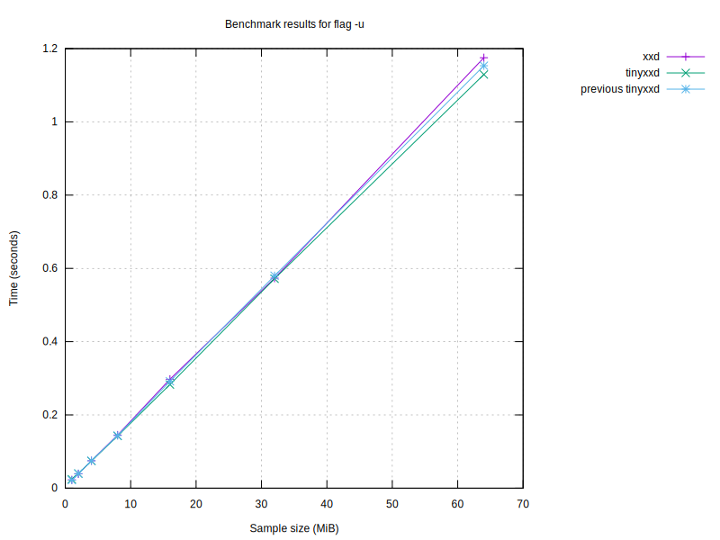

# Benchmark results

## Graphs

### Graph by sample size

### Graph for no flag

### Graph for flag '-p'

### Graph for flag '-i'

### Graph for flag '-e'

### Graph for flag '-b'

### Graph for flag '-u'

### Graph for flag '-E'

### Graph for flag '-b -i'

| Program | Size (MiB) | Conversion Time (s) | Flags |
|---------|------------|----------------------|-------|
| xxd | 64 | 1.33 |  |
| xxd | 64 | 2.22 | -r |
| xxd | 64 | 4.07 | -b |
| xxd | 64 | 4.55 | -r -b |
| xxd | 64 | 1.76 |  |
| xxd | 64 | 1.08 | -p |
| xxd | 64 | 4.88 | -i |
| xxd | 64 | 1.37 | -e |
| xxd | 64 | 2.72 | -b |
| xxd | 64 | 1.32 | -u |
| xxd | 64 | 1.46 | -E |
| xxd | 64 | 5.99 | -b -i |
| tinyxxd | 64 | 0.94 |  |
| tinyxxd | 64 | 0.94 | -r |
| tinyxxd | 64 | 4.98 | -b |
| tinyxxd | 64 | 1.84 | -r -b |
| tinyxxd | 64 | 1.30 |  |
| tinyxxd | 64 | 0.93 | -p |
| tinyxxd | 64 | 4.65 | -i |
| tinyxxd | 64 | 1.11 | -e |
| tinyxxd | 64 | 3.18 | -b |
| tinyxxd | 64 | 0.94 | -u |
| tinyxxd | 64 | 1.08 | -E |
| tinyxxd | 64 | 4.17 | -b -i |
| xxd | 32 | 0.66 |  |
| xxd | 32 | 1.15 | -r |
| xxd | 32 | 1.79 | -b |
| xxd | 32 | 2.19 | -r -b |
| xxd | 32 | 0.75 |  |
| xxd | 32 | 0.52 | -p |
| xxd | 32 | 2.45 | -i |
| xxd | 32 | 0.68 | -e |
| xxd | 32 | 1.34 | -b |
| xxd | 32 | 0.66 | -u |
| xxd | 32 | 0.73 | -E |
| xxd | 32 | 3.05 | -b -i |
| tinyxxd | 32 | 0.48 |  |
| tinyxxd | 32 | 0.46 | -r |
| tinyxxd | 32 | 2.22 | -b |
| tinyxxd | 32 | 0.91 | -r -b |
| tinyxxd | 32 | 0.56 |  |
| tinyxxd | 32 | 0.46 | -p |
| tinyxxd | 32 | 2.33 | -i |
| tinyxxd | 32 | 0.56 | -e |
| tinyxxd | 32 | 1.57 | -b |
| tinyxxd | 32 | 0.46 | -u |
| tinyxxd | 32 | 0.53 | -E |
| tinyxxd | 32 | 2.05 | -b -i |
| tinyxxd | 16 | 0.23 |  |
| tinyxxd | 16 | 0.23 | -r |
| tinyxxd | 16 | 0.98 | -b |
| tinyxxd | 16 | 0.46 | -r -b |
| tinyxxd | 16 | 0.28 |  |
| tinyxxd | 16 | 0.24 | -p |
| tinyxxd | 16 | 1.16 | -i |
| tinyxxd | 16 | 0.28 | -e |
| tinyxxd | 16 | 0.79 | -b |
| tinyxxd | 16 | 0.23 | -u |
| tinyxxd | 16 | 0.27 | -E |
| tinyxxd | 16 | 1.02 | -b -i |
| xxd | 16 | 0.33 |  |
| xxd | 16 | 0.58 | -r |
| xxd | 16 | 0.85 | -b |
| xxd | 16 | 1.12 | -r -b |
| xxd | 16 | 0.37 |  |
| xxd | 16 | 0.26 | -p |
| xxd | 16 | 1.27 | -i |
| xxd | 16 | 0.34 | -e |
| xxd | 16 | 0.67 | -b |
| xxd | 16 | 0.33 | -u |
| xxd | 16 | 0.37 | -E |
| xxd | 16 | 1.48 | -b -i |
| xxd | 8 | 0.17 |  |
| xxd | 8 | 0.29 | -r |
| xxd | 8 | 0.37 | -b |
| xxd | 8 | 0.59 | -r -b |
| xxd | 8 | 0.19 |  |
| xxd | 8 | 0.14 | -p |
| xxd | 8 | 0.61 | -i |
| xxd | 8 | 0.17 | -e |
| xxd | 8 | 0.34 | -b |
| xxd | 8 | 0.17 | -u |
| xxd | 8 | 0.19 | -E |
| xxd | 8 | 0.73 | -b -i |
| tinyxxd | 8 | 0.12 |  |
| tinyxxd | 8 | 0.12 | -r |
| tinyxxd | 8 | 0.42 | -b |
| tinyxxd | 8 | 0.23 | -r -b |
| tinyxxd | 8 | 0.14 |  |
| tinyxxd | 8 | 0.12 | -p |
| tinyxxd | 8 | 0.58 | -i |
| tinyxxd | 8 | 0.14 | -e |
| tinyxxd | 8 | 0.39 | -b |
| tinyxxd | 8 | 0.15 | -u |
| tinyxxd | 8 | 0.13 | -E |
| tinyxxd | 8 | 0.51 | -b -i |
| tinyxxd | 4 | 0.06 |  |
| tinyxxd | 4 | 0.06 | -r |
| tinyxxd | 4 | 0.21 | -b |
| tinyxxd | 4 | 0.12 | -r -b |
| tinyxxd | 4 | 0.07 |  |
| tinyxxd | 4 | 0.06 | -p |
| tinyxxd | 4 | 0.29 | -i |
| tinyxxd | 4 | 0.07 | -e |
| tinyxxd | 4 | 0.20 | -b |
| tinyxxd | 4 | 0.06 | -u |
| tinyxxd | 4 | 0.07 | -E |
| tinyxxd | 4 | 0.26 | -b -i |
| xxd | 4 | 0.08 |  |
| xxd | 4 | 0.14 | -r |
| xxd | 4 | 0.18 | -b |
| xxd | 4 | 0.29 | -r -b |
| xxd | 4 | 0.10 |  |
| xxd | 4 | 0.07 | -p |
| xxd | 4 | 0.31 | -i |
| xxd | 4 | 0.09 | -e |
| xxd | 4 | 0.17 | -b |
| xxd | 4 | 0.08 | -u |
| xxd | 4 | 0.09 | -E |
| xxd | 4 | 0.37 | -b -i |
| xxd | 2 | 0.04 |  |
| xxd | 2 | 0.08 | -r |
| xxd | 2 | 0.09 | -b |
| xxd | 2 | 0.15 | -r -b |
| xxd | 2 | 0.05 |  |
| xxd | 2 | 0.04 | -p |
| xxd | 2 | 0.16 | -i |
| xxd | 2 | 0.05 | -e |
| xxd | 2 | 0.09 | -b |
| xxd | 2 | 0.04 | -u |
| xxd | 2 | 0.05 | -E |
| xxd | 2 | 0.19 | -b -i |
| tinyxxd | 2 | 0.03 |  |
| tinyxxd | 2 | 0.03 | -r |
| tinyxxd | 2 | 0.11 | -b |
| tinyxxd | 2 | 0.06 | -r -b |
| tinyxxd | 2 | 0.04 |  |
| tinyxxd | 2 | 0.03 | -p |
| tinyxxd | 2 | 0.15 | -i |
| tinyxxd | 2 | 0.04 | -e |
| tinyxxd | 2 | 0.10 | -b |
| tinyxxd | 2 | 0.03 | -u |
| tinyxxd | 2 | 0.04 | -E |
| tinyxxd | 2 | 0.13 | -b -i |
| tinyxxd | 1 | 0.02 |  |
| tinyxxd | 1 | 0.02 | -r |
| tinyxxd | 1 | 0.06 | -b |
| tinyxxd | 1 | 0.03 | -r -b |
| tinyxxd | 1 | 0.02 |  |
| tinyxxd | 1 | 0.02 | -p |
| tinyxxd | 1 | 0.08 | -i |
| tinyxxd | 1 | 0.02 | -e |
| tinyxxd | 1 | 0.05 | -b |
| tinyxxd | 1 | 0.02 | -u |
| tinyxxd | 1 | 0.02 | -E |
| tinyxxd | 1 | 0.07 | -b -i |
| xxd | 1 | 0.02 |  |
| xxd | 1 | 0.04 | -r |
| xxd | 1 | 0.05 | -b |
| xxd | 1 | 0.07 | -r -b |
| xxd | 1 | 0.03 |  |
| xxd | 1 | 0.02 | -p |
| xxd | 1 | 0.08 | -i |
| xxd | 1 | 0.02 | -e |
| xxd | 1 | 0.04 | -b |
| xxd | 1 | 0.02 | -u |
| xxd | 1 | 0.03 | -E |
| xxd | 1 | 0.10 | -b -i |

## Performance Summaries
- For sample size 64 MiB, tinyxxd was 37.95% faster with no flag.
- For sample size 64 MiB, tinyxxd was 137.63% faster with flags '-r'.
- For sample size 64 MiB, xxd was 19.98% faster with flags '-b'.
- For sample size 64 MiB, tinyxxd was 147.98% faster with flags '-r -b'.
- For sample size 64 MiB, tinyxxd was 16.50% faster with flags '-p'.
- For sample size 64 MiB, tinyxxd was 23.82% faster with flags '-e'.
- For sample size 64 MiB, tinyxxd was 40.49% faster with flags '-u'.
- For sample size 64 MiB, tinyxxd was 36.04% faster with flags '-E'.
- For sample size 64 MiB, tinyxxd was 43.85% faster with flags '-b -i'.
- For sample size 32 MiB, tinyxxd was 35.88% faster with no flag.
- For sample size 32 MiB, tinyxxd was 149.52% faster with flags '-r'.
- For sample size 32 MiB, xxd was 21.39% faster with flags '-b'.
- For sample size 32 MiB, tinyxxd was 141.35% faster with flags '-r -b'.
- For sample size 32 MiB, tinyxxd was 11.55% faster with flags '-p'.
- For sample size 32 MiB, tinyxxd was 21.85% faster with flags '-e'.
- For sample size 32 MiB, tinyxxd was 42.85% faster with flags '-u'.
- For sample size 32 MiB, tinyxxd was 37.74% faster with flags '-E'.
- For sample size 32 MiB, tinyxxd was 48.42% faster with flags '-b -i'.
- For sample size 16 MiB, tinyxxd was 37.16% faster with no flag.
- For sample size 16 MiB, tinyxxd was 153.80% faster with flags '-r'.
- For sample size 16 MiB, xxd was 16.60% faster with flags '-b'.
- For sample size 16 MiB, tinyxxd was 144.51% faster with flags '-r -b'.
- For sample size 16 MiB, tinyxxd was 10.35% faster with flags '-p'.
- For sample size 16 MiB, tinyxxd was 8.97% faster with flags '-i'.
- For sample size 16 MiB, tinyxxd was 21.57% faster with flags '-e'.
- For sample size 16 MiB, tinyxxd was 42.56% faster with flags '-u'.
- For sample size 16 MiB, tinyxxd was 38.56% faster with flags '-E'.
- For sample size 16 MiB, tinyxxd was 45.55% faster with flags '-b -i'.
- For sample size 8 MiB, tinyxxd was 40.35% faster with no flag.
- For sample size 8 MiB, tinyxxd was 145.90% faster with flags '-r'.
- For sample size 8 MiB, xxd was 15.62% faster with flags '-b'.
- For sample size 8 MiB, tinyxxd was 159.03% faster with flags '-r -b'.
- For sample size 8 MiB, tinyxxd was 18.35% faster with flags '-p'.
- For sample size 8 MiB, tinyxxd was 5.46% faster with flags '-i'.
- For sample size 8 MiB, tinyxxd was 21.19% faster with flags '-e'.
- For sample size 8 MiB, tinyxxd was 11.67% faster with flags '-u'.
- For sample size 8 MiB, tinyxxd was 37.74% faster with flags '-E'.
- For sample size 8 MiB, tinyxxd was 42.56% faster with flags '-b -i'.
- For sample size 4 MiB, tinyxxd was 37.27% faster with no flag.
- For sample size 4 MiB, tinyxxd was 142.29% faster with flags '-r'.
- For sample size 4 MiB, xxd was 18.34% faster with flags '-b'.
- For sample size 4 MiB, tinyxxd was 147.71% faster with flags '-r -b'.
- For sample size 4 MiB, tinyxxd was 16.63% faster with flags '-p'.
- For sample size 4 MiB, tinyxxd was 6.47% faster with flags '-i'.
- For sample size 4 MiB, tinyxxd was 20.71% faster with flags '-e'.
- For sample size 4 MiB, tinyxxd was 41.19% faster with flags '-u'.
- For sample size 4 MiB, tinyxxd was 35.81% faster with flags '-E'.
- For sample size 4 MiB, tinyxxd was 45.64% faster with flags '-b -i'.
- For sample size 2 MiB, tinyxxd was 37.91% faster with no flag.
- For sample size 2 MiB, tinyxxd was 141.64% faster with flags '-r'.
- For sample size 2 MiB, xxd was 16.58% faster with flags '-b'.
- For sample size 2 MiB, tinyxxd was 145.71% faster with flags '-r -b'.
- For sample size 2 MiB, tinyxxd was 12.02% faster with flags '-p'.
- For sample size 2 MiB, tinyxxd was 21.03% faster with flags '-e'.
- For sample size 2 MiB, tinyxxd was 38.20% faster with flags '-u'.
- For sample size 2 MiB, tinyxxd was 34.28% faster with flags '-E'.
- For sample size 2 MiB, tinyxxd was 45.11% faster with flags '-b -i'.
- For sample size 1 MiB, tinyxxd was 34.39% faster with no flag.
- For sample size 1 MiB, tinyxxd was 133.62% faster with flags '-r'.
- For sample size 1 MiB, xxd was 17.54% faster with flags '-b'.
- For sample size 1 MiB, tinyxxd was 134.95% faster with flags '-r -b'.
- For sample size 1 MiB, tinyxxd was 16.51% faster with flags '-p'.
- For sample size 1 MiB, tinyxxd was 5.54% faster with flags '-i'.
- For sample size 1 MiB, tinyxxd was 18.56% faster with flags '-e'.
- For sample size 1 MiB, tinyxxd was 35.88% faster with flags '-u'.
- For sample size 1 MiB, tinyxxd was 34.22% faster with flags '-E'.
- For sample size 1 MiB, tinyxxd was 44.96% faster with flags '-b -i'.

### Performance by sample size
- For sample 64 MiB, tinyxxd was 25.91% faster than xxd.
- For sample 32 MiB, tinyxxd was 26.69% faster than xxd.
- For sample 16 MiB, tinyxxd was 29.29% faster than xxd.
- For sample 8 MiB, tinyxxd was 29.45% faster than xxd.
- For sample 4 MiB, tinyxxd was 29.64% faster than xxd.
- For sample 2 MiB, tinyxxd was 29.43% faster than xxd.
- For sample 1 MiB, tinyxxd was 28.17% faster than xxd.

### Performance by flag
- tinyxxd was 37.44% faster with no flag.
- tinyxxd was 143.31% faster with flag '-r'.
- xxd was 19.57% faster with flag '-b'.
- tinyxxd was 146.42% faster with flag '-r -b'.
- tinyxxd was 14.53% faster with flag '-p'.
- tinyxxd was 5.64% faster with flag '-i'.
- tinyxxd was 22.68% faster with flag '-e'.
- tinyxxd was 38.99% faster with flag '-u'.
- tinyxxd was 36.83% faster with flag '-E'.
- tinyxxd was 45.21% faster with flag '-b -i'.

### Performance compared to last run
- For sample 64 MiB with flags '', xxd improved by 21.54% compared to the last run.
- For sample 64 MiB with flags '-r', xxd improved by 3.58% compared to the last run.
- For sample 64 MiB with flags '-b', xxd slowed down by 45.45% compared to the last run.
- For sample 64 MiB with flags '-r_-b', xxd slowed down by 0.07% compared to the last run.
- For sample 64 MiB with flags '', xxd slowed down by 3.78% compared to the last run.
- For sample 64 MiB with flags '-p', xxd improved by 1.13% compared to the last run.
- For sample 64 MiB with flags '-i', xxd slowed down by 1.72% compared to the last run.
- For sample 64 MiB with flags '-e', xxd slowed down by 3.29% compared to the last run.
- For sample 64 MiB with flags '-b', xxd improved by 2.75% compared to the last run.
- For sample 64 MiB with flags '-u', xxd improved by 0.36% compared to the last run.
- For sample 64 MiB with flags '-E', xxd improved by 0.35% compared to the last run.
- For sample 64 MiB with flags '-b_-i', xxd slowed down by 2.14% compared to the last run.
- For sample 64 MiB with flags '', tinyxxd improved by 13.97% compared to the last run.
- For sample 64 MiB with flags '-r', tinyxxd improved by 16.97% compared to the last run.
- For sample 64 MiB with flags '-b', tinyxxd slowed down by 54.74% compared to the last run.
- For sample 64 MiB with flags '-r_-b', tinyxxd improved by 1.11% compared to the last run.
- For sample 64 MiB with flags '', tinyxxd slowed down by 19.20% compared to the last run.
- For sample 64 MiB with flags '-p', tinyxxd slowed down by 0.46% compared to the last run.
- For sample 64 MiB with flags '-i', tinyxxd improved by 0.44% compared to the last run.
- For sample 64 MiB with flags '-e', tinyxxd slowed down by 2.20% compared to the last run.
- For sample 64 MiB with flags '-b', tinyxxd improved by 1.31% compared to the last run.
- For sample 64 MiB with flags '-u', tinyxxd slowed down by 6.75% compared to the last run.
- For sample 64 MiB with flags '-E', tinyxxd improved by 1.64% compared to the last run.
- For sample 64 MiB with flags '-b_-i', tinyxxd slowed down by 1.11% compared to the last run.
- For sample 32 MiB with flags '', xxd improved by 11.40% compared to the last run.
- For sample 32 MiB with flags '-r', xxd slowed down by 0.95% compared to the last run.
- For sample 32 MiB with flags '-b', xxd slowed down by 34.21% compared to the last run.
- For sample 32 MiB with flags '-r_-b', xxd improved by 2.16% compared to the last run.
- For sample 32 MiB with flags '', xxd slowed down by 1.17% compared to the last run.
- For sample 32 MiB with flags '-p', xxd improved by 5.78% compared to the last run.
- For sample 32 MiB with flags '-i', xxd slowed down by 1.13% compared to the last run.
- For sample 32 MiB with flags '-e', xxd slowed down by 1.96% compared to the last run.
- For sample 32 MiB with flags '-b', xxd slowed down by 0.52% compared to the last run.
- For sample 32 MiB with flags '-u', xxd improved by 0.61% compared to the last run.
- For sample 32 MiB with flags '-E', xxd improved by 1.35% compared to the last run.
- For sample 32 MiB with flags '-b_-i', xxd slowed down by 2.95% compared to the last run.
- For sample 32 MiB with flags '', tinyxxd improved by 9.97% compared to the last run.
- For sample 32 MiB with flags '-r', tinyxxd improved by 16.30% compared to the last run.
- For sample 32 MiB with flags '-b', tinyxxd slowed down by 36.16% compared to the last run.
- For sample 32 MiB with flags '-r_-b', tinyxxd improved by 1.80% compared to the last run.
- For sample 32 MiB with flags '', tinyxxd slowed down by 4.59% compared to the last run.
- For sample 32 MiB with flags '-p', tinyxxd improved by 0.20% compared to the last run.
- For sample 32 MiB with flags '-i', tinyxxd improved by 0.21% compared to the last run.
- For sample 32 MiB with flags '-e', tinyxxd slowed down by 0.64% compared to the last run.
- For sample 32 MiB with flags '-b', tinyxxd improved by 3.77% compared to the last run.
- For sample 32 MiB with flags '-u', tinyxxd slowed down by 4.46% compared to the last run.
- For sample 32 MiB with flags '-E', tinyxxd improved by 1.33% compared to the last run.
- For sample 32 MiB with flags '-b_-i', tinyxxd improved by 4.49% compared to the last run.
- For sample 16 MiB with flags '', tinyxxd improved by 13.39% compared to the last run.
- For sample 16 MiB with flags '-r', tinyxxd improved by 15.67% compared to the last run.
- For sample 16 MiB with flags '-b', tinyxxd slowed down by 22.40% compared to the last run.
- For sample 16 MiB with flags '-r_-b', tinyxxd improved by 1.72% compared to the last run.
- For sample 16 MiB with flags '', tinyxxd slowed down by 3.53% compared to the last run.
- For sample 16 MiB with flags '-p', tinyxxd slowed down by 0.93% compared to the last run.
- For sample 16 MiB with flags '-i', tinyxxd improved by 0.09% compared to the last run.
- For sample 16 MiB with flags '-e', tinyxxd slowed down by 1.91% compared to the last run.
- For sample 16 MiB with flags '-b', tinyxxd improved by 1.80% compared to the last run.
- For sample 16 MiB with flags '-u', tinyxxd slowed down by 4.29% compared to the last run.
- For sample 16 MiB with flags '-E', tinyxxd improved by 8.28% compared to the last run.
- For sample 16 MiB with flags '-b_-i', tinyxxd improved by 0.25% compared to the last run.
- For sample 16 MiB with flags '', xxd improved by 12.06% compared to the last run.
- For sample 16 MiB with flags '-r', xxd slowed down by 0.02% compared to the last run.
- For sample 16 MiB with flags '-b', xxd slowed down by 27.89% compared to the last run.
- For sample 16 MiB with flags '-r_-b', xxd slowed down by 0.55% compared to the last run.
- For sample 16 MiB with flags '', xxd improved by 0.63% compared to the last run.
- For sample 16 MiB with flags '-p', xxd improved by 5.82% compared to the last run.
- For sample 16 MiB with flags '-i', xxd slowed down by 4.82% compared to the last run.
- For sample 16 MiB with flags '-e', xxd slowed down by 0.06% compared to the last run.
- For sample 16 MiB with flags '-b', xxd slowed down by 0.04% compared to the last run.
- For sample 16 MiB with flags '-u', xxd improved by 0.97% compared to the last run.
- For sample 16 MiB with flags '-E', xxd improved by 0.12% compared to the last run.
- For sample 16 MiB with flags '-b_-i', xxd improved by 0.37% compared to the last run.
- For sample 8 MiB with flags '', xxd improved by 10.94% compared to the last run.
- For sample 8 MiB with flags '-r', xxd improved by 0.62% compared to the last run.
- For sample 8 MiB with flags '-b', xxd slowed down by 9.16% compared to the last run.
- For sample 8 MiB with flags '-r_-b', xxd slowed down by 3.20% compared to the last run.
- For sample 8 MiB with flags '', xxd slowed down by 0.71% compared to the last run.
- For sample 8 MiB with flags '-p', xxd slowed down by 0.15% compared to the last run.
- For sample 8 MiB with flags '-i', xxd slowed down by 0.72% compared to the last run.
- For sample 8 MiB with flags '-e', xxd improved by 0.28% compared to the last run.
- For sample 8 MiB with flags '-b', xxd improved by 0.15% compared to the last run.
- For sample 8 MiB with flags '-u', xxd improved by 0.22% compared to the last run.
- For sample 8 MiB with flags '-E', xxd improved by 0.30% compared to the last run.
- For sample 8 MiB with flags '-b_-i', xxd improved by 2.38% compared to the last run.
- For sample 8 MiB with flags '', tinyxxd improved by 15.62% compared to the last run.
- For sample 8 MiB with flags '-r', tinyxxd improved by 14.60% compared to the last run.
- For sample 8 MiB with flags '-b', tinyxxd slowed down by 2.19% compared to the last run.
- For sample 8 MiB with flags '-r_-b', tinyxxd improved by 3.07% compared to the last run.
- For sample 8 MiB with flags '', tinyxxd improved by 0.31% compared to the last run.
- For sample 8 MiB with flags '-p', tinyxxd improved by 0.64% compared to the last run.
- For sample 8 MiB with flags '-i', tinyxxd improved by 0.13% compared to the last run.
- For sample 8 MiB with flags '-e', tinyxxd slowed down by 2.28% compared to the last run.
- For sample 8 MiB with flags '-b', tinyxxd improved by 4.43% compared to the last run.
- For sample 8 MiB with flags '-u', tinyxxd slowed down by 29.12% compared to the last run.
- For sample 8 MiB with flags '-E', tinyxxd slowed down by 0.39% compared to the last run.
- For sample 8 MiB with flags '-b_-i', tinyxxd improved by 0.22% compared to the last run.
- For sample 4 MiB with flags '', tinyxxd improved by 11.58% compared to the last run.
- For sample 4 MiB with flags '-r', tinyxxd improved by 17.55% compared to the last run.
- For sample 4 MiB with flags '-b', tinyxxd slowed down by 3.12% compared to the last run.
- For sample 4 MiB with flags '-r_-b', tinyxxd improved by 0.87% compared to the last run.
- For sample 4 MiB with flags '', tinyxxd slowed down by 3.35% compared to the last run.
- For sample 4 MiB with flags '-p', tinyxxd slowed down by 0.47% compared to the last run.
- For sample 4 MiB with flags '-i', tinyxxd improved by 1.79% compared to the last run.
- For sample 4 MiB with flags '-e', tinyxxd slowed down by 2.55% compared to the last run.
- For sample 4 MiB with flags '-b', tinyxxd improved by 3.19% compared to the last run.
- For sample 4 MiB with flags '-u', tinyxxd slowed down by 1.21% compared to the last run.
- For sample 4 MiB with flags '-E', tinyxxd slowed down by 0.81% compared to the last run.
- For sample 4 MiB with flags '-b_-i', tinyxxd improved by 7.52% compared to the last run.
- For sample 4 MiB with flags '', xxd improved by 14.01% compared to the last run.
- For sample 4 MiB with flags '-r', xxd improved by 2.06% compared to the last run.
- For sample 4 MiB with flags '-b', xxd slowed down by 5.84% compared to the last run.
- For sample 4 MiB with flags '-r_-b', xxd slowed down by 0.08% compared to the last run.
- For sample 4 MiB with flags '', xxd improved by 1.97% compared to the last run.
- For sample 4 MiB with flags '-p', xxd improved by 0.80% compared to the last run.
- For sample 4 MiB with flags '-i', xxd slowed down by 1.33% compared to the last run.
- For sample 4 MiB with flags '-e', xxd slowed down by 0.13% compared to the last run.
- For sample 4 MiB with flags '-b', xxd improved by 0.41% compared to the last run.
- For sample 4 MiB with flags '-u', xxd improved by 1.45% compared to the last run.
- For sample 4 MiB with flags '-E', xxd improved by 0.54% compared to the last run.
- For sample 4 MiB with flags '-b_-i', xxd slowed down by 2.39% compared to the last run.
- For sample 2 MiB with flags '', xxd improved by 10.45% compared to the last run.
- For sample 2 MiB with flags '-r', xxd improved by 0.42% compared to the last run.
- For sample 2 MiB with flags '-b', xxd slowed down by 7.53% compared to the last run.
- For sample 2 MiB with flags '-r_-b', xxd slowed down by 2.85% compared to the last run.
- For sample 2 MiB with flags '', xxd slowed down by 0.36% compared to the last run.
- For sample 2 MiB with flags '-p', xxd improved by 4.98% compared to the last run.
- For sample 2 MiB with flags '-i', xxd improved by 5.07% compared to the last run.
- For sample 2 MiB with flags '-e', xxd slowed down by 1.34% compared to the last run.
- For sample 2 MiB with flags '-b', xxd slowed down by 0.00% compared to the last run.
- For sample 2 MiB with flags '-u', xxd slowed down by 0.06% compared to the last run.
- For sample 2 MiB with flags '-E', xxd improved by 4.27% compared to the last run.
- For sample 2 MiB with flags '-b_-i', xxd slowed down by 1.47% compared to the last run.
- For sample 2 MiB with flags '', tinyxxd improved by 13.15% compared to the last run.
- For sample 2 MiB with flags '-r', tinyxxd improved by 15.15% compared to the last run.
- For sample 2 MiB with flags '-b', tinyxxd slowed down by 4.38% compared to the last run.
- For sample 2 MiB with flags '-r_-b', tinyxxd slowed down by 0.12% compared to the last run.
- For sample 2 MiB with flags '', tinyxxd slowed down by 0.38% compared to the last run.
- For sample 2 MiB with flags '-p', tinyxxd improved by 1.12% compared to the last run.
- For sample 2 MiB with flags '-i', tinyxxd slowed down by 0.40% compared to the last run.
- For sample 2 MiB with flags '-e', tinyxxd slowed down by 1.49% compared to the last run.
- For sample 2 MiB with flags '-b', tinyxxd improved by 0.85% compared to the last run.
- For sample 2 MiB with flags '-u', tinyxxd slowed down by 4.77% compared to the last run.
- For sample 2 MiB with flags '-E', tinyxxd improved by 2.95% compared to the last run.
- For sample 2 MiB with flags '-b_-i', tinyxxd improved by 0.16% compared to the last run.
- For sample 1 MiB with flags '', tinyxxd improved by 8.44% compared to the last run.
- For sample 1 MiB with flags '-r', tinyxxd improved by 15.10% compared to the last run.
- For sample 1 MiB with flags '-b', tinyxxd slowed down by 6.44% compared to the last run.
- For sample 1 MiB with flags '-r_-b', tinyxxd improved by 1.19% compared to the last run.
- For sample 1 MiB with flags '', tinyxxd slowed down by 2.51% compared to the last run.
- For sample 1 MiB with flags '-p', tinyxxd slowed down by 0.76% compared to the last run.
- For sample 1 MiB with flags '-i', tinyxxd slowed down by 0.72% compared to the last run.
- For sample 1 MiB with flags '-e', tinyxxd slowed down by 3.28% compared to the last run.
- For sample 1 MiB with flags '-b', tinyxxd slowed down by 1.52% compared to the last run.
- For sample 1 MiB with flags '-u', tinyxxd slowed down by 5.12% compared to the last run.
- For sample 1 MiB with flags '-E', tinyxxd improved by 0.98% compared to the last run.
- For sample 1 MiB with flags '-b_-i', tinyxxd slowed down by 0.86% compared to the last run.
- For sample 1 MiB with flags '', xxd improved by 11.39% compared to the last run.
- For sample 1 MiB with flags '-r', xxd slowed down by 0.58% compared to the last run.
- For sample 1 MiB with flags '-b', xxd slowed down by 5.65% compared to the last run.
- For sample 1 MiB with flags '-r_-b', xxd improved by 0.52% compared to the last run.
- For sample 1 MiB with flags '', xxd slowed down by 0.98% compared to the last run.
- For sample 1 MiB with flags '-p', xxd improved by 0.32% compared to the last run.
- For sample 1 MiB with flags '-i', xxd slowed down by 2.10% compared to the last run.
- For sample 1 MiB with flags '-e', xxd improved by 1.55% compared to the last run.
- For sample 1 MiB with flags '-b', xxd improved by 0.90% compared to the last run.
- For sample 1 MiB with flags '-u', xxd improved by 2.72% compared to the last run.
- For sample 1 MiB with flags '-E', xxd slowed down by 1.81% compared to the last run.
- For sample 1 MiB with flags '-b_-i', xxd slowed down by 2.59% compared to the last run.
---
Report generated on: 2026-02-02T14:38:02.263614
