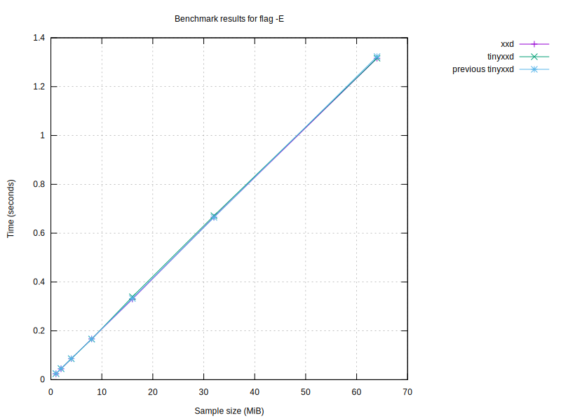

# Benchmark results

## Graphs

### Graph by sample size

### Graph for no flag

### Graph for flag '-p'

### Graph for flag '-i'

### Graph for flag '-e'

### Graph for flag '-b'

### Graph for flag '-u'

### Graph for flag '-E'

| Program | Size (MiB) | Conversion Time (s) | Flags |
|---------|------------|----------------------|-------|
| xxd | 64 | 1.38 |  |
| xxd | 64 | 2.26 | -r |
| xxd | 64 | 4.51 |  |
| xxd | 64 | 4.58 | -r |
| xxd | 64 | 1.31 |  |
| xxd | 64 | 0.93 | -p |
| xxd | 64 | 5.01 | -i |
| xxd | 64 | 1.34 | -e |
| xxd | 64 | 3.06 | -b |
| xxd | 64 | 1.35 | -u |
| xxd | 64 | 1.47 | -E |
| tinyxxd | 64 | 1.29 |  |
| tinyxxd | 64 | 2.34 | -r |
| tinyxxd | 64 | 4.49 |  |
| tinyxxd | 64 | 3.75 | -r |
| tinyxxd | 64 | 1.23 |  |
| tinyxxd | 64 | 0.77 | -p |
| tinyxxd | 64 | 4.99 | -i |
| tinyxxd | 64 | 1.32 | -e |
| tinyxxd | 64 | 2.97 | -b |
| tinyxxd | 64 | 1.28 | -u |
| tinyxxd | 64 | 1.42 | -E |
| tinyxxd | 32 | 0.66 |  |
| tinyxxd | 32 | 1.00 | -r |
| tinyxxd | 32 | 1.95 |  |
| tinyxxd | 32 | 1.85 | -r |
| tinyxxd | 32 | 0.63 |  |
| tinyxxd | 32 | 0.38 | -p |
| tinyxxd | 32 | 2.45 | -i |
| tinyxxd | 32 | 0.66 | -e |
| tinyxxd | 32 | 1.46 | -b |
| tinyxxd | 32 | 0.62 | -u |
| tinyxxd | 32 | 0.73 | -E |
| xxd | 32 | 0.74 |  |
| xxd | 32 | 1.46 | -r |
| xxd | 32 | 2.00 |  |
| xxd | 32 | 2.11 | -r |
| xxd | 32 | 0.67 |  |
| xxd | 32 | 0.47 | -p |
| xxd | 32 | 2.48 | -i |
| xxd | 32 | 0.68 | -e |
| xxd | 32 | 1.48 | -b |
| xxd | 32 | 0.66 | -u |
| xxd | 32 | 0.73 | -E |
| tinyxxd | 16 | 0.32 |  |
| tinyxxd | 16 | 0.50 | -r |
| tinyxxd | 16 | 0.89 |  |
| tinyxxd | 16 | 0.93 | -r |
| tinyxxd | 16 | 0.31 |  |
| tinyxxd | 16 | 0.19 | -p |
| tinyxxd | 16 | 1.24 | -i |
| tinyxxd | 16 | 0.34 | -e |
| tinyxxd | 16 | 0.76 | -b |
| tinyxxd | 16 | 0.32 | -u |
| tinyxxd | 16 | 0.36 | -E |
| xxd | 16 | 0.38 |  |
| xxd | 16 | 0.59 | -r |
| xxd | 16 | 0.86 |  |
| xxd | 16 | 1.10 | -r |
| xxd | 16 | 0.33 |  |
| xxd | 16 | 0.24 | -p |
| xxd | 16 | 1.25 | -i |
| xxd | 16 | 0.34 | -e |
| xxd | 16 | 0.74 | -b |
| xxd | 16 | 0.33 | -u |
| xxd | 16 | 0.37 | -E |
| xxd | 8 | 0.18 |  |
| xxd | 8 | 0.28 | -r |
| xxd | 8 | 0.47 |  |
| xxd | 8 | 0.53 | -r |
| xxd | 8 | 0.17 |  |
| xxd | 8 | 0.12 | -p |
| xxd | 8 | 0.62 | -i |
| xxd | 8 | 0.17 | -e |
| xxd | 8 | 0.37 | -b |
| xxd | 8 | 0.17 | -u |
| xxd | 8 | 0.18 | -E |
| tinyxxd | 8 | 0.16 |  |
| tinyxxd | 8 | 0.26 | -r |
| tinyxxd | 8 | 0.42 |  |
| tinyxxd | 8 | 0.49 | -r |
| tinyxxd | 8 | 0.16 |  |
| tinyxxd | 8 | 0.10 | -p |
| tinyxxd | 8 | 0.62 | -i |
| tinyxxd | 8 | 0.17 | -e |
| tinyxxd | 8 | 0.38 | -b |
| tinyxxd | 8 | 0.16 | -u |
| tinyxxd | 8 | 0.18 | -E |
| xxd | 4 | 0.09 |  |
| xxd | 4 | 0.14 | -r |
| xxd | 4 | 0.49 |  |
| xxd | 4 | 0.31 | -r |
| xxd | 4 | 0.09 |  |
| xxd | 4 | 0.06 | -p |
| xxd | 4 | 0.32 | -i |
| xxd | 4 | 0.09 | -e |
| xxd | 4 | 0.19 | -b |
| xxd | 4 | 0.09 | -u |
| xxd | 4 | 0.10 | -E |
| tinyxxd | 4 | 0.08 |  |
| tinyxxd | 4 | 0.13 | -r |
| tinyxxd | 4 | 0.21 |  |
| tinyxxd | 4 | 0.23 | -r |
| tinyxxd | 4 | 0.08 |  |
| tinyxxd | 4 | 0.05 | -p |
| tinyxxd | 4 | 0.31 | -i |
| tinyxxd | 4 | 0.09 | -e |
| tinyxxd | 4 | 0.19 | -b |
| tinyxxd | 4 | 0.08 | -u |
| tinyxxd | 4 | 0.09 | -E |
| xxd | 2 | 0.05 |  |
| xxd | 2 | 0.07 | -r |
| xxd | 2 | 0.10 |  |
| xxd | 2 | 0.13 | -r |
| xxd | 2 | 0.04 |  |
| xxd | 2 | 0.03 | -p |
| xxd | 2 | 0.16 | -i |
| xxd | 2 | 0.04 | -e |
| xxd | 2 | 0.09 | -b |
| xxd | 2 | 0.04 | -u |
| xxd | 2 | 0.05 | -E |
| tinyxxd | 2 | 0.04 |  |
| tinyxxd | 2 | 0.07 | -r |
| tinyxxd | 2 | 0.10 |  |
| tinyxxd | 2 | 0.12 | -r |
| tinyxxd | 2 | 0.04 |  |
| tinyxxd | 2 | 0.03 | -p |
| tinyxxd | 2 | 0.16 | -i |
| tinyxxd | 2 | 0.04 | -e |
| tinyxxd | 2 | 0.09 | -b |
| tinyxxd | 2 | 0.04 | -u |
| tinyxxd | 2 | 0.05 | -E |
| tinyxxd | 1 | 0.02 |  |
| tinyxxd | 1 | 0.03 | -r |
| tinyxxd | 1 | 0.05 |  |
| tinyxxd | 1 | 0.06 | -r |
| tinyxxd | 1 | 0.02 |  |
| tinyxxd | 1 | 0.01 | -p |
| tinyxxd | 1 | 0.08 | -i |
| tinyxxd | 1 | 0.02 | -e |
| tinyxxd | 1 | 0.05 | -b |
| tinyxxd | 1 | 0.02 | -u |
| tinyxxd | 1 | 0.02 | -E |
| xxd | 1 | 0.02 |  |
| xxd | 1 | 0.04 | -r |
| xxd | 1 | 0.05 |  |
| xxd | 1 | 0.07 | -r |
| xxd | 1 | 0.02 |  |
| xxd | 1 | 0.02 | -p |
| xxd | 1 | 0.08 | -i |
| xxd | 1 | 0.02 | -e |
| xxd | 1 | 0.05 | -b |
| xxd | 1 | 0.02 | -u |
| xxd | 1 | 0.03 | -E |

## Performance Summaries
- For sample size 64 MiB, tinyxxd was 12.20% faster with flags '-r'.
- For sample size 64 MiB, tinyxxd was 22.04% faster with flags '-p'.
- For sample size 64 MiB, tinyxxd was 5.97% faster with flags '-u'.
- For sample size 32 MiB, tinyxxd was 25.21% faster with flags '-r'.
- For sample size 32 MiB, tinyxxd was 21.78% faster with flags '-p'.
- For sample size 32 MiB, tinyxxd was 6.51% faster with flags '-u'.
- For sample size 16 MiB, tinyxxd was 17.80% faster with flags '-r'.
- For sample size 16 MiB, tinyxxd was 20.95% faster with flags '-p'.
- For sample size 8 MiB, tinyxxd was 9.62% faster with no flag.
- For sample size 8 MiB, tinyxxd was 7.45% faster with flags '-r'.
- For sample size 8 MiB, tinyxxd was 20.96% faster with flags '-p'.
- For sample size 8 MiB, tinyxxd was 7.22% faster with flags '-u'.
- For sample size 4 MiB, tinyxxd was 80.60% faster with no flag.
- For sample size 4 MiB, tinyxxd was 24.76% faster with flags '-r'.
- For sample size 4 MiB, tinyxxd was 22.00% faster with flags '-p'.
- For sample size 4 MiB, tinyxxd was 8.25% faster with flags '-u'.
- For sample size 4 MiB, tinyxxd was 6.91% faster with flags '-E'.
- For sample size 2 MiB, tinyxxd was 12.54% faster with flags '-r'.
- For sample size 2 MiB, tinyxxd was 20.35% faster with flags '-p'.
- For sample size 2 MiB, tinyxxd was 5.27% faster with flags '-u'.
- For sample size 1 MiB, tinyxxd was 13.34% faster with flags '-r'.
- For sample size 1 MiB, tinyxxd was 17.45% faster with flags '-p'.
- For sample size 1 MiB, tinyxxd was 5.88% faster with flags '-u'.

### Performance by sample size
- For sample 64 MiB, tinyxxd was 5.19% faster than xxd.
- For sample 32 MiB, tinyxxd was 8.62% faster than xxd.
- For sample 16 MiB, tinyxxd was 5.66% faster than xxd.
- For sample 8 MiB, tinyxxd was 5.03% faster than xxd.
- For sample 4 MiB, tinyxxd was 28.19% faster than xxd.
- For sample 2 MiB, tinyxxd was 5.35% faster than xxd.
- For sample 1 MiB, tinyxxd was 4.51% faster than xxd.

### Performance by flag
- tinyxxd was 5.82% faster with no flag.
- tinyxxd was 16.14% faster '-r'.
- tinyxxd was 21.70% faster '-p'.
- tinyxxd was 5.78% faster '-u'.
---
Report generated on: 2024-05-19T11:37:36.750266
